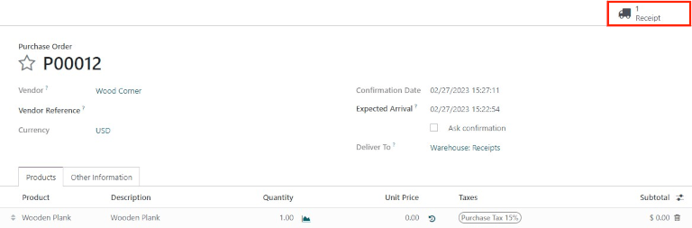
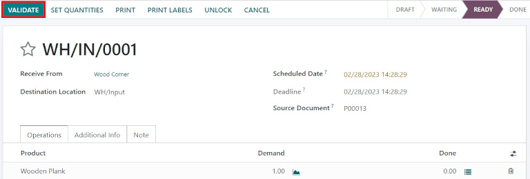
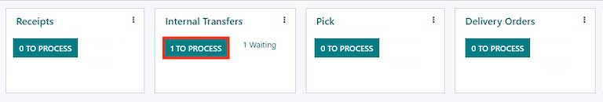
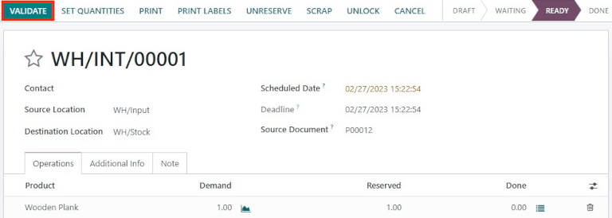
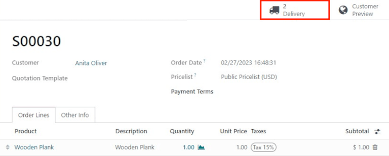
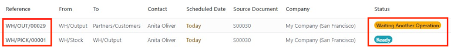
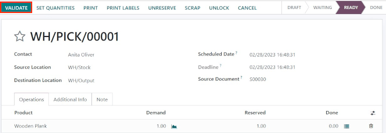
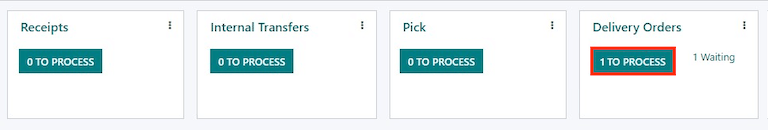
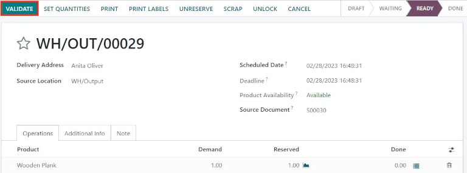

============================================
Process receipts and deliveries in two steps
============================================

.. _inventory/receipts_delivery_two_steps:

Depending on a company's business processes, multiple steps may be needed before receiving or
shipping products. In the two-step receipt process, products are received in an input area, then
transferred to stock. Two-step receipts work best when various storage locations are being used,
such as locked or secured areas, freezers and refrigerators, or various shelves.

Products can be sorted according to where they are going to be stored, and employees can stock all
the products going to a specific location. The products are not available for further processing
until they are transferred into stock.

In the two-step delivery process, products that are part of a delivery order are picked from the
warehouse according to their removal strategy, and brought to an output location before being
shipped.

One situation where this would be useful is when using either a :abbr:`FIFO (First In, First Out)`,
:abbr:`LIFO (Last In, First Out)`, or :abbr:`FEFO (First Expired, First Out)` removal strategy,
where the products that are being picked need to be selected based on their receipt date or
expiration date.

Odoo is configured by default to :ref:`receive and deliver goods in one step
<inventory/receipts_delivery_one_step>`, so the settings need to be changed in order to utilize
two-step receipts and deliveries. Incoming and outgoing shipments do not need to be set to have the
same steps. For example, products can be received in two steps, but shipped in one step. In the
following example, two steps will be used for both receipts and deliveries.

Configure multi-step routes
===========================

First, make sure the :guilabel:`Multi-Step Routes` option is enabled in :menuselection:`Inventory
--> Configuration --> Settings`, under the :guilabel:`Warehouse` heading. After enabling the
setting, :guilabel:`Save` the changes.

.. note::
   Activating the :guilabel:`Multi-Step Routes` setting will also activate the :guilabel:`Storage
   Locations` feature.

.. image:: receipts_delivery_two_steps/multi-step-routes.png
   :align: center
   :alt: Activate multi-step routes and storage locations in inventory settings.

Next, the warehouse needs to be configured for two-step receipts and deliveries. Go to
:menuselection:`Inventory --> Configuration --> Warehouses`, and click on the warehouse to change
the warehouse settings.

Then, select :guilabel:`Receive goods in input and then stock (2 steps)` for :guilabel:`Incoming
Shipments`, and :guilabel:`Send goods in output and then deliver (2 steps)` for :guilabel:`Outgoing
Shipments`.

.. image:: receipts_delivery_two_steps/two-step-warehouse-config.png
   :align: center
   :alt: Set incoming and outgoing shipment options to receive and deliver in two steps.

.. tip::
   Activating two-step receipts and deliveries will create new *input* and *output* locations, which
   by default, are labeled :guilabel:`WH/Input` and :guilabel:`WH/Output`, respectively, on the
   :guilabel:`Locations` dashboard. To rename these locations, go to :menuselection:`Configuration
   --> Locations`, and select the :guilabel:`Location` to change. On the location form, update the
   :guilabel:`Location Name`, and make any other changes (if necessary).

Process a receipt in two steps (input + stock)
==============================================

Create a purchase order
-----------------------

On the main :menuselection:`Purchase` application dashboard, start by making a new quote by clicking
:guilabel:`New`. Then, select (or create) a :guilabel:`Vendor` from the drop-down field, add a
storable :guilabel:`Product` to the order lines, and click :guilabel:`Confirm Order` to finalize the
quote as a new purchase order.

.. important::
   For businesses with multiple warehouses that have different step configurations, the
   :guilabel:`Deliver To` field on the :abbr:`PO (Purchase Order)` form may need to be specified as
   the correct *input location* connected to the two-step warehouse, which can be done by selecting
   the warehouse from the drop-down selection that includes the `Receipts` label at the end of the
   name.

After confirming the :abbr:`PO (Purchase Order)`, a :guilabel:`Receipt` smart button will appear in
the top of the :abbr:`PO (Purchase Order)` form — click it to reveal the associated receipt.

.. tip::
   Purchase order receipts can also be found in the :menuselection:`Inventory` application. In the
   :guilabel:`Overview` dashboard, click the :guilabel:`# to Process` smart button in the
   :guilabel:`Receipts` kanban card.

   .. image:: receipts_delivery_two_steps/two-step-receipts-kanban.png
      :align: center
      :alt: One receipt ready to process in the Inventory Overview kanban view.

Process the receipt
-------------------

The receipt and internal transfer will be created once the purchase order is confirmed. The status
of the receipt will be :guilabel:`Ready`, since the receipt must be processed first. The status of
the internal transfer will be :guilabel:`Waiting Another Operation`, since the transfer cannot
happen until the receipt is completed. The status of the internal transfer will only change to
:guilabel:`Ready` once the receipt has been marked as :guilabel:`Done`.

Click on the :guilabel:`Receipt` associated with the purchase order, then click :guilabel:`Validate`
to complete the receipt and move the product to the :guilabel:`Input Location`.

         WH/Input location.

Process the internal transfer
-----------------------------

Once the product is in the :guilabel:`Input Location`, the internal transfer is ready to move the
product into stock. Navigate to the :menuselection:`Inventory` app, and on the :guilabel:`Inventory
Overview` dashboard, click the :guilabel:`# To Process` smart button in the :guilabel:`Internal
Transfers` kanban card.

Click on the :guilabel:`Transfer` associated with the purchase order, then click
:guilabel:`Validate` to complete the receipt and move the product to stock. Once the transfer is
validated, the product enters the stock and is available for customer deliveries or manufacturing
orders.

Process a delivery order in two steps (pick + ship)
===================================================

Create a sales order
--------------------

In the :menuselection:`Sales` application, create a new quote by clicking :guilabel:`New`. Select
(or create) a :guilabel:`Customer`, add a storable :guilabel:`Product` to the order lines, and then
click :guilabel:`Confirm`.

After confirming the :abbr:`SO (Sales Order)`, a :guilabel:`Delivery` smart button will appear in
the top, above the :abbr:`SO (Sales Order)` form. Click the :guilabel:`Delivery` smart button to
reveal the associated receipt.

         associated with it.

.. tip::
   Sales order receipts can also be found in the :menuselection:`Inventory` application. In the
   :guilabel:`Overview` dashboard, click the :guilabel:`# To Process` smart button in the
   :guilabel:`Pick` kanban card.

   .. image:: receipts_delivery_two_steps/two-step-pick-kanban.png
      :align: center
      :alt: The pick order can be seen in the Inventory kanban view.

Process the picking
-------------------

The picking and delivery order will be created once the sales order is confirmed. When the
:guilabel:`Delivery` smart button appears, click it to reveal the :guilabel:`Transfers` dashboard,
which lists both the picking and the delivery orders.

The status of the picking will be :guilabel:`Ready`, since the product must be picked from stock
before it can be shipped. The status of the delivery order will be :guilabel:`Waiting Another
Operation`, since the delivery cannot happen until the picking is completed. The status of the
delivery order will only change to :guilabel:`Ready` once the picking has been marked as
:guilabel:`Done`.

         Operation.

Click on the picking delivery order to begin processing it. If the product is in stock, Odoo will
automatically reserve the product. Click :guilabel:`Validate` to mark the picking as
:guilabel:`Done`, then the delivery order will be ready for processing. Since the documents are
linked, the products which have been previously picked are automatically reserved on the delivery
order.

Process the delivery
--------------------

The delivery order will be ready to be processed once the picking is completed, and can be found in
the :menuselection:`Inventory` application, on the :guilabel:`Inventory Overview` dashboard. Click
the :guilabel:`# To Process` smart button in the :guilabel:`Delivery Orders` kanban card to begin.

.. tip::
   The delivery order associated with the :abbr:`SO (Sales Order)` can also be quickly accessed by
   clicking on the :guilabel:`Delivery` smart button again, and choosing the delivery order on the
   :guilabel:`Transfers` page (which should now be marked as :guilabel:`Ready`).

Click on the delivery order associated with the :abbr:`SO (Sales Order)`, then click on
:guilabel:`Validate` to complete the move.

         the customer location.

Once the delivery order is validated, the product leaves the :guilabel:`WH/Output` location on the
:guilabel:`Transfers` dashboard and moves to the :guilabel:`Partners/Customers` location. Then, the
status of the document will change to :guilabel:`Done`.
