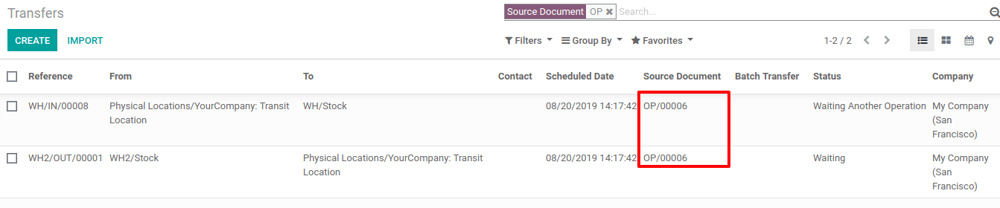

===============================
Resupply from another warehouse
===============================

A common use case for multiple warehouses is to have one central warehouse that resupplies multiple
shops, and in this case, each shop is considered a local warehouse. When a shop wants to replenish
a product, the product is ordered to the central warehouse. Odoo allows the user to easily set
which warehouse(s) can resupply another warehouse.

Configuration
=============

To resupply from another warehouse, first go to :menuselection:`Inventory --> Configuration -->
Settings --> Warehouse` and activate :guilabel:`Multi-Step Routes`. Then, click :guilabel:`Save` to
apply the setting.

.. image:: resupply_warehouses/virtual-warehouses-settings.png
   :align: center
   :alt: Enable Multi-Step Routes in Inventory settings.

View all the configured warehouses by going to :menuselection:`Inventory --> Configuration -->
Warehouses`.

Create a new warehouse by clicking :guilabel:`Create`. Then, give the warehouse a name and a
:guilabel:`Short Name`. Finally, click :guilabel:`Save` to finish creating the warehouse.

After that, go back to the :guilabel:`Warehouses` page and open the warehouse that will be
resupplied by the second warehouse. Then, click :guilabel:`Edit`. In the :guilabel:`Warehouse
Configuration` tab, locate the :guilabel:`Resupply From` field, and check the box next to the
second warehouse's name. If the warehouse can be resupplied by more than one warehouse, make sure
to check those warehouses' boxes too. Finally, click :guilabel:`Save` to apply the setting. Now,
Odoo knows which warehouses can resupply this warehouse.

.. image:: resupply_warehouses/resupply-from-second-warehouse.png
   :align: center
   :alt: Supply one warehouse with another in the Warehouse Configuration tab.

Set route on a product
======================

After configuring which warehouse(s) to resupply from, a new route is now available on all product
forms. The new route appears as :guilabel:`Supply Product from [Warehouse Name]` under the
:guilabel:`Inventory` tab on a product form. Use the :guilabel:`Supply Product from [Warehouse
Name]` route with a reordering rule or the make to order (MTO) route to replenish stock by moving
the product from one warehouse to another.

.. image:: resupply_warehouses/product-resupply-route-settings.png
   :align: center
   :alt: Route setting which enables a product to resupplied from a second warehouse.

When a product's reordering rule is triggered and the product has the :guilabel:`Supply Product
from [Warehouse Name]` route set, Odoo automatically creates two pickings. One picking is a
*delivery order* from the second warehouse, which contains all the necessary products, and the
second picking is a *receipt* with the same products for the main warehouse. The product move from
the second warehouse to the main warehouse is fully tracked in Odoo.

On the picking/transfer records created by Odoo, the :guilabel:`Source Document` is the product's
reordering rule. The location between the delivery order and the receipt is a transit location.

.. image:: resupply_warehouses/second-warehouse-delivery-order.png
   :align: center
   :alt: A warehouse order for resupplying one warehouse's stock with another.

.. image:: resupply_warehouses/second-warehouse-stock-receipt.png
   :align: center
   :alt: A receipt for stock received to one warehouse from another.
