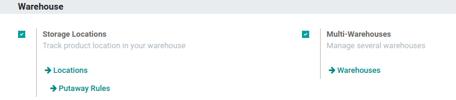
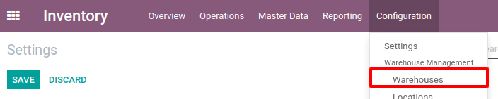
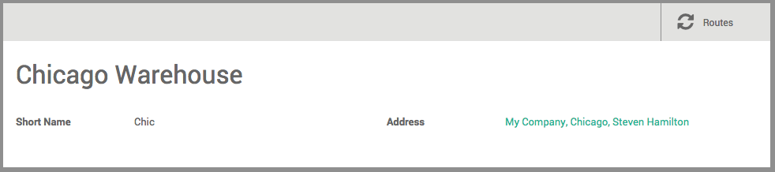

======================
Create a New Warehouse
======================

Configuration
=============

In order to create a new warehouse, you should activate the
*Multi-Warehouse* settings. Note that the *Multi-Locations* settings
will be automatically activated at the same time.

In order to do so, go to the :menuselection:`Inventory app --> Configuration -->
Settings`.

You can then go to :menuselection:`Inventory --> Configuration --> Warehouses` and hit
*Create* to add a new warehouse.

You will be able to enter your warehouse name. You should also choose a
short name for your warehouse which is 5-characters long and is used on
the different warehouse documents.

In the Address field, you can select an existing company or create one
on-the-go. Therefore, the address of your warehouse will be the same as
the one of the company you selected. You can also leave this field empty
and edit it afterward.

After the creation of your new warehouse, you can go back to the
*Dashboard* and you will see the new operation types automatically
created by Odoo due to the creation of a new warehouse.

.. image:: media/warehouse_creation_04.png
   :align: center