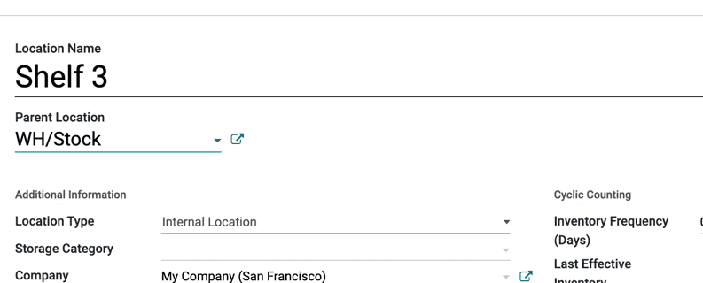

===============================
Manage Warehouses and Locations
===============================

Terminology
===========

Warehouse
---------

In Odoo, a **Warehouse** is the actual building/place in which your items
are stocked. You can setup multiple warehouses and create moves between
warehouses.

Location
--------

A **Location**, is a specific space within your warehouse. It can be
considered as a sublocation of your warehouse, as a shelf, a floor, an
aisle, etc. Therefore, a location is part of one warehouse only and it
is not possible to link one location to multiple warehouses. You can
configure as many locations as you need under one warehouse.

There are 3 types of locations:

-   The **Physical Locations** are internal locations that are part of the
    warehouses for which you are the owner. They can be the loading and
    unloading area of your warehouse, a shelf or a department, etc.

-   The **Partner Locations** are spaces within a customer and/or vendor's
    warehouse. They work the same way as Physical Locations with the only
    difference being that you are not the owner of the warehouse.

-   The **Virtual Locations** are places that do not exist, but in which
    products can be placed when they are not physically in an inventory yet
    (or anymore). They come in handy when you want to place lost products
    out of your stock (in the **Inventory loss**), or when you want to take into
    account products that are on their way to your warehouse (**Procurements**).

In Odoo, locations are structured hierarchically. You can structure your
locations as a tree, dependent on a parent-child relationship. This
gives you more detailed levels of analysis of your stock operations and
the organization of your warehouses.

Configuration
=============

To activate the locations, go to :menuselection:`Configuration --> Settings` and enable 
**Storage Locations**. Then, hit *Save*.

.. image:: warehouses_locations/feature-storage-location.png
   :align: center
   :alt: Enabling the storage location feature in Odoo Inventory.

.. important::
   If you want to manage several routes within your warehouses, then enable **Multi-Step Routes**
   and check :doc:`use-routes`.

Creating a new warehouse
========================

To create a warehouse, go to :menuselection:`Configuration -->
Warehouse Management --> Warehouses` and click on **Create**.

Fill out a **Warehouse Name** and a **Short Name**. The short name is five characters maximum.

.. image:: warehouses_locations/create-new-warehouse.png
   :align: center
   :alt: Short name field of a warehouse on Odoo Inventory.

.. important::
   The **Short Name** appears on your transfer orders and other warehouse documents. We recommend
   using an understandable one (e.g.: WH/[first letters of location]).

Now, go back to your dashboard. There, new operations related to your warehouse have been
automatically generated.

.. image:: warehouses_locations/new-transfer-types.png
   :align: center
   :alt: Inventory app dashboard displaying new transfer type for the recently created warehouse.

.. note::
   Adding a second warehouse will automatically activate the **Locations** setting.
   
Creating a new location
=======================

To create a location, go to :menuselection:`Configuration -->
Warehouse Management --> Locations` and click on **Create**.

Fill out a **Location Name** and a **Parent Location** and hit *Save*.

