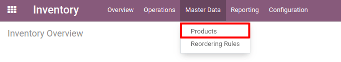
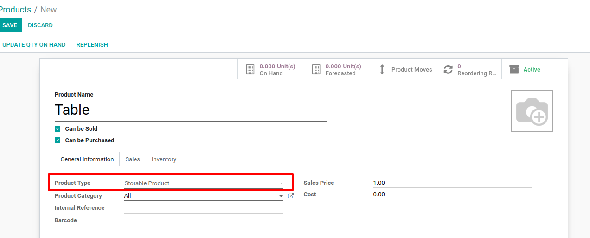
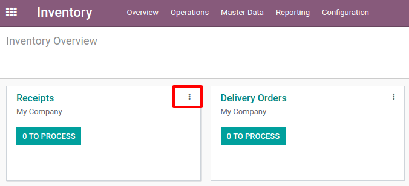
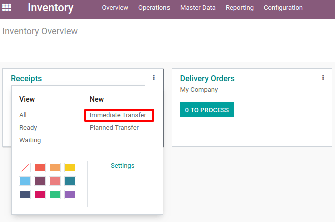
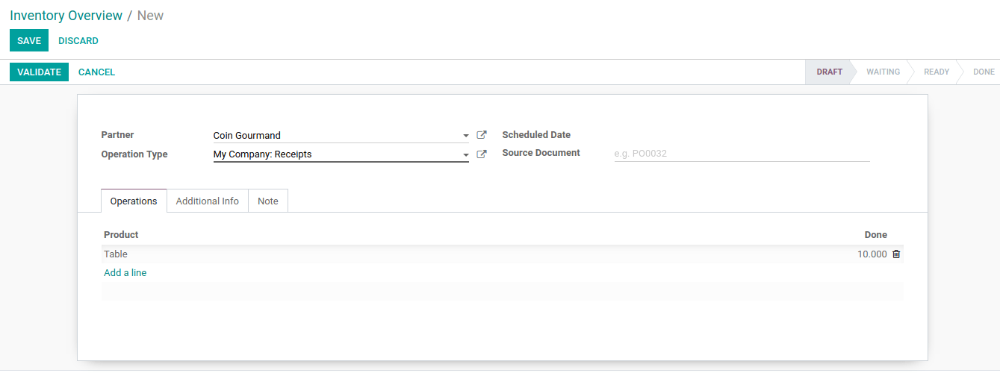
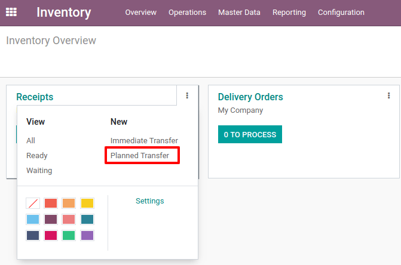
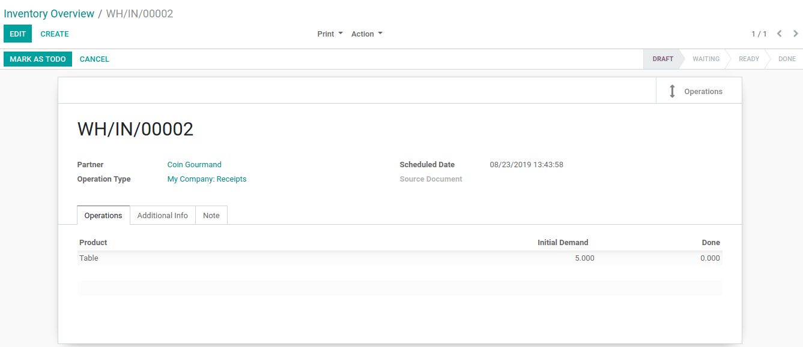
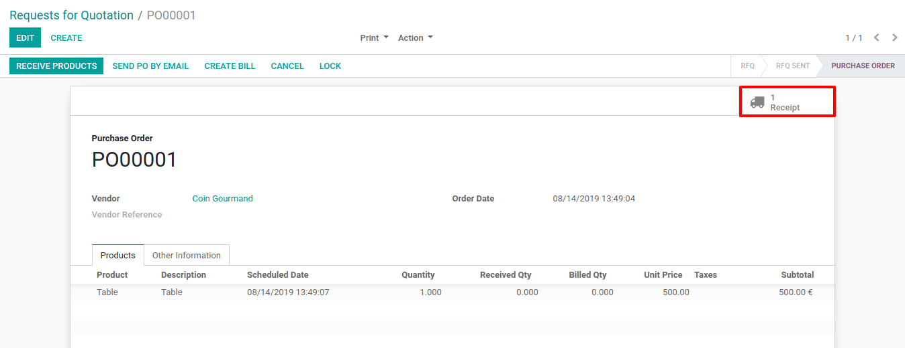

=========================
Receive Products in Stock
=========================

The first step to use the inventory application is to create products in
your database via the menu :menuselection:`Master Data --> Products`. Click the Create
button and enter the name of your product.

In case you set the product as *storable*, you will track the stock
for this product and know how many units are in stock and what is the
forecasted number of units. If you want to include a product on
receipts/deliveries but don’t need to track its stock, you can set it as
*consumable*.

Receive Products in Stock
=========================

Once you have existing products, you can decide to create a receipt to
enter products from your supplier in stock. The process in order to do
so is described in the following print screens.

On the receipt document, you can select the quantity of the different
products you receive and the supplier from who you received them. When
the receipt is complete, you can hit *Validate* and the products will
enter your stock.

In case you have a receipt that is planned but shouldn’t be immediately
validated, you can create a *planned receipt* with a scheduled date in
the future. You can indicate the initial demand for each product,
corresponding to what has been ordered to your supplier. Once the
document is filled in, you can hit “Mark as to do” in order to consider
it in your product forecasts.

Receive Products in Stock from Purchase Orders
==============================================

If you have the *Purchase* application installed, receipts can be
directly created by validating a *request for quotation*. You will be
able to find the corresponding receipt directly on the *purchase
order*.

