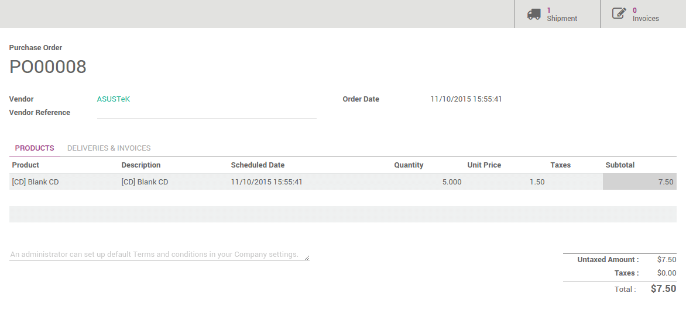

============================
From procurement to delivery
============================

Overview
========

Inventory is the heart of your business. It can be really complicated,
but with Odoo, doing a receipt or a delivery has never been easier. We
will show you in this document how easy to do a full process, from the
receipt to the delivery.

Odoo inventory is fully integrated with other applications, such as
**Purchase**, **Sales** or **Inventory**. But is not limited to those processes, it
is also fully integrated with our **e-Commerce**, **Manufacturing** and **Repairs**
applications.

How to process a receipt ?
==========================

Install Purchase application
----------------------------

First, you will need to install the **Purchase Management** application. Go
to :menuselection:`Apps` and install it.

.. image:: media/sale_to_delivery01.png
    :align: center

Make a purchase order
---------------------

Go to the **Purchases** applications. The first screen is the **Request for
Quotation** list. Click on the **Create** button.

Fill in the **Vendor** information and click on **Add an Item** to add some
products to your request for quotation.

Click on **Confirm order** when you are sure about the products, prices
and quantity.

Retrieve the Receipt
--------------------

You can retrieve the receipt order in 2 ways:

From the purchase order 
~~~~~~~~~~~~~~~~~~~~~~~~

On the top right of your purchase order, you will see a button with the
related **Receipt**:

.. image:: media/sale_to_delivery03.png
    :align: center

Click on it to see the **Transfer order**.

From the Inventory Dashboard
~~~~~~~~~~~~~~~~~~~~~~~~~~~~

When opening the **Inventory** application, click on **# to receive** to see
the list of your deliveries to process.

.. image:: media/sale_to_delivery04.png
    :align: center

In the list, click on the one related to the purchase order:

.. image:: media/sale_to_delivery05.png
    :align: center

Process the Receipt
-------------------

.. image:: media/sale_to_delivery06.png
    :align: center

To process the stock transfer. Simply click on **Validate** to complete
the transfer. A message will appear asking if you want to process the
whole order, accept it by clicking on **Apply**.

.. note::
    Procurements can be automated. Please read our document 
    :doc:`../../management/adjustment/min_stock_rule_vs_mto` 
    for more information.

How to process a delivery order ?
=================================

Install Sales application
-------------------------

First, you will need to install the **Sales Management** application. Go to
:menuselection:`Apps` and install it.

.. image:: media/sale_to_delivery07.png
    :align: center

Place a sale order
------------------

Go to the **Sales** applications. Click on the **Quotations** button of your
team.

.. image:: media/sale_to_delivery08.png
    :align: center

You will get the list of all your quotations. Click on the **Create**
button.

Fill in the **Customer informations** and click on **Add an Item** to add
some products to your quotation.

.. image:: media/sale_to_delivery09.png
    :align: center

Click on **Confirm sale** to place the order.

Retrieve the Delivery order
---------------------------

You can retrieve the delivery order in 2 ways:

From the sale order 
~~~~~~~~~~~~~~~~~~~~

On the top right of your sale order, you will see a button with the
related **Delivery**:

.. image:: media/sale_to_delivery10.png
    :align: center

Click on it to see the **Transfer order**.

From the Inventory Dashboard
~~~~~~~~~~~~~~~~~~~~~~~~~~~~

When opening the **Inventory** application, click on **# to do** to see the
list of your receipts to process.

.. image:: media/sale_to_delivery11.png
    :align: center

In the list, click on the one related to the sale order:

.. image:: media/sale_to_delivery12.png
    :align: center

.. note::
    If the product is not in stock, the sale order will be listed as
    **Waiting** on your dashboard.

Process the delivery
--------------------

.. image:: media/sale_to_delivery12.png
    :align: center

To process the stock transfer. Simply click on **Validate** to complete
the transfer. A message will appear asking if you want to process the
whole order, accept it by clicking on **Apply**.

.. note::
    E-Commerce orders are processed the same way.

.. tip::
    You can easily integrate your delivery orders with different
    delivery methods. Please read the document 
    :doc:`../../shipping/setup/delivery_method`.

Advanced flows 
===============

In this document, the flows that are explained are the most simple ones.
Odoo also suit for companies having advanced warehouse management.

-   By default, only **receipts** and **deliveries** are configured but you can
    activate the use of multi-locations and multi-warehouses to do
    **internal transfers**.

-   **Routes**: you can automate flows with push and pull rules

-   **Multi-step** receipts and deliveries can be easily configured for each
    warehouse

-   Much more: **Barcode scanning**, **serial numbers**, **lots**, **cross-docking**,
    **dropshipping**, integration with a **third-party** shipper, **putaway** and
    **removal** strategies.... All of it is possible with Odoo.
