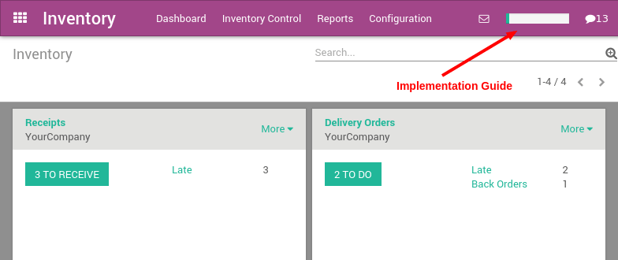

============================
How to setup Odoo inventory?
============================

The Odoo Inventory application has an implementation guide that you
should follow to configure it. It's a step-by-step manual with links to
the different screens you need.

Once you have installed the **Inventory** application, click on
the top-right progress bar to get access to the implementation guide.

The implementation guide helps you through the following steps:

1. Set up your warehouse

2. Import your vendors

3. Import your products

4. Set up the initial inventory

5. Configure your sales and purchase flows

6. Set up replenishment mechanisms

7. Configure advanced features like package, traceability, routes and
   inventory valuation.

.. image:: media/setup02.png
   :align: center

.. note::

	If you want to set up operations with barcode scanner in your
	warehouse, you should install the **Barcode** application that adds
	features on top of the inventory application. The barcode application
	will guide you to configure and use your scanner optimally.
