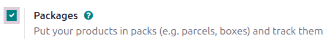
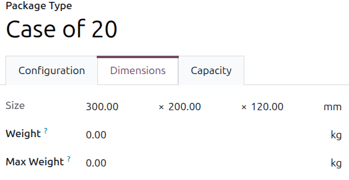
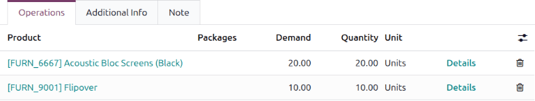
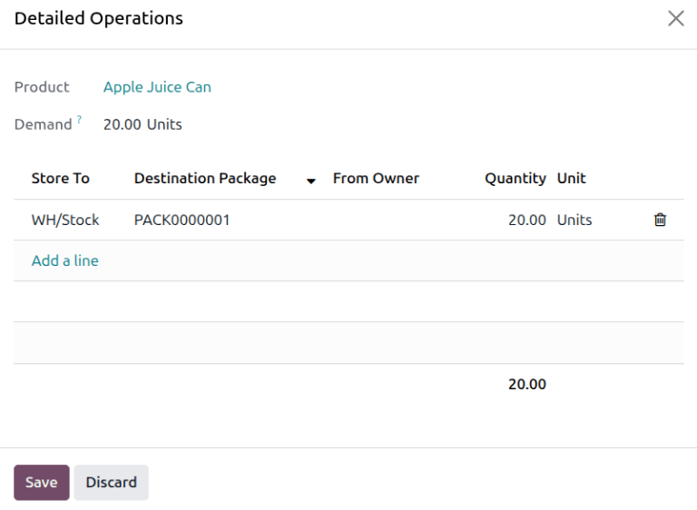
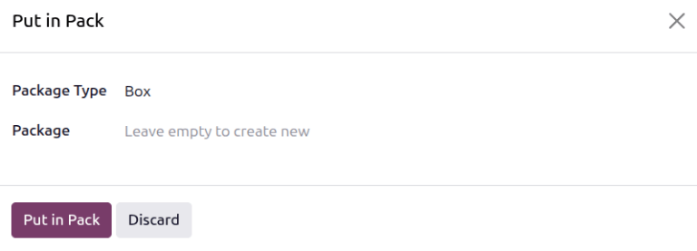
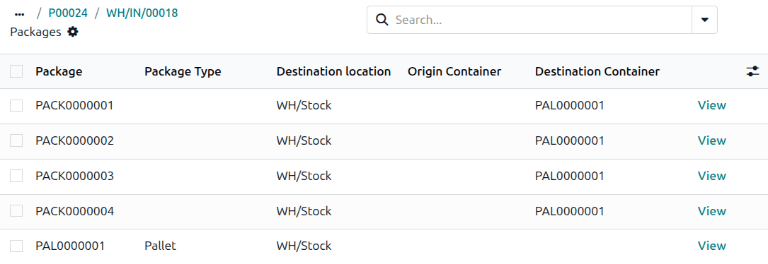
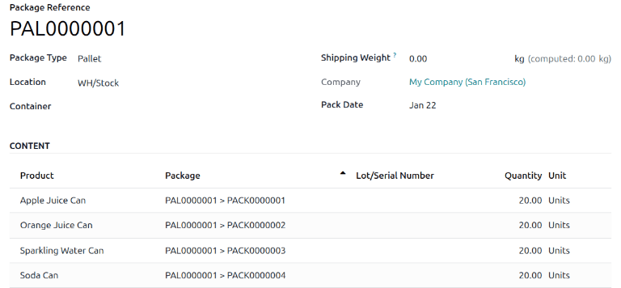

============
Pack-in-pack
============

In more complex warehouse operations, it is sometimes necessary to handle groups of containers (for
example, grouping pallets together). These containers may be physically combined or logically
grouped at the database level, allowing them to be treated as a single unit for certain stock
movements while still retaining visibility into their internal structure. This makes it possible to
move the entire group with a single scan, rather than scanning each pallet individually.

Enable settings
===============

Before working with the pack-in-pack settings, open :menuselection:`Inventory app --> Configuration
--> Settings`. Enable the :guilabel:`Packages` setting. Be sure to click :guilabel:`Save` before
exiting this page.

Set package type
================

The *Set Package Type* setting must be enabled for all operations that require pack-in-pack
functionality.

Open :menuselection:`Inventory app --> Configuration --> Operation Types`. The :guilabel:`Operation
Types` page opens. Open an operation type.

On the operation type form, in the :guilabel:`Packages` section, select :guilabel:`Set Package
Type`.

.. example::
   :guilabel:`Set Package Type` is enabled for the `Receipts` operation type.

   .. image:: pack_in_pack/set-package-type.png
      :alt: Update the Set Package Type setting on the operation type form.

Create package types
====================

Create package types by navigating to :menuselection:`Inventory app --> Configuration --> Package
Types`, in order to set custom dimensions and weight limits. This feature is mainly used to
calculate package weights for shipping costs.

On the :guilabel:`Package Types` list, clicking :guilabel:`New` opens a blank package type form. The
fields of the form are as follows:

- :guilabel:`Package Type` (required): Define the package type's name.
- :guilabel:`Size`: Define the package dimensions in millimeters (mm). The fields, from left to
  right, define the Length, Width, and Height.
- :guilabel:`Weight`: weight of an empty package (e.g., an empty box, pallet).

    .. note::
       Odoo calculates the package's weight by adding the weight of the empty package plus the
       weight of the items, which can be found in the :guilabel:`Weight` field, in the
       :guilabel:`Inventory` tab, of each product form.

- :guilabel:`Max Weight`: maximum shipping weight allowed in the package.
- :guilabel:`Barcode`: Define a barcode to identify the package type from a scan.
- :guilabel:`Sequence Prefix`: Specify a prefix to use when a new package name is created by Odoo.

   .. example::
       Use `PAL` for the `Pallet` package type. When the first package of the `Pallet` type is
       created, it is named `PAL0000001`.

- :guilabel:`Company`: Specify a company to make the package type available only within that
  company. Leave the field blank if it is available at all companies.
- :guilabel:`Carrier`: Specify the intended shipping carrier for this package type.
- :guilabel:`Carrier Code`: Define a code that is linked to the package type.

Pack-in-pack process
====================

After :guilabel:`Set Package Type` is enabled in the operation type form, pack-in-pack can be used
from that operation type.

Open the operation type from the :guilabel:`Operations` menu. The list of operations for that
operation type displays. Open an operation from that list.

To put the contents of a line into a single package, click the :guilabel:`Details` link on the far
right of the product line.

The *Detailed Operations* window opens. In this window, specify a :guilabel:`Store to`
location, the name of the :guilabel:`Destination Package`, and the :guilabel:`Quantity` of items to
be put in that package. To break the inventory into multiple packages, click the :guilabel:`Add a
line` link; be sure that the :guilabel:`Quantity` of each line adds up to the total
:guilabel:`Demand`. Click :guilabel:`Save` to create the package in Odoo.

Repeat this process for all product lines on the operation form.

Alternatively, click the :guilabel:`Put in Pack` button on the operation form to put all items with
a :guilabel:`Quantity` greater than `0.00` into a package. The *Put in Pack* pop-up window opens.

In the *Put in Pack* window, specify a :guilabel:`Package Type` and :guilabel:`Package`, or leave
the :guilabel:`Package` field blank to create a new package. Then click the :guilabel:`Put in Pack`
button. The package name appears in the product line's :guilabel:`Packages` field.

.. example::
    A business has placed an order for `20` units each of `Apple Juice Cans`, `Orange Juice Cans`,
    `Sparkling Water Cans`, and `Soda Cans`. When the order arrives, each product arrives in its own
    box of 20 cans.

    The warehouse manager specifies a separate package for each product line on the receipt.

    .. image:: pack_in_pack/example-packages.png
       :alt: Four packages are created on the receipt form.

Then, to organize all packages into a single larger unit (for example, to package multiple cases of
soda into a pallet), click the :guilabel:`Put in Pack` button. After closing the *Put in Pack*
window, the :guilabel:`Packages` field for the product lines in the greater package updates with the
new package name.

.. example::
   Continuing the example from above, the warehouse manager wants to package all of the products
   onto a single pallet for storage in the warehouse. They click the :guilabel:`Put in Pack`
   button, then in the *Put in Pack* window, they specify `Pallet` as the :guilabel:`Package Type`.
   The :guilabel:`Packages` field for all product lines updates to show the pallet package name,
   `PAL0000001`.

    .. image:: pack_in_pack/example-pallet.png
       :alt: The Packages field updates with a new package name.

Be sure to :guilabel:`Validate` the operation to process its move in inventory.

Viewing the packages in an operation
====================================

To view the packages created from an operation, click the :icon:`fa-cubes` :guilabel:`Packages`
smart button at the top of the operation form. By default, this list is filtered by the
:guilabel:`Main Packages`, or the largest package assigned to the operation. To view all packages,
remove the :guilabel:`Main Packages` filter.

Removing packages from parent packages
======================================

To remove packages from parent packages, click the :icon:`fa-cubes` :guilabel:`Packages` smart
button at the top of the operation form. By default, this list is filtered by the :guilabel:`Main
Packages`, or the largest package assigned to the operation. To view all packages, remove the
:guilabel:`Main Packages` filter.

Select the check boxes next to the packages that you want to remove, then click the
:guilabel:`Remove` button.

Viewing packages in inventory
=============================

Open :menuselection:`Inventory app --> Products --> Packages`. All packages in inventory are listed
here.

To view the contents of a package, open the package from the list of packages. The products in the
package, including the child packages they are stored in, are listed on the package form.

