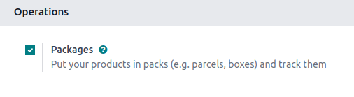
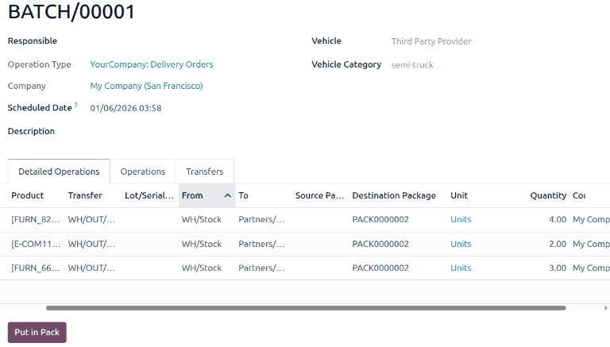
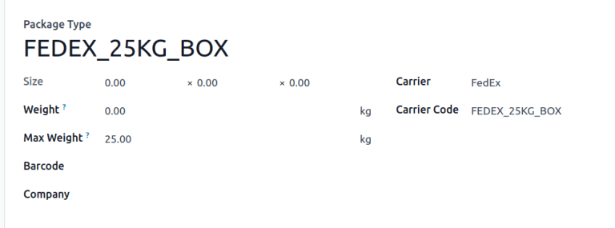
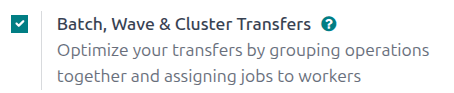
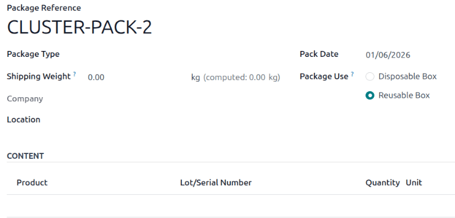

========
Packages
========

.. |SO| replace:: :abbr:`SO (Sales Order)`

A *package* is a physical container holding one or more products. Packages can also be used to store
items in bulk.

Packages are commonly used for the following purposes:

#. :ref:`Grouping products to move them in bulk <inventory/warehouses_storage/pack>`.
#. :ref:`Shipping to customers <inventory/warehouses_storage/package-type>`: configure package types
   to align with shipping carriers' size and weight requirements, streamlining the packing process,
   and ensuring compliance with carrier shipping specifications.
#. Storing items in bulk.

*Package use* is a field on the package form in Odoo that is only visible by enabling the *Batch
Transfers* and *Packages* features (:menuselection:`Inventory app --> Configuration --> Settings`).

By default, the *Package Use* field on a packages form is set to *Disposable Box*. Change this field
to *Reusable Box* **only** when configuring packages for :ref:`cluster pickings
<inventory/warehouses_storage/cluster-pack>`.

*Package type* is an optional feature used for :doc:`calculating shipping cost
<../../shipping_receiving/setup_configuration>`, based on real shipping weight. Create package types
to include the weight of the package itself (e.g. boxes, pallets, other shipping containers) in
shipping cost calculations.

.. note::
   While packages are commonly used in the :doc:`three-step delivery route
   <../../shipping_receiving/daily_operations/delivery_three_steps>`, they can be used in any
   workflow involving storable products.

.. _inventory/warehouses_storage/enable-package:

Configuration
=============

To use packages, first go to :menuselection:`Inventory app --> Configuration --> Settings`. Under
the :guilabel:`Operations` heading, activate the :guilabel:`Packages` feature. Then, click
:guilabel:`Save`.

.. _inventory/warehouses_storage/pack:

Pack items
==========

Products can be added to packages in any transfer by:

#. Clicking each :ref:`Detailed Operations <inventory/warehouses_storage/detailed-operations>` icon
   on the product line.
#. Using the :ref:`Put in Pack <inventory/warehouses_storage/put-in-pack>` button to place
   everything in the transfer into a package.

.. _inventory/warehouses_storage/detailed-operations:

Detailed operations
-------------------

On any warehouse transfer (e.g. receipt, delivery order), add a product to a package by clicking the
:guilabel:`⦙≣ (bulleted list)` icon in the :guilabel:`Operations` tab.

.. image:: package/detailed-operations.png
   :align: center
   :alt: Show "Detailed Operations" icon in the product line.

Doing so opens the :guilabel:`Detailed Operations` pop-up window for the :guilabel:`Product`.

To put the :guilabel:`Product` in a package, click :guilabel:`Add a line`, and assign the product to
a :guilabel:`Destination Package`. Select an existing package, or create a new one by typing the
name of the new package, then select :guilabel:`Create...`.

.. figure:: package/destination-package.png
   :align: center
   :alt: Assign a package to "Destination Package" field.

   Twelve units of `Acoustic Bloc Screen` are placed in `PACK0000001`.

Then, specify the quantity of items to go into the package in the :guilabel:`Done` column. Repeat
the above steps to place the :guilabel:`Product` in different packages. Once finished, click
:guilabel:`Confirm` to close the window.

.. seealso::
   :doc:`Ship one order in multiple packages
   <../../shipping_receiving/advanced_operations_shipping/multipack>`

.. _inventory/warehouses_storage/put-in-pack:

Put in pack
-----------

Alternatively, click the :guilabel:`Put in Pack` button on **any** warehouse transfer to create a
new package, and place all the items in the transfer in that newly-created package.

.. important::
   The :guilabel:`Put in Pack` button appears on receipts, delivery orders, and other transfer forms
   with the *Packages* feature enabled in :menuselection:`Inventory app --> Configuration -->
   Settings`.

   In batch transfer `BATCH/00003`, the :guilabel:`Put in Pack` button was clicked to create a new
   package, `PACK0000002`, and assign all items to it in the :guilabel:`Destination Package` field.

.. _inventory/warehouses_storage/package-type:

Package type
============

Create package types by navigating to :menuselection:`Inventory app --> Configuration --> Package
Types`, in order to set custom dimensions and weight limits. This feature is mainly used to
calculate package weights for shipping costs.

.. seealso::
   - :doc:`Shipping carriers <../../shipping_receiving/setup_configuration/third_party_shipper>`
   - :doc:`../../shipping_receiving/setup_configuration`

On the :guilabel:`Package Types` list, clicking :guilabel:`New` opens a blank package type form. The
fields of the form are as follows:

- :guilabel:`Package Type` (required): define the package type's name.
- :guilabel:`Size`: define the dimensions of the package in millimeters (mm). The fields, from left
  to right, define the :guilabel:`Length`, :guilabel:`Width`, and :guilabel:`Height`.
- :guilabel:`Weight`: weight of an empty package (e.g. an empty box, pallet).

.. note::
   Odoo calculates the package's weight by adding the weight of the empty package plus the weight of
   the item(s), which can be found in the :guilabel:`Weight` field, in the :guilabel:`Inventory`
   tab, of each product form.

- :guilabel:`Max Weight`: maximum shipping weight allowed in the package.
- :guilabel:`Barcode`: define a barcode to identify the package type from a scan.
- :guilabel:`Company`: specify a company to make the package type available **only** at the selected
  company. Leave the field blank if it is available at all companies.
- :guilabel:`Carrier`: specify the intended shipping carrier for this package type.
- :guilabel:`Carrier Code`: define a code that is linked to the package type.

.. _inventory/warehouses_storage/cluster-pack:

Cluster packages
================

To use *cluster packages*, first navigate to :menuselection:`Inventory app --> Configuration -->
Settings`, and activate the :guilabel:`Batch Transfers` feature, located in the
:guilabel:`Operations` section. Doing so makes the *Package Use* field become visible on a package
form.

Add new packages by going to :menuselection:`Inventory app --> Products --> Packages`. Then, click
:guilabel:`New`, or select an existing package. Doing so opens the package form, which contains the
following fields:

- :guilabel:`Package Reference` (required): name of the package.
- :guilabel:`Package Type`: used for :ref:`configuring shipping boxes to ship to the customer
  <inventory/warehouses_storage/package-type>`.

  .. note::
     :guilabel:`Package Type` is unnecessary for configuring packages for cluster pickings.

- :guilabel:`Shipping Weight`: used to input the weight of the package after measuring it on a
  scale.
- :guilabel:`Company`: specify a company to make the package available **only** at the selected
  company. Leave the field blank if the package is available at all companies.
- :guilabel:`Location`: current location of the package.
- :guilabel:`Pack Date`: the date the package was created.
- :guilabel:`Package Use`: choose :guilabel:`Reusable` for packages used for moving products within
  the warehouse; :guilabel:`Disposable` for packages used to ship products to customers.

.. seealso::
   :doc:`Using cluster packages
   <../../shipping_receiving/picking_methods/cluster>`
