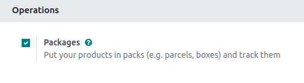
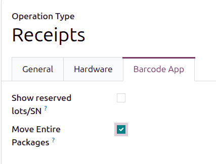
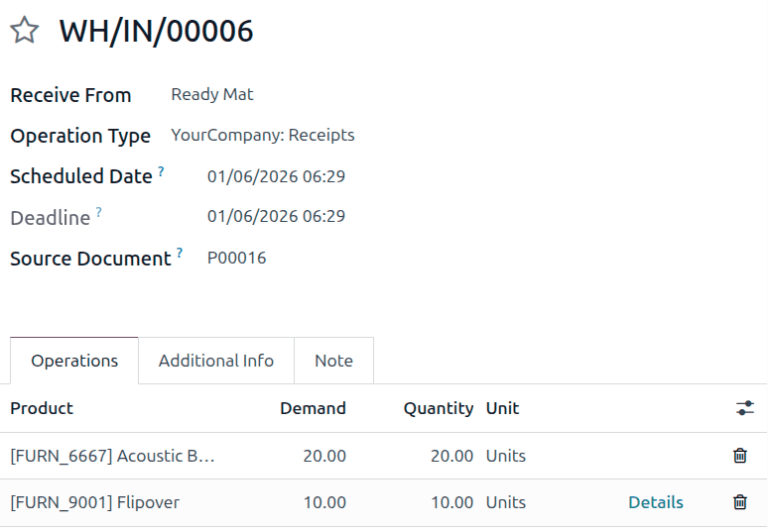
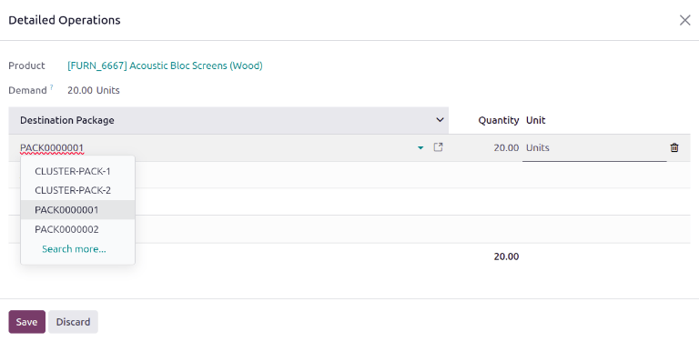
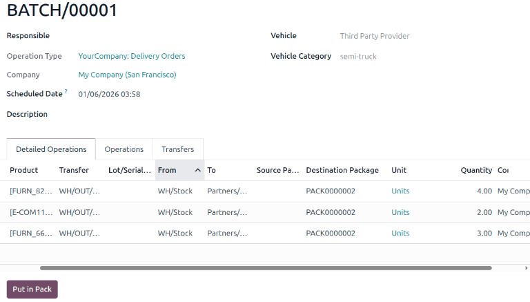
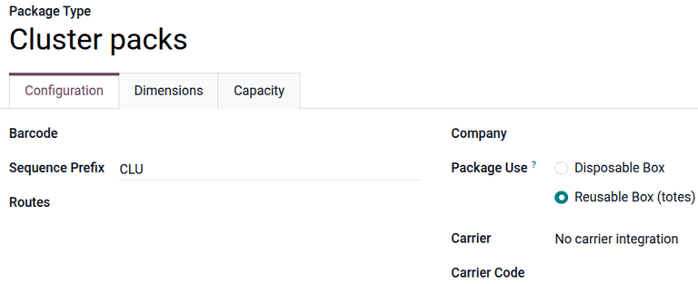
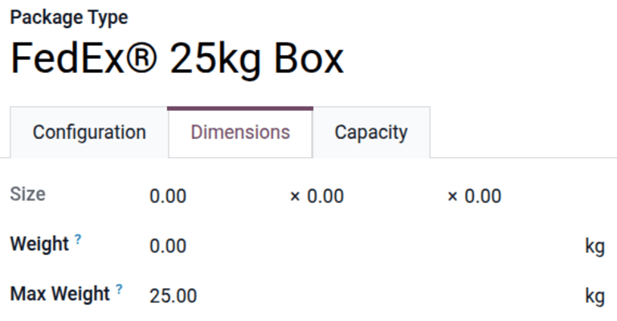
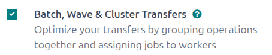
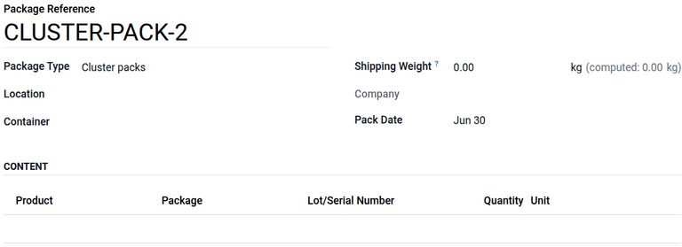
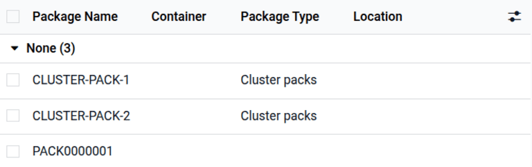

========
Packages
========

.. |SO| replace:: :abbr:`SO (Sales Order)`

A *package* is a physical container holding one or more products. Packages can also be used to store
items in bulk.

Packages are commonly used for the following purposes:

#. :ref:`Grouping products to move them in bulk <inventory/warehouses_storage/pack>`.
#. :ref:`Shipping to customers <inventory/warehouses_storage/package-type>`: configure package types
   to align with shipping carriers' size and weight requirements, streamlining the packing process,
   and ensuring compliance with carrier shipping specifications.
#. Storing items in bulk.

:guilabel:`Package Use` is a field on the package type form in Odoo that is only visible by enabling
the :guilabel:`Batch, Wave & Cluster Transfers` and :guilabel:`Packages` features
(:menuselection:`Inventory app --> Configuration --> Settings`).

By default, the :guilabel:`Package Use` field on a package type form is set to :guilabel:`Disposable
Box`. **Only** change this field to :guilabel:`Reusable Box` when configuring packages for
:ref:`cluster pickings <inventory/warehouses_storage/cluster-pack>`.

:guilabel:`Package Type` is a feature most often used for :doc:`calculating shipping cost
<../../shipping_receiving/setup_configuration>`, based on real shipping weight. Create package types
to include the weight of the package itself (e.g. boxes, pallets, other shipping containers) in
shipping cost calculations.

.. note::
   While packages are commonly used in the :doc:`three-step delivery route
   <../../shipping_receiving/daily_operations/delivery_three_steps>`, they can be used in any
   workflow involving products tracked by quantity, lots, or serial numbers.

.. _inventory/warehouses_storage/enable-package:

Configuration
=============

To use packages, first go to :menuselection:`Inventory app --> Configuration --> Settings`. Under
the :guilabel:`Operations` heading, activate the :guilabel:`Packages` feature. Then, click
:guilabel:`Save`.

.. _inventory/product_management/move-entire-pack:

When moving packages internally, the *Move Entire Packages* feature can be enabled on an operation
type to update a package's contained item's location upon updating the package's location.

To do that, go to :menuselection:`Inventory app --> Configuration --> Operations Types` and select
the desired operation this feature will apply to (may have to set it for multiple).

Open the :guilabel:`Barcode App` tab, then select the :guilabel:`Move Entire Packages` checkbox.

.. _inventory/warehouses_storage/pack:

Pack items
==========

Products can be added to packages in any transfer by:

#. Clicking each :ref:`Details <inventory/warehouses_storage/detailed-operations>` link on the
   product line.
#. Using the :ref:`Put in Pack <inventory/warehouses_storage/put-in-pack>` button to place
   everything in the transfer into a package.

.. _inventory/warehouses_storage/detailed-operations:

Details
-------

On any warehouse transfer (e.g. receipt, delivery order), add a product to a package by clicking the
:guilabel:`Details` link in the :guilabel:`Operations` tab.

Doing so opens the :guilabel:`Detailed Operations` pop-up window for the :guilabel:`Product`.

To put the :guilabel:`Product` in a package, assign the product to a :guilabel:`Destination
Package`. Split into multiple packages by clicking :guilabel:`Add a line`. Select an existing
package, or create a new one by typing the name of the new package, then select :guilabel:`Create`.

   20 units of `Acoustic Bloc Screen` are placed in `PACK0000001`.

Then, specify the quantity of items to go into the package in the :guilabel:`Quantity` column.
Repeat the above steps to place the :guilabel:`Product` in different packages. Once finished, click
:guilabel:`Save` to close the window.

.. seealso::
   :doc:`Ship one order in multiple packages
   <../../shipping_receiving/setup_configuration/multipack>`

.. _inventory/warehouses_storage/put-in-pack:

Put in pack
-----------

Alternatively, click the :guilabel:`Put in Pack` button on **any** warehouse transfer to create a
new package, and place all the items in the transfer in that newly-created package.

.. important::
   The :guilabel:`Put in Pack` button appears on receipts, delivery orders, and other transfer forms
   with the *Packages* feature enabled in :menuselection:`Inventory app --> Configuration -->
   Settings`.

   In batch transfer `BATCH/00001`, the :guilabel:`Put in Pack` button was clicked to create a new
   package, `PACK0000002`, and assign all items to it in the :guilabel:`Destination Package` field.

.. _inventory/warehouses_storage/package-type:

Create package types
====================

Create package types by navigating to :menuselection:`Inventory app --> Configuration --> Package
Types`, in order to set custom dimensions and weight limits. This feature is mainly used to
calculate package weights for shipping costs.

.. seealso::
   - :doc:`Shipping carriers <../../shipping_receiving/setup_configuration/third_party_shipper>`
   - :doc:`../../shipping_receiving/setup_configuration`

On the :guilabel:`Package Types` list, clicking :guilabel:`New` opens a blank package type form.

Define the :guilabel:`Package Type` name.

Configuration tab
-----------------

The following fields are available in the *Configuration* tab of a package type form:

- :guilabel:`Barcode`: Define a barcode to identify the package type from a scan.
- :guilabel:`Sequence prefix`: Specify the prefix to use when creating new packages of this type.

  .. example::
     Stealthy Wood wants to create a package type for cluster packs. They specify `CLU` as the
     sequence prefix.

- :guilabel:`Routes`: Specify the routes for which this package type can be used.
- :guilabel:`Company`: Specify a company to make the package type available **only** at the selected
  company. Leave the field blank if it is available at all companies.
- :guilabel:`Package Use`: Choose :guilabel:`Reusable Box (totes)` for packages used for moving
  products within the warehouse. Choose :guilabel:`Disposable Box` for packages used to ship
  products to customers.
- :guilabel:`Carrier`: Specify the intended shipping carrier for this package type.
- :guilabel:`Carrier Code`: Define a code that is linked to the package type.

Dimensions tab
--------------

Use the *Dimensions* tab to specify package dimensions:

- :guilabel:`Size`: Define the dimensions of the package in millimeters (mm). The fields, from left
  to right, define the :guilabel:`Length`, :guilabel:`Width`, and :guilabel:`Height`.
- :guilabel:`Weight`: Define the weight of an empty package (e.g. an empty box, pallet).

.. note::
   Odoo calculates the package's weight by adding the weight of the empty package plus the weight of
   the items, which can be found in the :guilabel:`Weight` field in the :guilabel:`Inventory` tab of
   each product form.

- :guilabel:`Max Weight`: Specify the maximum shipping weight allowed in the package.

Capacity tab
------------

This tab can only be configured if :guilabel:`Multi-Step Routes` is also enabled in
:menuselection:`Inventory app --> Configuration --> Settings`.

Select or create a :guilabel:`Storage Category` and :guilabel:`Quantity` by clicking :guilabel:`Add
a line`.

.. seealso::
   :doc:`../../shipping_receiving/daily_operations/storage_category`

.. _inventory/warehouses_storage/cluster-pack:

Cluster packages
================

To use *cluster packages*, first navigate to :menuselection:`Inventory app --> Configuration -->
Settings`, and activate the :guilabel:`Batch, Wave & Cluster Transfers` feature, located in the
:guilabel:`Operations` section.

Add new packages by going to :menuselection:`Inventory app --> Products --> Packages`. Then, click
:guilabel:`New`, or select an existing package. Doing so opens the package form, which contains the
following fields:

- :guilabel:`Package Reference` (required): Define the name of the package.
- :guilabel:`Package Type`: Specify the :ref:`package type
  <inventory/warehouses_storage/package-type>` to use.

  .. note::
     Setting a :guilabel:`Package Type` is unnecessary for configuring packages for cluster
     pickings.

- :guilabel:`Location`: Define the current location of the package.
- :guilabel:`Container`: If the package is contained within another package, define the container
  package.
- :guilabel:`Shipping Weight`: Used to input the weight of the package after measuring it on a
  scale.
- :guilabel:`Company`: The company that can use this package is defined.
- :guilabel:`Pack Date`: Specify the date the package was created.

Below the package definition fields is the *Content* section. Use this field to learn more about the
contents of the package.

.. seealso::
   :doc:`Using cluster packages <../../shipping_receiving/picking_methods/cluster>`

View packages
=============

To view all packages, go to :menuselection:`Inventory app --> Products --> Packages`. By default,
packages are shown in list view.

