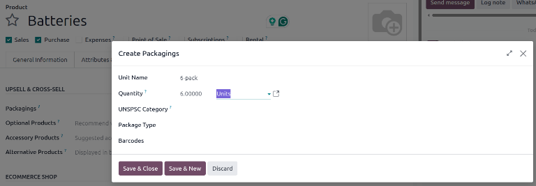

=========
Packaging
=========

.. |adjust| replace:: :icon:`oi-settings-adjust` :guilabel:`(additional options)`

In Odoo *Inventory*, *packaging* refers to disposable containers holding multiple units of a
specific product.

For example, different packages for cans of soda, such as a 6-pack, a 12-pack, or a case of 36,
**must** be configured on the individual product form. This is because packagings are product
specific, not generic.

.. tip::
   Packaging can be used in conjunction with Odoo :doc:`Barcode <../../../barcode/setup/software>`.
   When receiving products from suppliers, scanning the packaging barcode automatically adds the
   number of units in the packaging to the internal count of the product.

Configuration
=============

To use packagings, navigate to :menuselection:`Inventory app --> Configuration --> Settings`. Then,
under the :guilabel:`Products` heading, enable the :guilabel:`Units of Measure & Packagings`
feature, and click :guilabel:`Save`.

.. image:: packaging/enable-uom-packagings.png
   :alt: Enable packagings by selecting Units of Measure & Packagings.

.. _inventory/product_management/packaging-setup:

Create packaging
================

Packagings can be created directly on the product form, or from the :guilabel:`Product Packagings`
page.

From product form
-----------------

Create packagings on a product form by going to :menuselection:`Inventory app --> Products -->
Products`, and select the desired product.

To specify a sales packaging, open the :guilabel:`Sales` tab, then specify :guilabel:`Packagings` in
the :guilabel:`Upsell & Cross-Sell` section. Specify existing packagings or create new ones by
clicking :guilabel:`Create and edit`. When :guilabel:`Create and edit` is clicked, a
:guilabel:`Create Packagings` box opens, where information about the packaging can be specified:

Under the :guilabel:`Inventory` tab, scroll down to the :guilabel:`Packaging` section, and click
:guilabel:`Add a line`. In the table, fill out the following fields:

- :guilabel:`Unit Name` (required): name of packaging that appears on sales/purchase orders as a
  packaging option for the product.
- :guilabel:`Quantity` (required): amount of product in the packaging.
- :guilabel:`Reference Unit` (required): measurement unit for quantifying the product.
- :guilabel:`Package Type`: package type used to set custom dimensions and limits. See :ref:`package
  type <inventory/warehouses_storage/package-type>` to learn more.
- :guilabel:`Barcodes`: identifier for tracing packaging in stock moves or pickings, using the
  :ref:`Barcode app <barcode/operations/intro>`. Leave blank if not in use.

To specify a purchase packaging for a vendor, open the :guilabel:`Purchase` tab, then add a vendor.
Update the :guilabel:`Unit` field to specify a purchase packaging for that vendor. Specify existing
packagings here, or create new ones by clicking :guilabel:`Create and edit`. When :guilabel:`Create
and edit` is clicked, the :guilabel:`Create Unit` box opens. The fields in this box are the same as
for the :guilabel:`Create Packagings` box above.

.. example::
   To create a purchase packaging type for six units of the product, `Grape Soda`, begin by clicking
   :guilabel:`Add a line` in the :guilabel:`Purchase` tab. Specify a :guilabel:`Vendor`. Specify
   `6-pack` in the :guilabel:`Unit` field, then click :guilabel:`Create and edit`. In the
   :guilabel:`Create Unit` box, specify a quantity and reference unit (in this case, `6` `Units`),
   then click :guilabel:`Save`. Repeat this process for additional packagings.

   .. image:: packaging/create-purchase-packagings.png
      :alt: Create purchase packagings for product.

From units & packagings page
----------------------------

To view all packagings that have been created, go to :menuselection:`Inventory app --> Configuration
--> Units & Packagings`. Doing so reveals the :guilabel:`Units & Packagings` page with a complete
list of all units of measure and packagings that have been created for all products. Create new
packagings by clicking :guilabel:`New`.

.. example::
   Two soda products, `Grape Soda` and `Diet Coke`, have three types of packagings configured. On
   the :guilabel:`Product Packagings` page, each product can be sold as a `6-Pack` that contains 6
   products, as a `12-Pack` of 12 products, or as a `Case` of 32 products.

   .. image:: packaging/packagings.png
      :alt: List of different packagings for products.

Partial reservation
-------------------

After :ref:`completing the packaging setup <inventory/product_management/packaging-setup>`,
packagings can be reserved in full or partial quantities for outgoing shipments. Partial packaging
flexibility expedites order fulfillment by allowing the immediate shipment of available items, while
awaiting the rest.

To configure packaging reservation methods, go to :menuselection:`Inventory app --> Configuration
--> Products --> Categories`. Then, click :guilabel:`New`, or select the desired product category.

On the product category's form, in the :guilabel:`Logistics` section, :guilabel:`Reserve Packagings`
can be set to :guilabel:`Reserve Only Full Packagings` or :guilabel:`Reserve Partial Packagings`.

.. important::
   To see the :guilabel:`Reserve Packaging` field, the :guilabel:`Units of Measure & Packagings`
   feature **must** be enabled. To enable this feature, go to :menuselection:`Inventory app -->
   Configuration --> Settings`, scroll to the :guilabel:`Products` section, tick the
   :guilabel:`Units of Measure & Packagings` checkbox, and click :guilabel:`Save`.

.. image:: packaging/reserve-packaging.png
   :align: center
   :alt: Show Reserve Packagings field on the product categories page.

.. example::
   To better evaluate the options based on business needs, consider the following example:

   - a product is sold in twelve units per packaging.
   - an order demands two packagings.
   - there are only twenty-two units in stock.

   When :guilabel:`Reserve Only Full Packagings` is selected, only twelve units are reserved for the
   order.

   Conversely, when :guilabel:`Reserve Partial Packagings` is selected, twenty-two units are
   reserved for the order.

Apply packagings
================

When creating a sales order in the :menuselection:`Sales` app, specify the packagings that should be
used for the product. The chosen packaging is displayed on the :abbr:`SO (Sales Order)` under the
:guilabel:`Units` field.

.. example::
   18 cans of the product, `Grape Soda`, is packed using three 6-pack packagings.

   .. image:: packaging/packagings-sales-order.png
      :alt: Assign packagings on the Sales Order Line.
