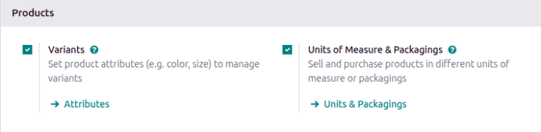
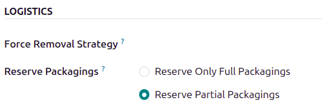

=========
Packaging
=========

In Odoo *Inventory*, *packaging* refers to disposable containers holding multiple units of a
specific product.

For example, different packages for cans of soda, such as a 6-pack, a 12-pack, or a case of 36,
**must** be configured on the individual product form. This is because packagings are product
specific, not generic.

.. tip::
   Packaging can be used in conjunction with Odoo :ref:`Barcode <inventory/barcode/software>`. When
   receiving products from suppliers, scanning the packaging barcode automatically adds the number
   of units in the packaging to the internal count of the product.

Configuration
=============

To use packagings, navigate to :menuselection:`Inventory app --> Configuration --> Settings`. Then,
under the :guilabel:`Products` heading, enable the :guilabel:`Product Packagings` feature, and click
:guilabel:`Save`.

.. _inventory/product_management/packaging-setup:

Create packaging
================

Packagings can be created directly on the product form, or from the :guilabel:`Product Packagings`
page.

From product form
-----------------

Create packagings on a product form by going to :menuselection:`Inventory app --> Products -->
Products`, and select the desired product.

Under the :guilabel:`Inventory` tab, scroll down to the :guilabel:`Packaging` section, and click
:guilabel:`Add a line`. In the table, fill out the following fields:

- :guilabel:`Packaging` (required): name of packaging that appears on sales/purchase orders as a
  packaging option for the product.
- :guilabel:`Contained quantity` (required): amount of product in the packaging.
- :guilabel:`Unit of Measure` (required): measurement unit for quantifying the product.
- :guilabel:`Sales`: check this option for packagings intended for use on sales orders.
- :guilabel:`Purchase`: check this option for packagings intended for use on purchase orders.

.. note::
   Access additional fields in the :guilabel:`Packaging` table below by clicking the
   :guilabel:`(sliders)` icon to the far-right of the column titles in the :guilabel:`Packaging`
   section, and selecting the desired options from the drop-down menu that appears.

   .. image:: packaging/slide.png
      :align: center
      :alt: Show the additional options menu's icon: sliders.

- :guilabel:`Barcode`: identifier for tracing packaging in stock moves or pickings, using the
  :ref:`Barcode app <barcode/operations/intro>`. Leave blank if not in use.
- :guilabel:`Company`: indicates the packaging is only available at the selected company. Leave
  blank to make the packaging available across all companies.

.. example::
   To create a packaging type for six units of the product, `Grape Soda`, begin by clicking
   :guilabel:`Add a line`. In the line, name the :guilabel:`Packaging` `6-pack`, and set the
   :guilabel:`Contained quantity` to `6`. Repeat this process for additional packagings.

   .. image:: packaging/create-product-packaging.png
      :align: center
      :alt: Create 6-pack case for product.

From product packagings page
----------------------------

To view all packagings that have been created, go to :menuselection:`Inventory app --> Configuration
--> Product Packagings`. Doing so reveals the :guilabel:`Product Packagings` page with a complete
list of all packagings that have been created for all products. Create new packagings by clicking
:guilabel:`New`.

.. example::
   Two soda products, `Grape Soda` and `Diet Coke`, have three types of packagings configured. On
   the :guilabel:`Product Packagings` page, each product can be sold as a `6-Pack` that contains 6
   products, as a `12-Pack` of 12 products, or as a `Case` of 32 products.

   .. image:: packaging/packagings.png
      :align: center
      :alt: List of different packagings for products.

Partial reservation
-------------------

After :ref:`completing the packaging setup <inventory/product_management/packaging-setup>`,
packagings can be reserved in full or partial quantities for outgoing shipments. Partial packaging
flexibility expedites order fulfillment by allowing the immediate shipment of available items, while
awaiting the rest.

To configure packaging reservation methods, go to :menuselection:`Inventory app --> Configuration
--> Product Categories`. Then, click :guilabel:`New`, or select the desired product category.

On the product category's form, in the :guilabel:`Logistics` section, :guilabel:`Reserve Packagings`
can be set to :guilabel:`Reserve Only Full Packagings` or :guilabel:`Reserve Partial Packagings`.

.. important::
   To see the :guilabel:`Reserve Packaging` field, the :guilabel:`Product Packaging` feature
   **must** be enabled. To enable this feature, go to :menuselection:`Inventory app -->
   Configuration --> Settings`, scroll to the :guilabel:`Products` section, tick the
   :guilabel:`Product Packagings` checkbox, and click :guilabel:`Save`.

.. example::
   To better evaluate the options based on business needs, consider the following example:

   - a product is sold in twelve units per packaging.
   - an order demands two packagings.
   - there are only twenty-two units in stock.

   When :guilabel:`Reserve Only Full Packagings` is selected, only twelve units are reserved for the
   order.

   Conversely, when :guilabel:`Reserve Partial Packagings` is selected, twenty-two units are
   reserved for the order.

Apply packagings
================

When creating a sales order in the :menuselection:`Sales` app, specify the packagings that should be
used for the product. The chosen packaging is displayed on the :abbr:`SO (Sales Order)` under the
:guilabel:`Packaging` field.

.. example::
   18 cans of the product, `Grape Soda`, is packed using three 6-pack packagings.

   .. image:: packaging/packagings-sales-order.png
      :align: center
      :alt: Assign packagings on the Sales Order Line.

