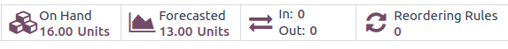
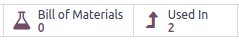
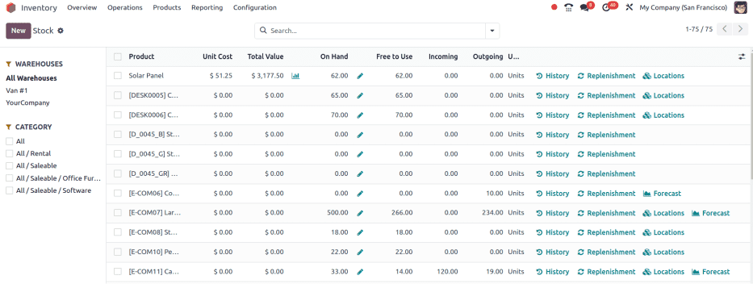
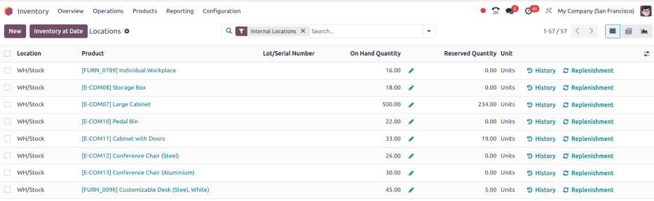

============
Product type
============

.. |BOM| replace:: :abbr:`BoM (Bill of Materials)`

Define *product types* in Odoo to track products in varying levels of detail.

Classify products as *storable* to track stock counts, allowing users to trigger :doc:`reordering
rules <../../warehouses_storage/replenishment/reordering_rules>` for generating purchase orders.
*Consumable* products are assumed to always be in stock, and *service* products are performed and
served by the business.

.. seealso::
   `Odoo Tutorials: Product Type <https://www.youtube.com/watch?v=l6j0ZkP5mLM>`_

Set product type
================

To set a product type, go to :menuselection:`Inventory app --> Products --> Products`, and select
the desired product from the list.

On the product form, in the :guilabel:`Product Type` field, select:

- :guilabel:`Storable Product` for products tracked with stock counts. Only storable products can
  trigger reordering rules for generating purchase orders;

   .. tip::
      Choose :guilabel:`Storable Product` if it is necessary to track a product's stock at various
      locations, inventory valuations, or if the product has lots and/or serial numbers.

- :guilabel:`Consumable` for products that are always assumed to be in stock, whose quantities are
  not necessary to track or forecast (e.g. nails, toilet paper, coffee, etc.). Consumables are
  replaceable and essential, but exact counts are unnecessary; or
- :guilabel:`Service` for sellable service products that are performed, and not tracked with stock
  counts (i.e. maintenance, installation, or repair services).

  .. image:: type/product-form.png
    :align: center
    :alt: Set a product type on the product form.

.. note::
   The product types listed above are part of the standard *Inventory* app. For access to the fields
   below, :ref:`install <general/install>` the corresponding apps **in addition** to *Inventory*.

- :guilabel:`Booking Fees`: charge a fee for booking appointments through the *Appointments* app.
  Requires the installation of the *Calendar* app and *Pay to Book* (`appointment_account_payment`)
  module
- :guilabel:`Combo`: create discounted products sold in a bundle. Requires the installation of the
  *PoS* app.
- :guilabel:`Event Ticket`: sold to attendees wanting to go to an event. Requires the installation
  of the *Events* app
- :guilabel:`Event Booth`: sold to partners or sponsors to set up a booth at an event. Requires the
  installation of the *Events* app
- :guilabel:`Course`: sell access to an educational course. Requires the installation of the
  *eLearning* app

Compare types
=============

Below is a summary of how each product type affects common *Inventory* operations, like transfers,
reordering rules, and the forecasted report. Click the chart item with an asterisk (*) to navigate
to detailed sections.

.. list-table::
   :header-rows: 1
   :stub-columns: 1

   * - Product type
     - Storable
     - Consumable
     - Service
   * - Physical product
     - Yes
     - Yes
     - No
   * - On-hand quantity
     - :ref:`Yes* <inventory/product_management/on-hand-store>`
     - :ref:`Yes* <inventory/product_management/on-hand-con>`
     - No
   * - :doc:`Inventory valuation
       <../../warehouses_storage/inventory_valuation/using_inventory_valuation>`
     - Yes
     - No
     - No
   * - Create transfer
     - :ref:`Yes* <inventory/product_management/transfer-store>`
     - :ref:`Yes* <inventory/product_management/transfer-con>`
     - :ref:`No* <inventory/product_management/transfer-serv>`
   * - :doc:`Lot/serial number tracking <../product_tracking>`
     - Yes
     - No
     - No
   * - Create purchase order
     - Yes
     - :ref:`Yes* <inventory/product_management/po>`
     - No
   * - Can be manufactured or subcontracted
     - :ref:`Yes* <inventory/product_management/manufacture>`
     - :ref:`Yes* <inventory/product_management/manufacture>`
     - No
   * - Can be in a kit
     - Yes
     - Yes
     - No
   * - Placed in package
     - Yes
     - :ref:`Yes* <inventory/product_management/package>`
     - No
   * - Appears on Inventory report
     - :ref:`Yes <inventory/product_management/report>`
     - No
     - No

.. _inventory/product_management/on-hand-store:

On-hand quantity
----------------

A storable product's on-hand and forecasted quantities, based on incoming and outgoing orders, are
reflected on the product form, accessed by going to :menuselection:`Inventory app --> Products -->
Products`, and selecting the desired product.

   Current and forecasted quantities are displayed in the **On Hand** and **Forecasted** smart
   buttons on the product form.

.. _inventory/product_management/on-hand-con:

On the other hand, consumable products are regarded as always available, and they **cannot** be
managed using reordering rules or lot/serial numbers.

.. _inventory/product_management/transfer-store:

Create transfer
---------------

*Transfers* are any warehouse operation, such as receipts, internal or batch transfers, or
deliveries.

When creating a transfer for storable products in the *Inventory* app, transfers modify the on-hand
quantity at each location.

For example, transferring five units from the internal location `WH/Stock` to `WH/Packing Zone`
decreases the recorded quantity at `WH/Stock` and increases it at `WH/Packing Zone`.

.. _inventory/product_management/transfer-con:

For consumable products, transfers can be created, but exact quantities at each storage location are
not tracked.

.. _inventory/product_management/transfer-serv:

Service products cannot be included in transfers, but these products can be `linked to projects and
tasks for deadline tracking <https://www.youtube.com/watch?v=fix2LGkv13c>`_.

.. _inventory/product_management/po:

Create purchase order
---------------------

Both storable and consumable products can be included in a request for quotation in the *Purchase*
app.

However, when receiving consumable products, their on-hand quantity does not change upon validating
the receipt (e.g. `WH/IN`).

.. _inventory/product_management/manufacture:

Manufacture or subcontract
--------------------------

Storable and consumable products can be manufactured, subcontracted, or included in a bill of
materials (BoM).

   When the **Bill of Materials** and **Used In** smart buttons are visible on the product form,
   this indicates the product can be manufactured or used as a component of a |BOM|.

.. _inventory/product_management/package:

Packages
--------

Both storable and consumable products can be placed in :doc:`packages <package>`.

However, for consumable products, the quantity is not tracked, and the product is not listed in the
package's :guilabel:`Contents`, accessed by going to :menuselection:`Inventory app --> Products -->
Packages`, and selecting the desired package.

.. figure:: type/package-content.png
   :align: center
   :alt: Show Packages page, containing the package contents list.

   A consumable product was placed in the package, but the **Content** section does not list it.

If the *Move Entire Package* feature is enabled, moving a package updates the location of the
contained storable products. However, the location of consumable products are not updated.

.. _inventory/product_management/report:

Inventory report
----------------

**Only** storable products appear on the following reports.

The *stock report* is a comprehensive list of all on-hand, unreserved, incoming, and outgoing
storable products. The report is only available to users with :doc:`administrator access
<../../../../general/users/access_rights>`, and is found by navigating to :menuselection:`Inventory
app --> Reporting --> Stock`.

The *location report* is a breakdown of each location (internal, external, or virtual) and the
on-hand and reserved quantity of each storable product. The report is only available with the
*Storage Location* feature activated (:menuselection:`Inventory app --> Configuration -->
Settings`), and to users with :doc:`administrator access <../../../../general/users/access_rights>`.

Navigate to the location report by going to :menuselection:`Inventory app --> Reporting -->
Locations`.

