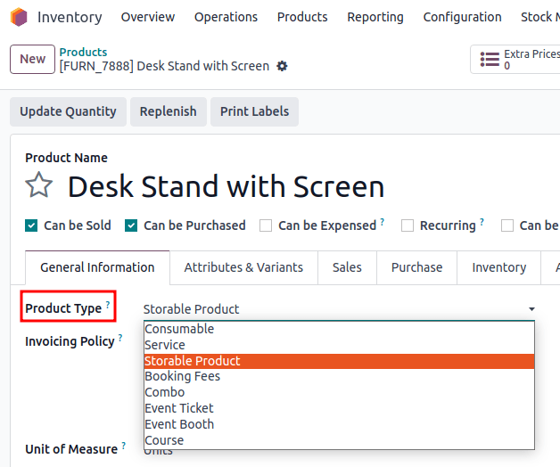
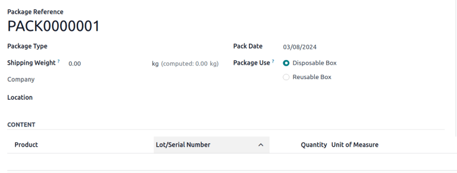

============
Product type
============

.. |BOM| replace:: :abbr:`BoM (Bill of Materials)`

In Odoo, goods and services are both set up as *products*. When setting up a new product, there are
several fields that should be carefully chosen, as they determine how to invoice and track a
business' goods or services.

To configure an existing product, go to :menuselection:`Inventory app --> Products --> Products`,
and select the desired product from the list. Alternatively, from the :guilabel:`Products` menu,
click :guilabel:`New` to create a new product.

.. seealso::
   `Odoo Tutorials: Product Type <https://www.youtube.com/watch?v=l6j0ZkP5mLM>`_

.. _inventory/product_management/for-sale-or-purchase:

For sale vs. purchase
=====================

Goods and services can be designated as those that can be bought, sold, or both. On the product
form, tick the :guilabel:`Sales` checkbox if a product can be *sold* to a customer (e.g. finished
goods). Tick :guilabel:`Purchase` if the product can be *purchased* (e.g. raw materials).

.. example::
   If a resale clothing shop buys discounted denim jackets and sells them at a higher cost to the
   end consumer, the `Jacket` product form might have *both* the :guilabel:`Sales` and
   :guilabel:`Purchase` checkbox ticked.

   On the other hand, say the store occasionally sews new jackets using denim and thread as
   raw materials. In the `Denim` and `Thread` product forms, only :guilabel:`Purchase` should be
   ticked, whereas the `Handmade Jacket` product form would only tick :guilabel:`Sales`.

Goods vs. services
==================

When configuring a product, a :guilabel:`Product Type` needs to be selected on the
:guilabel:`General Information` tab of a product form. Each product type impacts different
operations in other Odoo applications, such as **Sales** and **Purchase**, and should be chosen
carefully.

- :guilabel:`Goods`: a tangible, material object (e.g. anything from a hamburger to a house)
- :guilabel:`Service`: an intangible, immaterial offering (e.g., a repair, a haircut, call center
  assistance)
- :guilabel:`Combo`: any mix of goods and services (e.g. a new car (*good*) with an oil change
  included (*service*))

.. note::
  Due to their immaterial nature, services are not trackable in Odoo's **Inventory** application.

.. _inventory/product_management/manufacture:

Configure goods
===============

Selecting :guilabel:`Goods` as the :guilabel:`Product Type` automatically triggers the appearance of
a few fields and tabs in the product form:

- :guilabel:`Inventory` tab: From here,
  :doc:`purchasing and manufacturing routes <../../shipping_receiving/daily_operations/use_routes>`
  and product logistics, such as product weight and customer lead time, can be specified.
- :ref:`Invoicing Policy <inventory/product_management/invoicing-policy>` field: This field
  determines at what point in the sales process a customer is invoiced.

  .. important::
     The :guilabel:`Invoicing Policy` field **only** appears if the **Sales** app is installed.

- :ref:`Track Inventory <inventory/product_management/tracking-inventory>` field: This checkbox
  determines whether Odoo tracks inventory for this product.
- Smart buttons: Some smart buttons appear above the form when :guilabel:`Goods` is selected;
  others show upon selecting a :guilabel:`Track Inventory` method. For example,
  :guilabel:`On Hand` and :guilabel:`Forecasted` display when :guilabel:`Track Inventory` is
  ticked. In general, most smart buttons on a product form link to :ref:`inventory operations
  <inventory/product_management/inventory-ops-by-product-type>`.

.. _inventory/product_management/invoicing-policy:

Invoicing policy
----------------

The :guilabel:`Invoicing policy` field only shows on the product form if a product is for sale (in
other words, if :guilabel:`Sales` is ticked, and the **Sales** app is installed).

When configuring a product for sale, it is necessary to choose an
:doc:`invoicing policy <../../../../sales/sales/invoicing/invoicing_policy>`. When an invoicing
policy of :guilabel:`Ordered quantities` is selected, customers are invoiced once the sales order
is confirmed. When :guilabel:`Delivered quantities` is selected, customers are invoiced once the
delivery is completed.

.. _inventory/product_management/tracking-inventory:

Tracked vs. untracked goods
---------------------------

The :guilabel:`Track Inventory` field on the product form determines a lot of Odoo's **Inventory**
operations.

*Tracked* products are those for which stock and inventory are maintained. Examples include finished
goods and, often, the raw materials or components needed to make them.

When :guilabel:`Track Inventory` is ticked, a drop-down menu appears, offering for inventory to be
tracked one of three ways: :guilabel:`By Unique Serial Number`, :guilabel:`By Lots`, or
:guilabel:`By Quantity`.

.. image:: type/tracked.png
   :alt: Configure a tracked good.

*Untracked* products (sometimes referred to as *non-inventory* products) are typically consumed in a
short period of time, meaning that stock/inventory does *not* need to be maintained. Non-inventory
products are often essential, but exact counts are unnecessary. Examples include: office supplies,
packaging materials, or items used in production that do not need to be individually tracked.

.. tip::
   Tick the :guilabel:`Track Inventory` checkbox if it is necessary to track a product's stock at
   various locations, for inventory valuation, with lots and/or serial numbers, or when using
   reordering rules.

.. seealso::
   :doc:`Tracking storable products using lot and serial numbers <../product_tracking>`

.. _inventory/product_management/inventory-ops-by-product-type:

Inventory operations by product type
------------------------------------

:ref:`Whether a good is tracked or untracked <inventory/product_management/tracking-inventory>`
affects common **Inventory** operations, like transfers and reordering rules.

The table below summarizes which operations (and smart buttons) are enabled for tracked vs.
untracked goods. Click highlighted chart items to navigate to detailed sections and related
documents.

.. list-table::
   :header-rows: 1
   :stub-columns: 1

   * - Inventory operation
     - Tracked
     - Untracked
   * - :ref:`Show on-hand quantity <inventory/product_management/on-hand>`
     - Yes
     - No
   * - :ref:`Show forecasted quantity <inventory/product_management/on-hand>`
     - Yes
     - No
   * - :ref:`Use reordering rules <inventory/product_management/replenishment>`
     - Yes
     - No
   * - :ref:`Can be included in a purchase order <inventory/product_management/po>`
     - Yes
     - Yes
   * - :ref:`Use putaway rules <inventory/product_management/putaway>`
     - Yes
     - No
   * - :ref:`Can be manufactured, subcontracted, or used in another good's BoM
       <inventory/product_management/manufacturing>`
     - Yes
     - Yes
   * - :doc:`Use inventory adjustments <../../warehouses_storage/inventory_management/count_products>`
     - Yes
     - No
   * - :doc:`Use inventory valuation <../inventory_valuation/using_inventory_valuation>`
     - Yes
     - No
   * - :ref:`Create transfer <inventory/product_management/transfer-store>`
     - Yes
     - Yes
   * - :doc:`Use lot/serial number tracking <../product_tracking>`
     - Yes
     - No
   * - :doc:`Can be placed in a kit <../../../manufacturing/advanced_configuration/kit_shipping>`
     - Yes
     - Yes
   * - :ref:`Can be placed in a package <inventory/product_management/package>`
     - Yes
     - Yes
   * - :ref:`Appears on inventory reports <inventory/product_management/report>`
     - Yes
     - No

Inventory
~~~~~~~~~

.. _inventory/product_management/on-hand:

On-hand and forecasted quantities
*********************************

A tracked product's on-hand and forecasted quantities, based on incoming and outgoing orders, are
reflected on the product form with two smart buttons:

- :icon:`fa-cubes` :guilabel:`On-Hand Quantity`: This represents the number of units currently
  available in inventory. Click the button to view or add stock levels for a tracked product.
- :icon:`fa-area-chart` :guilabel:`Forecasted`: This represents the number of units *expected* to be
  available in inventory after all orders are taken into account. In other words,
  :math:`\text{forecasted} = \text{on hand quantity} + \text{incoming shipments} - \text{outgoing shipments}`.
  Click the button to view the :guilabel:`Forecasted Report`.

On the other hand, untracked products are regarded as *always* available. Consequently,
:guilabel:`On-Hand Quantity` is not tracked, and there is no :guilabel:`Forecasted` quantity
available.

.. _inventory/product_management/putaway:

Putaway rules and storage
*************************

Both tracked and untracked goods can optimize storage using:

- :icon:`fa-random` :doc:`Putaway Rules <../../shipping_receiving/daily_operations/putaway>`:
  This represents putaway rules that apply to a good, such as where to store it when a new shipment
  arrives.
- :icon:`fa-cubes`
  :doc:`Storage Capacities <../../shipping_receiving/daily_operations/storage_category>`:
  This represents any storage capacity limitations specified for this good. For example, a warehouse
  may require that only ten (or less) sofas be stored there at any given time, due to their large
  size.

.. _inventory/product_management/replenishment:

Replenishment
*************

Reordering rules
^^^^^^^^^^^^^^^^

Only tracked products can trigger
:doc:`reordering rules <../../warehouses_storage/replenishment/reordering_rules>` to generate
purchase orders. Untracked goods *cannot* be managed using reordering rules.

Reordering rules can be configured directly on the product form via the
:icon:`fa-refresh` :guilabel:`(refresh)` icon.

.. note::
   If reordering rules already exist on a product, Odoo re-labels this button to
   :guilabel:`Min / Max`, to show the minimum and maximum number of units that must be in stock.

.. _inventory/product_management/po:

Create purchase orders
^^^^^^^^^^^^^^^^^^^^^^

Both tracked and untracked products can be included in a request for quotation in the **Purchase**
app. However, when receiving untracked products, their on-hand quantity does not change upon
validating the receipt (`WH/IN`).

Replenish smart button
^^^^^^^^^^^^^^^^^^^^^^

The :guilabel:`Replenish` smart button allows all goods to be restocked directly from the product
form, according to the *Preferred Route*.

.. seealso::
   :doc:`Replenishment <../../warehouses_storage/replenishment>`
   `Odoo Tutorials: Replenishment Methods for Manufacturing
   <https://www.youtube.com/watch?v=vtjeMGcG8aM>`_

.. _inventory/product_management/manufacturing:

Manufacturing
~~~~~~~~~~~~~

Both tracked and untracked products can be manufactured,
:doc:`subcontracted <../../../manufacturing/subcontracting>`, or included in another product's
:doc:`bill of materials (BoM) <../../../manufacturing/basic_setup/bill_configuration>`.

.. _inventory/product_management/BoM:

On the product form for a tracked or untracked good, there are several smart buttons that may
appear for manufacturing operations:

- :icon:`fa-flask` :guilabel:`Bill of Materials`: This shows the BoMs used to make this product.
- :icon:`fa-level-up` :guilabel:`Used In`: This shows other goods that include this product in their
  BoM.

.. _inventory/product_management/transfer-store:

Transfer goods
~~~~~~~~~~~~~~

*Transfers* are warehouse operations that involve the movement of goods. Examples of transfers
include :doc:`deliveries and receipts
<../../shipping_receiving/daily_operations/receipts_delivery_one_step>`, as well as
:doc:`internal transfers <../../warehouses_storage/replenishment/resupply_warehouses>` between
warehouses.

When creating a transfer for tracked products in the **Inventory** app, transfers modify the on-hand
quantity at each location. For example, transferring five units from the internal location
`WH/Stock` to `WH/Packing Zone` decreases the recorded quantity at `WH/Stock` and increases it at
`WH/Packing Zone`.

For untracked products, transfers can be created, but exact quantities at each storage location are
not tracked.

.. _inventory/product_management/package:

Packages
~~~~~~~~

Both tracked and untracked (non-inventory), products can be placed in :doc:`packages <package>`.

However, for non-inventory products, the quantity is not tracked, and the product is not listed in
the package's :guilabel:`Contents` (which can be accessed by going to :menuselection:`Inventory app
--> Products --> Packages`, and selecting the desired package).

   An untracked product was placed in the package, but the **Content** section does not list it.

Additionally, if the *Move Entire Packages* feature is enabled, moving a package updates the
location of the contained tracked products but not the contained untracked products. To enable this
feature, navigate to :menuselection:`Inventory app --> Configuration --> Operations Types`, select
any operation, and tick the :guilabel:`Move Entire Packages` checkbox.

.. _inventory/product_management/report:

Inventory reports
~~~~~~~~~~~~~~~~~

**Only** tracked products appear on the following reports.

.. important::
   These reports are only available to users with
   :doc:`administrator access <../../../../general/users/access_rights>`.

- :doc:`Stock report <../../warehouses_storage/reporting/stock>`: This report provides a
  comprehensive list of all on-hand, unreserved, incoming, and outgoing tracked inventory. To access
  the report, go to :menuselection:`Inventory app --> Reporting --> Stock`.
- :doc:`Location report  <../../warehouses_storage/reporting/locations>`: This report shows a
  breakdown of which tracked products are held at each location (internal, external, or virtual).
  The report is only available with the *Storage Location* feature activated
  (:menuselection:`Inventory app --> Configuration --> Settings`). To access it, go to
  :menuselection:`Inventory app --> Reporting --> Locations`.
- :doc:`Moves History report <../../warehouses_storage/reporting/moves_history>`: This report
  summarizes where and when this good has moved in/out of stock. To access the report, go to
  :menuselection:`Inventory app --> Reporting --> Moves History`. Alternatively, click the
  :icon:`fa-exchange` :guilabel:`In / Out` smart button on a product form to filter the report
  on that product's specific moves history.
- :guilabel:`Moves Analysis`: This report provides a pivot table view of inventory transfers by
  operation type.
- :ref:`Stock Valuation report <inventory/management/reporting/valuation-report>`: A detailed record
  of the monetary value of all tracked inventory.

