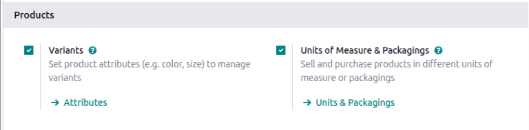
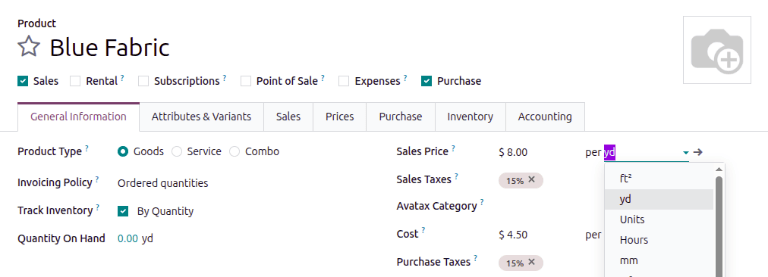
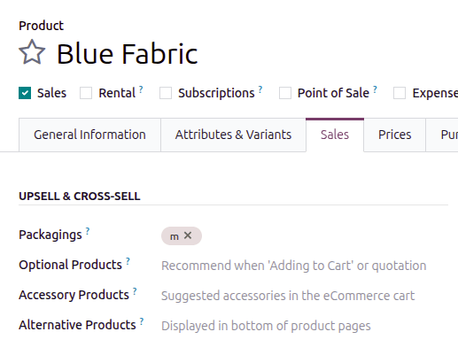
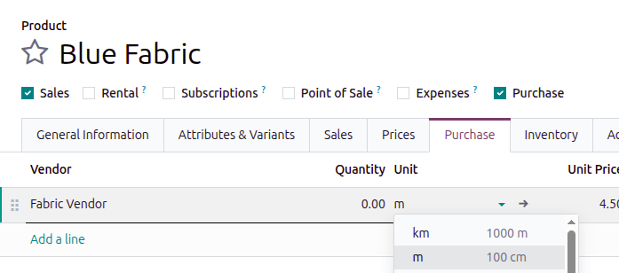
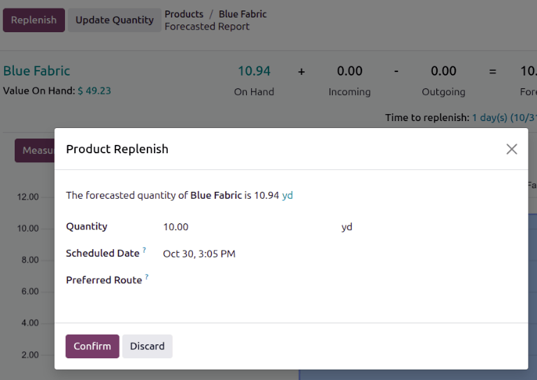

================
Units of measure
================

.. |UOM| replace:: :abbr:`UoM (Unit of Measure)`
.. |PO| replace:: :abbr:`PO (Purchase Order)`
.. |POs| replace:: :abbr:`POs (Purchase Orders)`
.. |RFQ| replace:: :abbr:`RFQ (Request for Quotation)`
.. |SO| replace:: :abbr:`SO (Sales Order)`

In some cases, handling products in different units of measure is necessary. For example, a business
can buy products from a country that uses the metric system, and then sell those products in a
country that uses the imperial system. In that case, the business needs to convert the units.

Another case for unit conversion is when a business buys products in a big pack from a supplier, and
then sells those products in individual units.

Odoo can be set up to use different *units of measure (UoM)* for one product.

Configuration
=============

To use different units of measure in Odoo, first go to :menuselection:`Inventory app -->
Configuration --> Settings`, and under the :guilabel:`Products` section, activate the
:guilabel:`Units of Measure & Packagings` setting. Then, click :guilabel:`Save`.

Configure units of measure
==========================

To set units of measure on a product, first go to :menuselection:`Inventory app --> Products -->
Products` and select a product to open its product form page.

Inventory unit of measure
-------------------------

The inventory unit of measure specifies how inventory is measured. For example, track inventory of
blue fabric in yards. This unit of measure is also used to track internal transfers.

To specify what unit the product is inventoried in, update the second field of the :guilabel:`Sales
Price` or :guilabel:`Cost` fields.

.. important::
   The :guilabel:`Sales Price` and :guilabel:`Cost` units of measure cannot be updated
   independently of each other. When one unit of measure is updated, the other unit of measure
   automatically updates to use the same unit of measure.

Sales unit of measure (packagings)
----------------------------------

Units of measure that the product is sold in are considered packagings. To define these packagings,
open the :guilabel:`Sales` tab of the product, and then in the :guilabel:`Upsell & Cross-Sell`
section, add a packaging to the :guilabel:`Packagings` field. Multiple packagings can be specified
for each product.

.. seealso::
   :doc:`Packaging <packaging>`

Purchase unit of measure
------------------------

Units of measure that the product is purchased in are defined in the :guilabel:`Purchase` tab of the
product. Purchase orders can be created in these units of measure after they are defined in the
vendor price list.

.. _inventory/product_replenishment/unit-conversion:

Unit conversion
===============

Odoo automatically converts unit measurements when products have different :abbr:`UoMs (Units of
Measure)` and purchase :abbr:`UoMs (Units of Measure)`.

This occurs in various scenarios, including:

#. :ref:`Vendor orders <inventory/product_replenishment/buy-in-uom>`: purchase |UOM| on purchase
   orders (POs) converts to |UOM| on internal warehouse documents
#. :ref:`Automatic replenishment <inventory/product_replenishment/replenish>`: generates |POs| when
   the stock levels of a product (tracked in |UOM|) dips below a certain level. But, the |POs| are
   created using the purchase |UOM|
#. :ref:`Sell products <inventory/product_replenishment/sell-in-uom>`: if a different |UOM| is used
   on the sales order (SO), the quantity is converted to the warehouse's preferred |UOM| on the
   delivery order

.. _inventory/product_replenishment/buy-in-uom:

Buy products in the purchase UoM
--------------------------------

When creating a new request for quotation (RFQ) in the *Purchase* app, Odoo pulls the unit that the
vendor prefers to use, defined in the :guilabel:`Unit` field of the vendor line in the
:guilabel:`Purchase` tab of the product. The unit the vendor prefers **can** be different from the
unit your company prefers to use. If needed, manually edit the :guilabel:`Unit` value on
the |RFQ|.

After the |RFQ| is confirmed into a |PO|, click the :guilabel:`Receipt` smart button at the top of
the |PO|.

Odoo automatically converts the purchase unit of measure into the product's sales/inventory unit of
measure, so the :guilabel:`Demand` column of the delivery receipt shows the converted quantity.

.. example::
   When the product's purchase :guilabel:`Unit` is `m` (meters), and its inventory unit of
   measure is `yard`, the |PO| shows the quantity in meters, and the receipt (and other
   internal warehouse documents) shows the quantity in yards.

   .. figure:: uom/on-po.png
      :alt: Image of a purchase order that is using the purchase unit of measure.

      An order of 10 quantities is placed using the purchase "Unit": `m`.

   .. figure:: uom/on-receipt.png
      :alt: Image of receipt displaying the unit of measure.

      Upon warehouse receipt, the recorded quantities are in the internal "Unit": `yards`.

.. _inventory/product_replenishment/replenish:

Replenishment
-------------

A request for quotation for a product can also be generated directly from the product's
:guilabel:`Forecasted Report` using the :guilabel:`Replenish` button. To open the Forecasted Report,
click the :guilabel:`Forecasted` smart button on the product form.

After clicking :guilabel:`Replenish`, a :guilabel:`Product Replenish` box pops up. The purchase unit
of measure can be manually edited in the :guilabel:`Quantity` field, if needed. Then, click
:guilabel:`Confirm` to create the |RFQ|.

.. important::
   A |PO| can **only** be automatically generated if at least **one** vendor is listed in the
   product form's :guilabel:`Purchase` tab.

Navigate to the created |PO| by scrolling down to the :guilabel:`Forecasted Inventory` section, and
in the :guilabel:`Requests for quotation` line, click the |RFQ| reference number to open the draft
|RFQ|. If necessary, the purchase |UOM| can be edited directly on the |PO|.

.. _inventory/product_replenishment/sell-in-uom:

Sell in a different UoM
-----------------------

When creating a new quotation in the *Sales* app, Odoo automatically uses the product's specified
unit of measure. If needed, the :guilabel:`Unit` can be manually edited on the quotation.

After the quotation is sent to the customer, and confirmed into a sales order (SO), click the
:guilabel:`Delivery` smart button at the top of the |SO|. Odoo automatically converts the unit of
measure into the product's inventory unit of measure, so the :guilabel:`Demand` column of the
delivery shows the converted quantity.

.. example::
   When the product's sales :guilabel:`Unit` is `m` (meters), and its inventory unit of
   measure is `yard`, the |SO| shows the quantity in meters, and the delivery (and other
   internal warehouse documents) shows the quantity in yards.

   .. figure:: uom/on-so.png
      :alt: Sales order that is using the sales unit of measure.

      An order of 5 quantities is placed using the sales "Unit": `m`.

   .. figure:: uom/on-delivery.png
      :alt: Delivery displaying the inventory unit of measure.

      Upon warehouse delivery, the recorded quantities are in the internal "Unit":
      `yards`.

Create custom units of measure
==============================

Create custom units of measure by going to :menuselection:`Inventory app --> Configuration --> Units
& Packagings`. Each unit of measure can also use a reference unit to convert between different units
of measure.

To create a new unit, click the :guilabel:`New` button. Specify a unit name. If you want to convert
between units, specify a quantity and a reference unit of measure to convert between. If applicable,
enter a :guilabel:`UNSPSC Category`, which is a globally recognized `code managed by
GS1 <https://www.unspsc.org/>`_, that **must** be purchased in order to use.

.. example::
   You will be purchasing fabric in terms of yards or meters. Specify that one yard is equal to
   `0.9144` of its reference unit, `m`, in the :guilabel:`Quantity` field.

   .. figure:: uom/custom-uom.png
      :alt: Specify a reference unit in the "Quantity" field.
