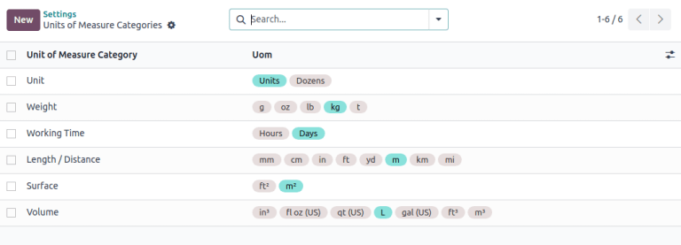

================
Units of measure
================

.. |UOM| replace:: :abbr:`UoM (Unit of Measure)`
.. |PO| replace:: :abbr:`PO (Purchase Order)`
.. |POs| replace:: :abbr:`POs (Purchase Orders)`
.. |RFQ| replace:: :abbr:`RFQ (Request for Quotation)`
.. |SO| replace:: :abbr:`SO (Sales Order)`

In some cases, handling products in different units of measure is necessary. For example, a business
can buy products from a country that uses the metric system, and then sell those products in a
country that uses the imperial system. In that case, the business needs to convert the units.

Another case for unit conversion is when a business buys products in a big pack from a supplier, and
then sells those products in individual units.

Odoo can be set up to use different *units of measure (UoM)* for one product.

Configuration
=============

To use different units of measure in Odoo, first go to :menuselection:`Inventory app -->
Configuration --> Settings`, and under the :guilabel:`Products` section, activate the
:guilabel:`Units of Measure` setting. Then, click :guilabel:`Save`.

.. image:: uom/uom-enable-setting.png
   :align: center
   :alt: Enable Units of Measure in the Inventory settings.

Units of measure categories
===========================

After enabling the *Units of Measure* setting, view the default units of measure categories in
:menuselection:`Inventory app --> Configuration --> UoM Categories`. The category is important for
unit conversion; Odoo can convert a product's units from one unit to another **only** if both units
belong to the same category.

Each units of measure category has a reference unit. The reference unit is highlighted in blue in
the :guilabel:`Uom` column of the :guilabel:`Units of Measure Categories` page. Odoo uses the
reference unit as a base for any new units.

To create a new unit, first select the correct category from the :guilabel:`Units of Measure
Categories` page. For example, to sell a product in a box of six units, click the :guilabel:`Unit`
category line. Then, on the category page that appears, click :guilabel:`Add a line` in the
:guilabel:`Units of Measure` tab. Then, in the :guilabel:`Unit of Measure` field, title the new
unit, such as `Box of 6`, then in the :guilabel:`Type` field, select the appropriate size reference,
such as :guilabel:`Bigger than the reference Unit of Measure`.

If applicable, enter a :guilabel:`UNSPSC Category`, which is a globally recognized `code managed by
GS1 <https://www.unspsc.org/>`_, that **must** be purchased in order to use.

In the :guilabel:`Ratio` field, enter how many individual units are in the new |UOM|, such as
`6.00000` when using the example of the `6-Pack` (since a box of six is six times *bigger* than the
reference unit, `1.00000`).

.. image:: uom/convert-products-by-unit.png
   :align: center
   :alt: Convert products from one unit to another as long as they belong to the same category.

Specify a product's units of measure
====================================

To set units of measure on a product, first go to :menuselection:`Inventory app --> Products -->
Products` and select a product to open its product form page.

In the :guilabel:`General Information` tab, edit the :guilabel:`Unit of Measure` field to specify
the unit of measure that the product is sold in. The specified unit is also the unit used to keep
track of the product's inventory and internal transfers.

Edit the :guilabel:`Purchase UoM` field to specify the unit of measure that the product is purchased
in.

.. _inventory/product_replenishment/unit-conversion:

Unit conversion
===============

Odoo automatically converts unit measurements when products have different :abbr:`UoMs (Units of
Measure)` and purchase :abbr:`UoMs (Units of Measure)`.

This occurs in various scenarios, including:

#. :ref:`Vendor orders <inventory/product_replenishment/buy-in-uom>`: purchase |UOM| on purchase
   orders (POs) converts to |UOM| on internal warehouse documents
#. :ref:`Automatic replenishment <inventory/product_replenishment/replenish>`: generates |POs| when
   the stock levels of a product (tracked in |UOM|) dips below a certain level. But, the |POs| are
   created using the purchase |UOM|
#. :ref:`Sell products <inventory/product_replenishment/sell-in-uom>`: if a different |UOM| is used
   on the sales order (SO), the quantity is converted to the warehouse's preferred |UOM| on the
   delivery order

.. _inventory/product_replenishment/buy-in-uom:

Buy products in the purchase UoM
--------------------------------

When creating a new request for quotation (RFQ) in the *Purchase* app, Odoo automatically uses the
product's specified purchase unit of measure. If needed, manually edit the :guilabel:`UoM` value on
the |RFQ|.

After the |RFQ| is confirmed into a |PO|, click the :guilabel:`Receipt` smart button at the top of
the |PO|.

Odoo automatically converts the purchase unit of measure into the product's sales/inventory unit of
measure, so the :guilabel:`Demand` column of the delivery receipt shows the converted quantity.

.. example::
   When the product's purchase :guilabel:`UoM` is `Box of 6`, and its sales/inventory unit of
   measure is `Units`, the |PO| shows the quantity in boxes of six, and the receipt (and other
   internal warehouse documents) shows the quantity in units.

   .. figure:: uom/on-po.png
      :align: center
      :alt: Image of a purchase order that is using the purchase unit of measure.

      An order of three quantities is placed using the purchase "UoM": `Box of 6`.

   .. figure:: uom/on-receipt.png
      :align: center
      :alt: Image of receipt displaying the unit of measure.

      Upon warehouse receipt, the recorded quantities are in the internal "Unit of Measure":
      `Units`.

.. _inventory/product_replenishment/replenish:

Replenishment
-------------

A request for quotation for a product can also be generated directly from the product form using
the :guilabel:`Replenish` button.

After clicking :guilabel:`Replenish`, a replenish assistant box pops up. The purchase unit of
measure can be manually edited in the :guilabel:`Quantity` field, if needed. Then, click
:guilabel:`Confirm` to create the |RFQ|.

.. important::
   A |PO| can **only** be automatically generated if at least **one** vendor is listed in the
   product form's :guilabel:`Purchase` tab.

Navigate to the created |PO| by clicking the :guilabel:`Forecasted` smart button on the product
form. Scroll down to the :guilabel:`Forecasted Inventory` section, and in the :guilabel:`Requests
for quotation` line, click the |RFQ| reference number to open the draft |RFQ|. If necessary, the
purchase |UOM| can be edited directly on the |PO|.

.. _inventory/product_replenishment/sell-in-uom:

Sell in a different UoM
-----------------------

When creating a new quotation in the *Sales* app, Odoo automatically uses the product's specified
unit of measure. If needed, the :guilabel:`UoM` can be manually edited on the quotation.

After the quotation is sent to the customer, and confirmed into a sales order (SO), click the
:guilabel:`Delivery` smart button at the top of the |SO|. Odoo automatically converts the unit of
measure into the product's inventory unit of measure, so the :guilabel:`Demand` column of the
delivery shows the converted quantity.

For example, if the product's |UOM| on the |SO| was changed to `Box of 6`, but its inventory unit of
measure is `Units`, the |SO| shows the quantity in boxes of six, and the delivery shows the quantity
in units.
