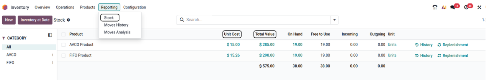
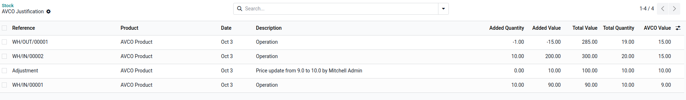
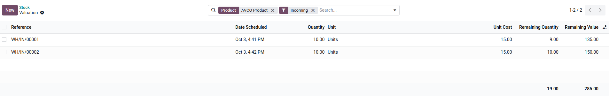
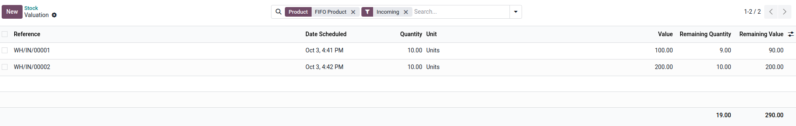
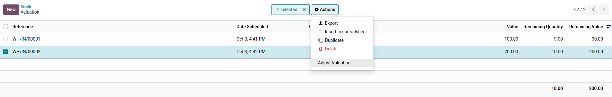
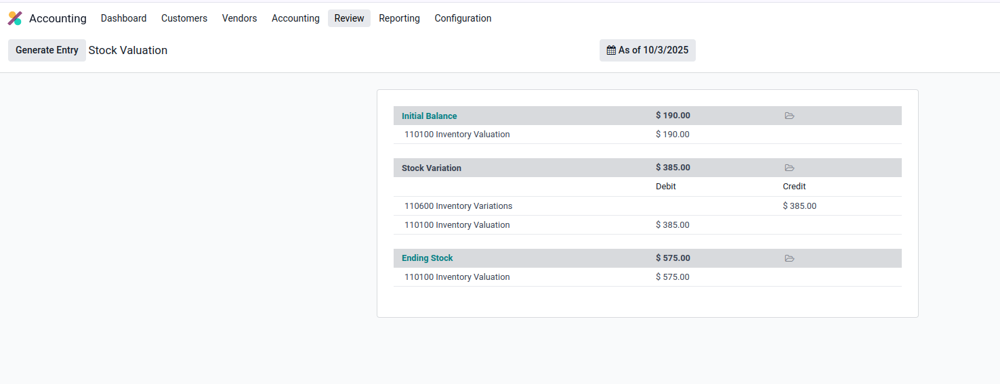

:custom-css: valuation.css
:custom-js: misc.js,valuation-data.js,valuation-journal.js,valuation-accounting.js

===========================
Odoo 19 inventory valuation
===========================

.. role:: good
.. role:: meh
.. role:: bad

.. important::
   This documentation is for Odoo 19: previous versions used a different approach.
   :ref:`Check the rationale of the changes. <changes-in-19>`

Costing Methods
===============
Odoo supports 3 costing methods:

.. rst-class:: alternatives

Standard Cost: the unit cost is fixed and updated manually 
  .. rst-class:: values-table

  .. list-table::
    :widths: 28 18 18 18 18
    :header-rows: 1
    :stub-columns: 1

    * - Operation
      - Unit Cost
      - Qty On Hand
      - Delta Value
      - Inventory Value
    * -
      - $10
      - 0
      -
      - $0
    * - Receive 8 products at $10
      - $10
      - 8
      - +8×$10
      - $80
    * - Receive 4 products at $16
      - $10
      - 12
      - +4×$10
      - $120
    * - Deliver 10 products
      - $10
      - 2
      - | -10×$10
        |
      - $20
    * - Receive 2 products at $9
      - $10
      - 4
      - +2×$10
      - $40

Average Cost: the unit cost represents the weighted average of all units
  .. rst-class:: values-table

  .. list-table::
    :widths: 28 18 18 18 18
    :header-rows: 1
    :stub-columns: 1

    * - Operation
      - Unit Cost
      - Qty On Hand
      - Delta Value
      - Inventory Value
    * -
      - $0
      - 0
      -
      - $0
    * - Receive 8 products at $10
      - $10
      - 8
      - +8×$10
      - $80
    * - Receive 4 products at $16
      - $12
      - 12
      - +4×$16
      - $144
    * - Deliver 10 products [#average-removal]_
      - $12
      - 2
      - | -10×$12
        |
      - $24
    * - Receive 2 products at $6
      - $9
      - 4
      - +2×$6
      - $36

FIFO (First In, First Out): the oldest inventory items are delivered first.
  .. rst-class:: values-table

  .. list-table::
    :widths: 28 18 18 18 18
    :header-rows: 1
    :stub-columns: 1

    * - Operation
      - Unit Cost
      - Qty On Hand
      - Delta Value
      - Inventory Value
    * -
      - $0
      - 0
      -
      - $0
    * - Receive 8 products at $10
      - $10
      - 8
      - +8×$10
      - $80
    * - Receive 4 products at $16
      - $12
      - 12
      - +4×$16
      - $144
    * - Deliver 10 products
      - $16
      - 2
      - | -8×$10
        | -2×$16
      - $32
    * - Receive 2 products at $6
      - $11
      - 4
      - +2×$6
      - $44

The default costing method is defined in the :guilabel:`Settings`, but can be overridden depending
on the category of the product.

.. note:: Removal strategies also support :abbr:`LIFO (Last In, First Out)` and
  :abbr:`FEFO (First Expiry, First Out)`, but they only impact which product is first picked, not
  the valuation method. For example, you can pick using LIFO, but using Average Cost for valuation,
  as LIFO is not allowed by :abbr:`IFRS (International Financial Reporting Standards)`.

.. [#average-removal] Products leaving the stock have no impact on the average price.

Inventory vs Accounting
=======================
:doc:`The inventory app </applications/inventory_and_mrp/inventory>` keeps track of the inventory
value in real time as you **receive and deliver goods**. The reporting menu allows analysing
inventory on hand and values per company, location, product, etc.

:doc:`The accounting app </applications/finance/accounting>` updates accounts when you receive
**invoices or bills**. Even though receipts and invoices differ, it’s not feasible for accountants
to post journal entries for every inventory movement. So, they post a closing entry to account for
the difference between what has been invoiced and received/delivered. This closing process happens
usually once a year for SMEs, or once a month for larger companies.

.. h:div:: feature-table

  +----------------------+------------+-----------+
  |                      | Accounting | Inventory |
  +======================+============+===========+
  | Purchase Order       | :meh:`/`   | :meh:`/`  |
  +----------------------+------------+-----------+
  | Receipt              | :meh:`/`   | :good:`✓` |
  +----------------------+------------+-----------+
  | **Vendor Bill**      | :good:`✓`  | :meh:`/`  |
  +----------------------+------------+-----------+
  | Sale Order           | :meh:`/`   | :meh:`/`  |
  +----------------------+------------+-----------+
  | **Customer Invoice** | :good:`✓`  | :meh:`/`  |
  +----------------------+------------+-----------+
  | Delivery             | :meh:`/`   | :good:`✓` |
  +----------------------+------------+-----------+
  | **Closing Entry**    | :good:`✓`  | :meh:`/`  |
  +----------------------+------------+-----------+

Accounting Methods
==================
There are two accounting practices on how to maintain your accounts:

Periodic
  Post vendor bills as expenses by nature, and update stock valuation in the closing entry by
  reducing expenses (stock variation). It’s the best practice in Europe.

Perpetual
  Post vendor bills as assets (stock valuation), report expenses when goods are sold (cost of goods
  sold). It’s the best practice in countries that follow Anglo-Saxon accounting, like the USA and
  India.

Configuration:

.. _accounting-entries:

Accounting Entries
==================

.. h:div:: accounting-entries

   .. placeholder

.. _journal-entries:

Journal Entries Configuration
=============================

.. h:div:: journal-entries

    .. placeholder

.. _changes-in-19:

Changes in Odoo 19
==================
Before Odoo 19, the Perpetual accounting method was implemented by posting real-time accounting
entries at each stock movement. That created a lot of journal items in accounting, which was an
issue for performance, general ledger clarity and auditability.

Since Odoo 19, the Perpetual method impacts the stock valuation account at the invoice level. The
closing entry is then used to manage bills to receive, invoices to issue, deferred revenues, prepaid
expenses, and other gaps between inventory values and accounting ones.

Here are the impacts of the Odoo 19 changes:

.. h:div:: feature-table

  +-----------------------+--------------------------------+--------------------------------+
  |                       | Odoo 18                        | Odoo 19                        |
  +=======================+================================+================================+
  | Periodic Continental  | :meh:`Manual closing`          | :good:`Automated closing`      |
  +-----------------------+--------------------------------+--------------------------------+
  | Periodic Anglo-Saxon  | :bad:`Not supported`           | :good:`Fully supported`        |
  +-----------------------+--------------------------------+--------------------------------+
  | Perpetual Continental | :meh:`Manual closing`          | :good:`✓`                      |
  +-----------------------+--------------------------------+--------------------------------+
  | Perpetual Anglo-Saxon | :meh:`Manual closing`          | :good:`✓`                      |
  +-----------------------+--------------------------------+--------------------------------+
  | Accounting valuation  | :meh:`Requires inventory`      | :good:`Accounting only`        |
  +-----------------------+--------------------------------+--------------------------------+
  | Perpetual Entries     | :good:`Invoices + every moves` | :good:`Invoices + one closing` |
  +-----------------------+--------------------------------+--------------------------------+
  | Invoices to issue     | :bad:`✗`                       | :good:`✓`                      |
  +-----------------------+--------------------------------+--------------------------------+
  | Prepaid expenses      | :bad:`✗`                       | :good:`✓`                      |
  +-----------------------+--------------------------------+--------------------------------+
  | Bills to receive      | :bad:`✗`                       | :good:`✓`                      |
  +-----------------------+--------------------------------+--------------------------------+
  | Deferred revenues     | :bad:`✗`                       | :good:`✓`                      |
  +-----------------------+--------------------------------+--------------------------------+
  | Performance           | :bad:`Slower`                  | :good:`Faster`                 |
  +-----------------------+--------------------------------+--------------------------------+
  | General ledger        | :good:`More journal entries`   | :good:`Fewer journal entries`  |
  +-----------------------+--------------------------------+--------------------------------+

What does it look like in Odoo?
===============================

In Inventory
------------
Open :menuselection:`Reporting --> Stock` to have a view on the current average cost for the product
and the total value of the stock. They can both be open to display details.

AVCO product
^^^^^^^^^^^^
You can open :guilabel:`Unit Cost` to check all existing updates and their origins. In
:abbr:`AVCO (Average Cost)` this allows you to understand how the currently used value was
calculated.

By opening :guilabel:`Total Value`, you can see all incoming quantities for which you still have a
remaining quantity and the value used for their valuation. In AVCO or standard cost, the used value
is always the current average unit cost.

FIFO product
^^^^^^^^^^^^
In :abbr:`FIFO (First In, First Out)`, remaining units from each previous incoming move keep their
own individual valuation as shown in :guilabel:`Total Value`.

In FIFO or AVCO remaining quantities from a previous incoming move can have their value adjusted if
necessary.

In Accounting
-------------
Open :menuselection:`Review --> Inventory Valuation` to have a look at the difference between the
accounting stock value and the current inventory value recorded thanks to the incoming moves with a
remaining quantity.

Click on :guilabel:`Generate Entry` to get a new accounting entry to review and post.

Open
:menuselection:`Review --> Invoices not received, Invoices to be issued, Prepaid expenses and Deferred Revenues`
to easily record these entries.

With Anglo-Saxon perpetual accounting, this will also help to distribute recorded Inventory
Variations to accounts such as Bill to Receive/:abbr:`GRNI (Goods Received Not Invoiced)` or
:abbr:`COGS (Cost of Goods Sold)` as shown in :ref:`Accounting Entries <accounting-entries>`
and :ref:`Journal Entries <journal-entries>` configuration parts.

**COMING SOON IN ODOO 19**

