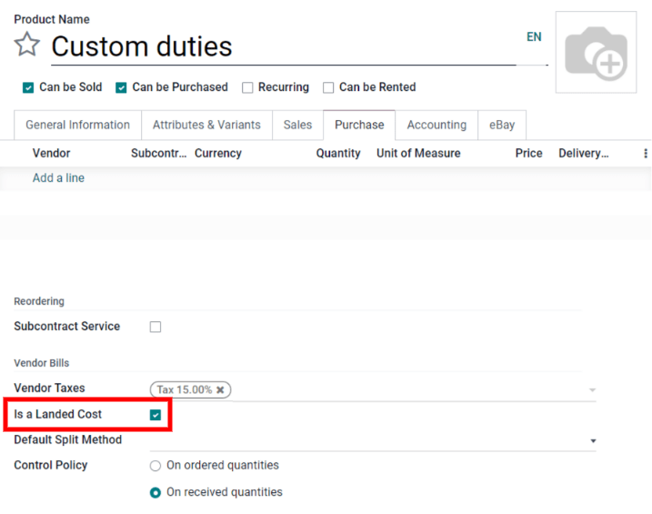
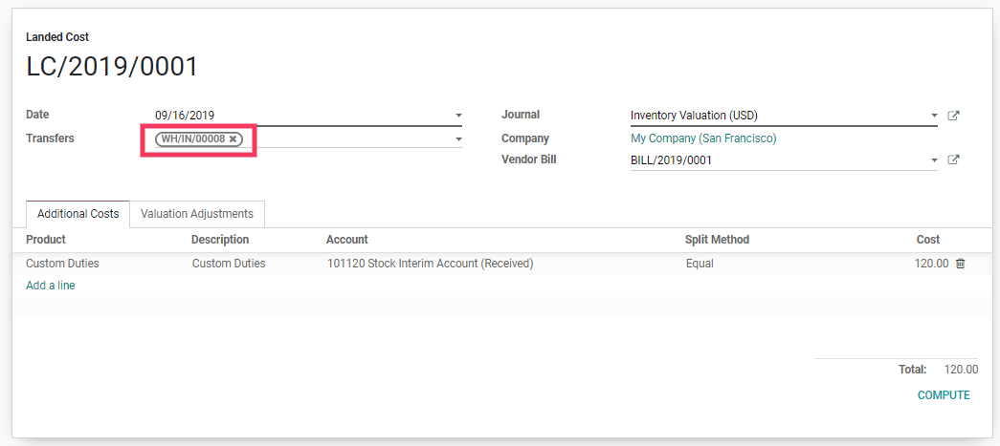
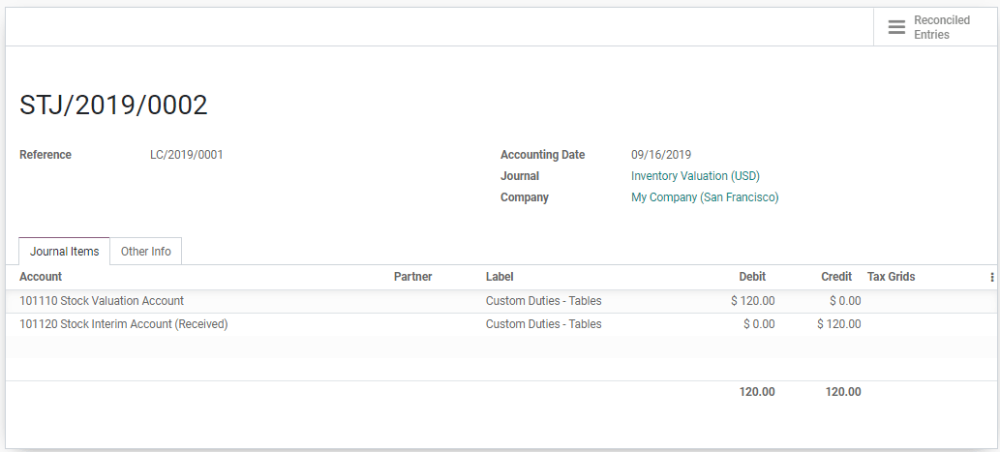

=======================================================
Integrating additional costs to products (landed costs)
=======================================================

.. _inventory/reporting/landed_costs:

The landed cost feature in Odoo allows the user to include additional costs (shipment, insurance,
customs duties, etc.) into the cost of the product.

Configuration
=============

First, go to :menuselection:`Inventory --> Configuration --> Settings --> Valuation` and activate
the :guilabel:`Landed Costs` feature. Odoo also gives the option to set a :guilabel:`Default
Journal` in which the landed costs accounting entries will be recorded.

.. image:: integrating_landed_costs/landed-costs-setting.png
   :align: center
   :alt: Activate the landed cost feature in Inventory settings.

Add costs to products
=====================

Receive the vendor bill
-----------------------

After a vendor fulfills a purchase order and sends a bill, click :guilabel:`Create Bill` on the
purchase order to create a vendor bill in Odoo. If the vendor bill includes landed costs, such as
custom duties, tick the box in the :guilabel:`Landed Costs` column on the vendor bill invoice line.

.. image:: integrating_landed_costs/landed-costs-field-vendor-bill.png
   :align: center
   :alt: Enable Landed Costs option on vendor bill line.

For charges that are always landed costs, create a landed cost product in Odoo. That way, the
landed cost product can be quickly added to the vendor bill as an invoice line instead of manually
entering the landed cost information every time a vendor bill comes in.

First, create a new product in :menuselection:`Inventory --> Products --> Products --> Create`.
Next, name the landed cost product. Then, set the :guilabel:`Product Type` to :guilabel:`Service`.
A landed cost product must always be a service product type. After that, go to the
:guilabel:`Purchase` tab and check the box next to :guilabel:`Is a Landed Cost`. Finally, click
:guilabel:`Save` to finish creating the landed cost product.

If this product is always a landed cost, you can also define it on the product and avoid having to
tick the box on each vendor bill.

Once the landed cost is added to the vendor bill (either by checking the :guilabel:`Landed Cost`
option on the invoice line or adding a landed cost product to the bill), click the
:guilabel:`Create Landed Costs` button at the top of the bill. Odoo automatically creates a landed
cost record with the set landed cost pre-filled in the :guilabel:`Additional Costs` product lines.
From here, decide which picking the additional costs apply to by clicking :guilabel:`Edit` and
selecting the picking reference number from the :guilabel:`Transfers` drop-down menu. Finally,
click :guilabel:`Save`.

After setting the picking, click :guilabel:`Compute` on the landed cost record. Then, go to the
:guilabel:`Valuation Adjustments` tab to see the impact of the landed costs. Finally, click
:guilabel:`Validate` to post the landed cost entry to the accounting journal.

The user can access the journal entry that has been created by the landed cost by clicking on the
:guilabel:`Journal Entry`.

.. note::
   The product that the landed cost is applied to must have a product category set to a :abbr:`FIFO
   (First In, First Out)` or an :abbr:`AVCO (Average Costing)` method.

.. note::
   Landed cost records can also be directly created in :menuselection:`Inventory --> Operations -->
   Landed Costs`, it is not necessary to create a landed cost record from the vendor bill.
