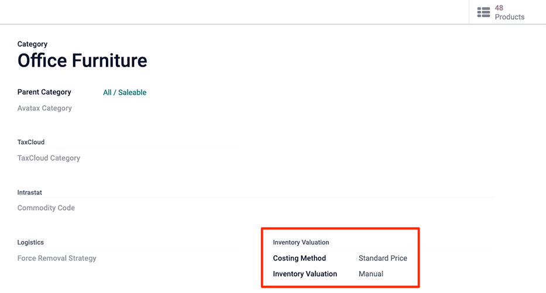
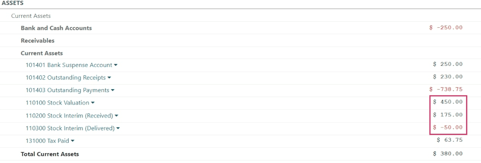

=================================
Inventory valuation configuration
=================================

.. |right arrow| replace:: :icon:`fa-arrow-right` :guilabel:`(right arrow)`

All of a company's stock on-hand contributes to the valuation of its inventory. That value should
be reflected in the company's accounting records to accurately show the value of the company and
all of its assets.

By default, Odoo uses a periodic inventory valuation (also known as manual inventory valuation).
This method implies that the accounting team posts journal entries based on the physical inventory
of the company, and that warehouse employees take the time to count the stock. In Odoo, this method
is reflected inside each product category, where the :guilabel:`Costing Method` field will be set to
`Standard Price` by default, and the :guilabel:`Inventory Valuation` field will be set to `Manual`.

Alternatively, automated inventory valuation is an integrated valuation method that updates the
inventory value in real-time by creating journal entries whenever there are stock moves initiated
between locations in a company's inventory.

.. note::
   Automated inventory valuation is a method recommended for expert accountants, given the extra
   steps involved in journal entry configuration. Even after the initial setup, the method will
   need to be periodically checked to ensure accuracy, and adjustments may be needed on an ongoing
   basis depending on the needs and priorities of the business.

.. _inventory/inventory_valuation_config/accounting:

Types of accounting
===================

Accounting entries will depend on the accounting mode: *Continental* or *Anglo-Saxon*.

.. tip::
   Verify the accounting mode by activating the :ref:`developer-mode` and navigating to
   :menuselection:`Accounting app --> Configuration --> Settings`.

   Then, in the search bar, look for :guilabel:`Anglo-Saxon Accounting`, to see if the feature is
   enabled. If it is **not** enabled, Continental accounting mode is in use.

   .. image:: inventory_valuation_config/anglo-saxon.png
      :align: center
      :alt: Show the Anglo-Saxon accounting mode feature.

In *Anglo-Saxon* accounting, the costs of goods sold (COGS) are reported when products are sold or
delivered. This means that the cost of a good is only recorded as an expense when a customer is
invoiced for a product. So for **manual** valuation method, set the :guilabel:`Expense Account` to
`Stock Valuation` for the current asset type; for **automatic** valuation method, set the the
:guilabel:`Expense Account` to an *Expenses* or a *Cost of Revenue* type (e.g. `Cost of Production`,
`Cost of Goods Sold`, etc.).

In *Continental* accounting, the cost of a good is reported as soon as a product is received into
stock. Because of this, the :guilabel:`Expense Account` can be set to **either** *Expenses* or a
*Cost of Revenue* type, however, it is more commonly set to an *Expenses* account.

.. seealso::
   :ref:`Details about configuring Expense and Stock accounts
   <inventory/management/config-inventory-valuation>`

Configuration
=============

Make changes to inventory valuation options by navigating to :menuselection:`Inventory app -->
Configuration --> Product Categories`. In the :guilabel:`Inventory Valuation` section, select the
desired :guilabel:`Costing Method` and :guilabel:`Inventory Valuation` options.

.. note::
   It is possible to use different valuation settings for different product categories.

.. image:: inventory_valuation_config/config-inventory-valuation.png
   :align: center
   :alt: Show inventory valuation configuration options.

.. _inventory/inventory_valuation_config/costing_methods:

Costing method
--------------

From the product category's configuration page, choose the desired :guilabel:`Costing Method`:

.. tabs::

   .. tab:: Standard Price

      The default costing method in Odoo. The cost of the product is manually defined on the product
      form, and this cost is used to compute the valuation. Even if the purchase price on a purchase
      order differs, the valuation is the cost defined on the product form.

      .. list-table::
         :header-rows: 1
         :stub-columns: 1

         * - Operation
           - Unit Cost
           - Qty On Hand
           - Incoming Value
           - Inventory Value
         * -
           - $10
           - 0
           -
           - $0
         * - Receive 8 products for $10/unit
           - $10
           - 8
           - 8 * $10
           - $80
         * - Receive 4 products for $16/unit
           - $10
           - 12
           - 4 * $10
           - $120
         * - Deliver 10 products
           - $10
           - 2
           - -10 * $10
           - $20
         * - Receive 2 products for $9/unit
           - $10
           - 4
           - 2 * $10
           - $40

   .. tab:: Average Cost (AVCO)

      Calculates the valuation of a product based on the average cost of that product, divided by
      the total number of available stock on-hand. With this costing method, inventory valuation is
      *dynamic*, and constantly adjusts based on the purchase price of products.

      .. list-table::
         :header-rows: 1
         :stub-columns: 1

         * - Operation
           - Unit Cost
           - Qty On Hand
           - Incoming Value
           - Inventory Value
         * -
           - $0
           - 0
           -
           - $0
         * - Receive 8 products for $10/unit
           - $10
           - 8
           - 8 * $10
           - $80
         * - Receive 4 products for $16/unit
           - $12
           - 12
           - 4 * $16
           - $144
         * - Deliver 10 products
           - $12
           - 2
           - -10 * $12
           - $24
         * - Receive 2 products for $6/unit
           - $9
           - 4
           - 2 * $6
           - $36

      How are unit cost and inventory value calculated at each step?

      - When receiving four products for $16 each:

        - Inventory value is calculated by adding the previous inventory value with the incoming
          value: :math:`$80 + (4 * $16) = $144`.
        - Unit cost is calculated by dividing the inventory value by the quantity on-hand:
          :math:`$144 / 12 = $12`.

      - When delivering ten products, the average unit cost is used to calculate the inventory
        value, regardless of the purchase price of the product. Therefore, inventory value is
        :math:`$144 + (-10 * $12) = $24`.

      - Receive two products for $6 each:

        - Inventory value: :math:`$24 + (2 * $6) = $36`
        - Unit cost: :math:`$36 / 4 = $9`

      .. note::
         When choosing :guilabel:`Average Cost (AVCO)` as the :guilabel:`Costing Method`, changing
         the numerical value in the *Cost* field for products in the respective product category
         creates a new record in the *Inventory Valuation* report to adjust the value of the
         product. The *Cost* amount is then automatically updated, based on the average purchase
         price of both the inventory on-hand and the costs accumulated from validated purchase
         orders.

   .. tab:: First In First Out (FIFO)

      Tracks the costs of incoming and outgoing items in real-time, and uses the real price of the
      products to change the valuation. The oldest purchase price is used as the cost for the next
      good sold, until an entire lot of that product is sold. When the next inventory lot moves up
      in the queue, an updated product cost is used based on the valuation of that specific lot.

      This method is arguably the most accurate inventory valuation method for a variety of reasons,
      but it is highly sensitive to input data and human error.

      .. list-table::
         :header-rows: 1
         :stub-columns: 1

         * - Operation
           - Unit Cost
           - Qty On Hand
           - Incoming Value
           - Inventory Value
         * -
           - $0
           - 0
           -
           - $0
         * - Receive 8 products for $10/unit
           - $10
           - 8
           - 8 * $10
           - $80
         * - Receive 4 products for $16/unit
           - $12
           - 12
           - 4 * $16
           - $144
         * - Deliver 10 products
           - $16
           - 2
           - | -8 * $10
             | -2 * $16
           - $32
         * - Receive 2 products for $6/unit
           - $11
           - 4
           - 2 * $6
           - $44

      How are unit cost and inventory value calculated at each step?

      - When receiving four products for $16 each:

        - Inventory value is calculated by adding the previous inventory value to the incoming
          value: :math:`$80 + (4 * $16) = $144`.
        - Unit cost is calculated by dividing the inventory value by the quantity on-hand:
          :math:`$144 / 12 = $12`.

         - When delivering ten products, eight units were purchased for $10, and two units were
           purchased for $16.

        - First, the incoming value is calculated by multiplying the on-hand quantity by the
          purchased price: :math:`(-8 * $10) + (-2 * $16) = -112`.
        - The inventory value is calculated by subtracting the incoming value from the previous
          inventory value: :math:`$144 - $112 = $32`.
        - Unit cost is calculated by dividing the inventory value by the remaining quantity:
          :math:`$32 / 2 = $16`.

      - When receiving two products for $6, inventory value is :math:`$32 + $12 = $44`. Unit cost is
        :math:`$44 / 4 = $11`.

.. warning::
   Changing the costing method greatly impacts inventory valuation. It is highly recommended to
   consult an accountant first before making any adjustments here.

.. seealso::
   :doc:`using_inventory_valuation`

When the :guilabel:`Costing Method` is changed, products already in stock that were using the
:guilabel:`Standard` costing method **do not** change value; rather, the existing units keep their
value, and any product moves from then on affect the average cost, and the cost of the product will
change. If the value in the :guilabel:`Cost` field on a product form is changed manually, Odoo will
generate a corresponding record in the *Inventory Valuation* report.

.. _inventory/management/config-inventory-valuation:

Inventory valuation
-------------------

Inventory valuation in Odoo can be set to be updated manually or automatically. While *Expense*
accounts apply to both, the *Stock Input* and *Stock Output* accounts are only used for automated
valuation.

Refer to the :ref:`Expense <inventory/management/expense-account>` and :ref:`Stock input/output
<inventory/management/stock-account>` sections for details on configuring each account type.

.. _inventory/management/expense-account:

Expense account
~~~~~~~~~~~~~~~

To configure the *expense account*, go to the :guilabel:`Account Properties` section of the intended
product category (:menuselection:`Inventory app --> Configuration --> Product Categories`). Then,
choose an existing account from the :guilabel:`Expense Account` drop-down menu.

To ensure the chosen account is the correct :guilabel:`Type,` click the |right arrow| icon to the
right of the account. Then, set the account type based on the information below.

.. tabs::

   .. group-tab:: Anglo-Saxon

      .. tabs::

         .. group-tab:: Automated

            In Anglo-Saxon accounting for automated inventory valuation, set the :guilabel:`Expense
            Account` to the `Expenses` account. Then, click the |right arrow| icon to the right of
            the account.

            In the pop-up window, choose :guilabel:`Expenses` or :guilabel:`Cost of Revenue` from
            the :guilabel:`Type` drop-down menu.

            .. image:: inventory_valuation_config/external-link.png
               :align: center
               :alt: Show **Expense Account** field, and external link icon.

         .. group-tab:: Manual

            To configure the :guilabel:`Expense Account`, choose :guilabel:`Stock Valuation` from
            the field's drop-down menu. Verify the account's type by clicking the |right arrow|
            icon, and then ensure the :guilabel:`Type` is :guilabel:`Current Assets`.

            .. image:: inventory_valuation_config/manual-anglo-saxon-expense.png
               :align: center
               :alt: Show the **Expense Account** field.

   .. group-tab:: Continental

      .. tabs::

         .. group-tab:: Automated

            Set the :guilabel:`Expense Account` to the :guilabel:`Expenses` or :guilabel:`Cost of
            Revenue` account type.

         .. group-tab:: Manual

            Set the :guilabel:`Expense Account` to the :guilabel:`Expenses` or :guilabel:`Cost of
            Revenue` account type.

.. _inventory/management/stock-account:

Stock input/output (automated only)
~~~~~~~~~~~~~~~~~~~~~~~~~~~~~~~~~~~

To configure the :guilabel:`Stock Input Account` and :guilabel:`Stock Output Account`, go to
:menuselection:`Inventory app --> Configuration --> Product Categories` and select the desired
product category.

In the :guilabel:`Inventory Valuation` field, select :guilabel:`Automated`. Doing so makes the
:guilabel:`Account Stock Properties` section appear. These accounts are defined as follows:

- :guilabel:`Stock Valuation Account`: when automated inventory valuation is enabled on a product,
  this account will hold the current value of the products.
- :guilabel:`Stock Journal`: accounting journal where entries are automatically posted when a
  product's inventory valuation changes.
- :guilabel:`Stock Input Account`: counterpart journal items for all incoming stock moves will be
  posted in this account, unless there is a specific valuation account set on the source location.
  This is the default value for all products in a given category, and can also be set directly on
  each product.
- :guilabel:`Stock Output Account`: counterpart journal items for all outgoing stock moves will be
  posted in this account, unless there is a specific valuation account set on the destination
  location. This is the default value for all products in a given category, and can also be set
  directly on each product.

.. tabs::

   .. group-tab:: Anglo-Saxon

      In Anglo-Saxon accounting, the :guilabel:`Stock Input Account` and :guilabel:`Stock Output
      Account` are set to *different* :guilabel:`Current Assets` accounts. This way, delivering
      products and invoicing the customer balance the *Stock Output* account, while receiving
      products and billing vendors balance the *Stock Input* account.

      To modify the account type, go to the click the |right arrow| icon to the right of the stock
      input/output account. In the pop-up window, choose :guilabel:`Current Assets` from the
      :guilabel:`Type` drop-down menu.

      .. figure:: inventory_valuation_config/account-type.png
         :align: center
         :alt: Display account setup page, highlighting the **Type** field.

         The *Stock Input* account is set to `Stock Interim (Received)`, a *Current Asset* account
         type.

   .. group-tab:: Continental

      In Continental accounting, the :guilabel:`Stock Input Account` and :guilabel:`Stock Output
      Account` are set to **the same** :guilabel:`Current Assets` account. That way, one account can
      be balanced when items are bought and sold.

      .. example::
         The stock input and output accounts are both set to `Stock Interim (Received)`, a
         :guilabel:`Current Assets` account type. They can also be set to the `Stock Interim
         (Delivered)`, as long as the input and output accounts are assigned to the **same**
         account.

         .. image:: inventory_valuation_config/continental-stock-account.png
            :align: center
            :alt: Show the Stock Input and Output accounts.

Inventory valuation reporting
=============================

To start, go to :menuselection:`Accounting --> Reporting --> Balance Sheet`. At the top of the
dashboard, change the :guilabel:`As of` field value to :guilabel:`Today`, and adjust the filtering
:guilabel:`Options` to :guilabel:`Unfold All` in order to see all of the latest data displayed, all
at once.

.. seealso::
   :doc:`../../../../finance/accounting/get_started/cheat_sheet`

Under the parent :guilabel:`Current Assets` line item, look for the nested :guilabel:`Stock
Valuation Account` line item, where the total valuation of all of the inventory on hand is
displayed.

Access more specific information with the :guilabel:`Stock Valuation Account` drop-down menu, by
selecting either the :guilabel:`General Ledger` to see an itemized view of all of the journal
entries, or by selecting :guilabel:`Journal Items` to review all of the individualized journal
entries that were submitted to the account. As well, annotations to the :guilabel:`Balance Sheet`
can be added by choosing :guilabel:`Annotate`, filling in the text box, and clicking
:guilabel:`Save`.

