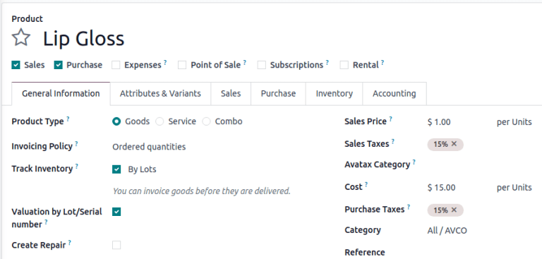
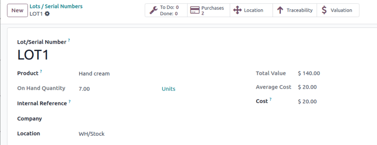

================================
Valuation by lots/serial numbers
================================

Track :doc:`inventory valuation <using_inventory_valuation>` by :doc:`lots or serial numbers
<../../product_management/product_tracking>` to:

#. :ref:`Compare and differentiate purchasing cost <inventory/product_management/view-valuation>`,
   based on lot or serial numbers.
#. Track the actual cost of manufactured products, based on the real cost of each tracked component
   used.
#. Depreciate specific lot or serial numbers when they :doc:`sit in stock for too long
   <../../warehouses_storage/reporting/aging>`.

.. important::
   Please read this :doc:`introduction to inventory valuation <inventory_valuation_config>` before
   setting up valuation by lot/serial numbers.

Configuration
=============

To enable valuation by lots or serial numbers, begin by enabling the :doc:`Lots and Serial Numbers
feature <../product_tracking>`. After that, go to :menuselection:`Inventory app --> Products -->
Products`, and select the desired product, or create a new product, by clicking :guilabel:`New`.

On the product form, in the :guilabel:`Category` field, choose a product category. Ensure the
product category's :ref:`Costing Method <inventory/warehouses_storage/costing_methods>` is set to
*First In First Out (FIFO)* or *Average Cost (AVCO)*.

.. tip::
   To check the costing method set on the product category, hover over the :guilabel:`Category`
   field, and click the :icon:`oi-arrow-right` :guilabel:`(Internal Link)` icon.

.. seealso::
   :ref:`Costing methods <inventory/warehouses_storage/costing_methods>`

Next, activate the product to be tracked by lots or serial numbers by ticking the :guilabel:`Track
Inventory` checkbox. Then, click the adjacent field that appears, and choose either :guilabel:`By
Lots` or :guilabel:`By Unique Serial Number` from the resulting drop-down menu.

Doing so makes the :guilabel:`Valuation by Lot/Serial number` checkbox appear below it. Tick that
checkbox, and the configuration to track valuation by lot or serial numbers is complete.

.. figure:: valuation_by_lots/product-form.png
   :alt: Product form showing the Valuation by Lot or Serial Number feature.

   Product form showing the Valuation by Lot or Serial Number feature

Valuation layers
================

To understand how valuation by lots and serial numbers works, consider these scenarios:

#. :ref:`Purchase and sell products <inventory/product_management/valuation-cost-example>`: cost is
   calculated based on the *product category's* costing method.
#. :ref:`Create new lot/serial numbers <inventory/product_management/valuation-cost-new>` using an
   inventory adjustment: value of the new lot/serial number is assigned to the cost from the product
   form.
#. Inventory adjustment to update quantities for an :ref:`existing lot/serial number
   <inventory/product_management/valuation-cost-existing>`: value is assigned based on the most
   recent cost for that lot/serial number.

For both :abbr:`AVCO (Average Cost)` and :abbr:`FIFO (First In First Out)` methods, the *Cost* field
on the product form is calculated using this formula:

:math:`Avg~Cost = \frac{Total~Value}{Total~Qty}`

.. _inventory/product_management/valuation-cost-example:

Purchase products
-----------------

Consider how purchasing products affect the inventory valuation, in the table below.

.. list-table::
   :header-rows: 1
   :stub-columns: 1

   * -
     - Quantity
     - Lot number
     - Math
     - Average cost on product form
   * - Empty stock
     - 0.00
     -
     -
     - $0
   * - Day 1: Receive one product at $10/unit
     - 1.00
     - LOT 1
     - :math:`\frac{10}{1}`
     - $10
   * - Day 2: Receive another product at $20/unit
     - 1.00
     - LOT 2
     - :math:`\frac{10+20}{2}`
     - $15

   As a result, the product form displays an average cost of $15 in the **Cost** field.

.. _inventory/product_management/valuation-cost-new:

Create new lot/serial number
----------------------------

Creating a new lot/serial number through an :doc:`inventory adjustment
<../../warehouses_storage/inventory_management/count_products>` assigns the same value as the cost
on the product form.

To make an inventory adjustment, and assign a lot number, go to :menuselection:`Inventory app -->
Operations --> Physical Inventory`. Then, click :guilabel:`New`.

In the new inventory adjustment line that appears, set the :guilabel:`Product`, create the
:guilabel:`Lot/Serial Number`, set the :guilabel:`Counted Quantity`, and click :icon:`fa-floppy-o`
:guilabel:`Apply`.

To view the valuation layer, go to :menuselection:`Inventory app --> Reporting --> Valuation`. The
:guilabel:`Total Value` per unit matches the *Cost* on the product form.

.. example::
   Continuing the example in the table above, when the product cost is `$15`, the valuation for a
   newly-created `LOT3` is also be `$15`.

   .. image:: valuation_by_lots/create-new.png
      :alt: Show inventory adjustment valuation.

.. _inventory/product_management/valuation-cost-existing:

Existing lot/serial number
--------------------------

When adjusting the quantity of an existing lot/serial number, the value is based on the most recent
valuation layer for that specific lot/serial number.

.. example::
   Continuing the example in the table above, the value for `LOT 1` is `$10`.

   So, when the quantity is updated from `1.00` to `2.00`, the additional quantity is also valued at
   `$10`, reflecting the latest valuation layer for `LOT 1`.

   .. figure:: valuation_by_lots/existing.png
      :alt: Show valuation of LOT 1 getting updated.

      The inventory adjustment (top line) is valued the same as LOT 1 (bottom line).

.. _inventory/product_management/view-valuation:

View valuation
==============

To find the average cost of a specific lot/serial number, go to :menuselection:`Inventory app -->
Products --> Lots/Serial Numbers`, and select the desired record.

Both the :guilabel:`Cost` and :guilabel:`Average Cost` fields show a unit's average cost. The
:guilabel:`Total Value` reflects the total on-hand value for that lot/serial number.

.. important::
   Ensure the costing method is set to *First In First Out (FIFO)* or *Average Cost (AVCO)* to
   display the cost on this page.

   Lot form, displaying **Cost** field. The **Valuation** smart button is in the top-right.

Valuation layers of a lot/serial number can be viewed through the :ref:`valuation report
<inventory/product_management/valuation-report>`, or by clicking the lot/serial number's
:guilabel:`Valuation` smart button. These detailed, line-by-line records can help determine how each
inventory move of the specific lot/serial number affects its valuation.

.. _inventory/product_management/valuation-report:

Valuation report
----------------

Display the valuation of lots and serial numbers in the database by going to
:menuselection:`Inventory app --> Reporting --> Valuation`.

On the resulting :guilabel:`Stock Valuation` report, click the search bar, and in the
:icon:`oi-group` :guilabel:`Group By` section of the resulting drop-down menu, select
:guilabel:`Lot/Serial number`.

.. tip::
   Click the :icon:`fa-plus` :guilabel:`(plus)` icon to the right of a collapsed lot number line to
   :ref:`manually modify the cost <inventory/product_management/update-unit-price>`.

   This is useful for adjusting individual lot prices when a purchase order or bill includes
   multiple lots/serial numbers, as initial prices are identical upon reception.

.. image:: valuation_by_lots/stock-valuation.png
   :alt: Show valuation report, by lots.

Valuation smart button
----------------------

To access a filtered part of the *Stock Valuation* report, specific to a lot or serial number, go to
:menuselection:`Inventory app --> Products --> Lots/Serial Numbers`, and select the desired item.

On the :guilabel:`Lot/Serial Numbers` page, click the :guilabel:`Valuation` smart button.

.. figure:: valuation_by_lots/lot-stock-valuation.png
   :alt: All stock moves relating to `LOT 1`.

   All stock moves that affect the valuation of `LOT 1`.
