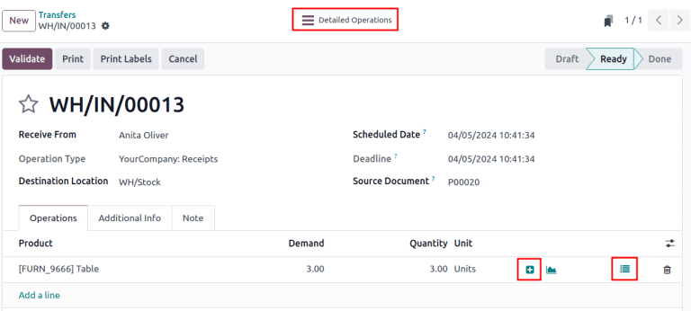
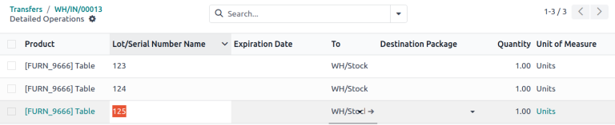
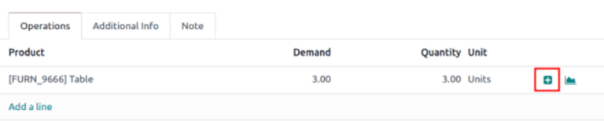
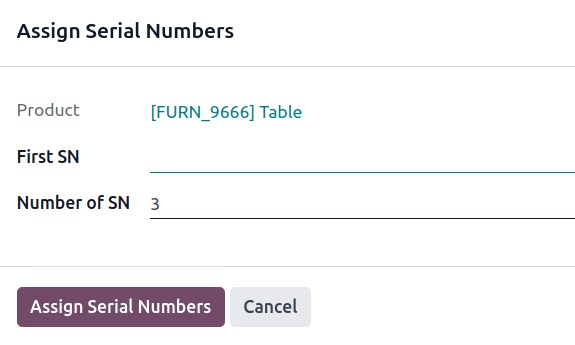
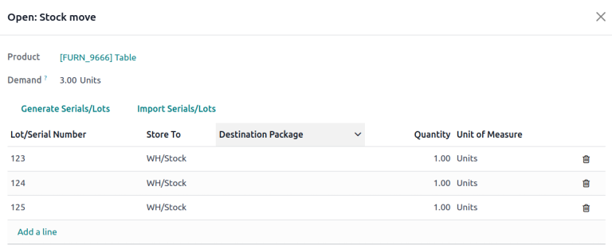
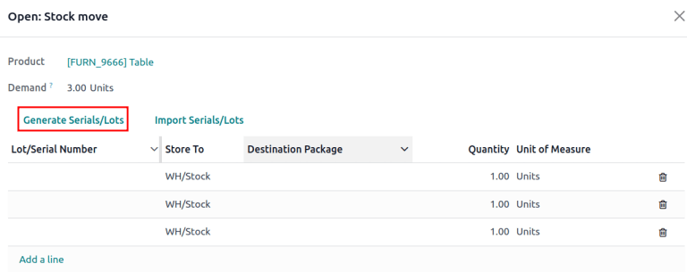

=====================
Assign serial numbers
=====================

Assigning serial numbers to individual products allows the for tracking of properties,
:doc:`expiration dates <expiration_dates>`, and location throughout the supply chain, which
particularly benefits manufacturers providing after-sales services.

.. seealso::
   - `Odoo Tutorials: Serial Numbers <https://www.youtube.com/watch?v=ZP-gMz2X5AY>`_
   - :doc:`serial_numbers`

In Odoo, serial numbers are assigned to products:

- in the :ref:`Detailed Operations page <inventory/product_management/detailed-operations>` on a
  receipt
- by clicking the :ref:`Assign Serial Numbers <inventory/product_management/assign-sn>` button on a
  receipt
- in the :ref:`Open: Stock move window <inventory/product_management/stock-move-section>` on a
  receipt
- :doc:`during a manufacturing order
  <../../../manufacturing/basic_setup/configure_manufacturing_product>` for a product tracked by
  lot/serial numbers
- when making an inventory adjustment

.. _inventory/product_management/detailed-operations-popup:

   Display the **Detailed Operations** smart button and bulleted list icon on a receipt.

Configuration
=============

To assign serial numbers to products, activate the :guilabel:`Lots and Serial Numbers` feature in
:menuselection:`Inventory app --> Configuration --> Settings`.

Then, in the :guilabel:`Inventory` tab of an item's product form, set the :guilabel:`Tracking` field
to :guilabel:`By Unique Serial Number`.

.. seealso::
   - :ref:`Enable serial numbers <inventory/product_management/enable-lots>`
   - :ref:`Track products by serial numbers <inventory/product_management/configure-lots>`

.. _inventory/product_management/configure-new-serials:

Next, enable creating new serial numbers by going to :menuselection:`Inventory app --> Configuration
--> Operations Types`.

From the :guilabel:`Operations Types` page, select the desired operation type (e.g.
:guilabel:`Receipts`, :guilabel:`Delivery Orders`, or :guilabel:`Manufacturing`), and select the
:guilabel:`Create New` option in the :guilabel:`Lots/Serial Numbers` section of the operation type's
configuration page.

.. image:: create_sn/create-new.png
   :align: center
   :alt: Show "Create New" option is selected on the Receipts operation type.

.. _inventory/product_management/detailed-operations:

Detailed Operations
===================

Serial numbers can be assigned to products when entering stock for the first time, from the
:guilabel:`Detailed Operations` page on the receipt. Receipts can be accessed by navigating to
:menuselection:`Inventory app --> Operations --> Receipts`.

.. important::
   Serial numbers can **not** be assigned to products on a request for quotation (RfQ) or purchase
   order (PO) — **only** on a receipt.

   .. figure:: create_sn/purchase-order-or-receipt.png
      :align: center
      :alt: Show the purchase order and the Receipt smart button

      Screenshot of a "Purchase Order" with the "Receipt" smart button at the top.

   To record an item's serial number before receiving the item, follow the steps in the next
   sections to assign serial numbers, but do **not** click the receipt's :guilabel:`Validate`
   button, until the products are received from the vendor.

Assign a single serial number to a product by clicking the :guilabel:`Detailed Operations` smart
button on a receipt.

In the :guilabel:`Lot/Serial Number Name` column, manually type in the serial number for a single
product.

When finished, click the receipt's breadcrumbs, and the assigned serial numbers are automatically
saved.

.. _inventory/product_management/assign-sn:

Assign serial numbers
=====================

To generate new serial numbers in a sequence, click the :guilabel:`+ (plus)` icon in the
:ref:`product line <inventory/product_management/detailed-operations-popup>`.

.. important::
   If the icon is not visible, ensure the :guilabel:`Create New` option is selected in the
   :ref:`receipt's configuration page <inventory/product_management/configure-new-serials>`.

Doing so opens the :guilabel:`Assign Serial Numbers` pop-up window. The :guilabel:`Number of SN`
field is auto-filled based on the product quantity requiring serial numbers. Manually input the
first serial number in the :guilabel:`First SN` field, and click :guilabel:`Assign Serial Numbers`
to generate a sequence of serial numbers based on the first serial number entered.

.. _inventory/product_management/stock-move-section:

Stock move pop-up window
========================

For various methods of assigning serial numbers in bulk, click the :guilabel:`⦙≣ (bulleted list)`
icon in the :ref:`product line <inventory/product_management/detailed-operations-popup>` of a
receipt.

Add a line
----------

In the :guilabel:`Open: Stock move` pop-up window that appears, manually input the serial numbers in
the :guilabel:`Lot/Serial Number` column.

Generate Serials
----------------

Assign multiple serial numbers at once by clicking the :guilabel:`Generate Serials/Lots` button in
the :guilabel:`Open: Stock move` pop-up window.

Doing so opens the :guilabel:`Generate Serial numbers` pop-up window, where the first serial number
is entered in the :guilabel:`First SN` field to generate a sequence of serial numbers, based on the
first serial number entered.

For more details on how to fill in this pop-up window, :ref:`refer to this section
<inventory/product_management/assign-sn>`.

Import Serials
--------------

Assign multiple serial numbers at once by clicking the :guilabel:`Import Serials/Lots` button in the
:guilabel:`Open: Stock move` pop-up window.

.. important::
   If the button is not visible, ensure the :guilabel:`Create New` option is selected in the
   :ref:`receipt's configuration page <inventory/product_management/configure-new-serials>`.

Doing so opens the :guilabel:`Import Lots` pop-up window. Enter each serial number on a separate
line in the :guilabel:`Lots/Serial numbers` text field.

.. tip::
   Copy/paste serial numbers from an existing excel spreadsheet and add them to the
   :guilabel:`Lots/Serial numbers` text field.

   .. image:: create_sn/copy-from-excel.png
      :align: center
      :alt: Show excel sheet to copy serial numbers from.

Tick the :guilabel:`Keep current lines` checkbox to add serial numbers to the list of products, and
serial numbers in the :guilabel:`Lot/Serial Number` table, in the :guilabel:`Open: Stock move`
pop-up window. To replace the serial numbers in the list, leave the :guilabel:`Keep current lines`
option unchecked.

Finally, click :guilabel:`Generate`.

.. example::
   For a receipt with a :guilabel:`Demand` of `3.00` products, one product has already been assigned
   a serial number in the :guilabel:`Open: Stock move` pop-up window.

   So, in the :guilabel:`Import Lots` pop-up window, two serial numbers, `124` and `125` are
   assigned to the remaining products by entering the following in the :guilabel:`Lots/Serial
   numbers` input field:

   .. code-block::

      124
      125

   The :guilabel:`Keep current lines` option is selected to add these two serial numbers **in
   addition** to the serial number, `123`, that has already been assigned.

   .. image:: create_sn/import-serial.png
      :align: center
      :alt: Show example of correctly inputting serial numbers in the text field.
