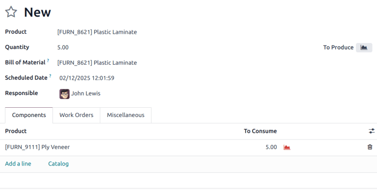

================
Expiration dates
================

.. _inventory/product_management/product_tracking/expiration_dates:

In Odoo, *expiration dates* can be used to manage and track the lifecycles of perishable products,
from purchase to sale. Using expiration dates reduces product loss due to unexpected expiry, and
helps to avoid sending expired products to customers.

In Odoo, only products that are tracked using *lots* and *serial numbers* can be assigned expiration
information. Once a lot or serial number has been assigned, an expiration date can be set. This is
especially helpful for companies (such as food manufacturers) that consistently, or exclusively, buy
and sell perishable products.

.. seealso::
   - :doc:`../product_tracking/lots`
   - :doc:`../product_tracking/serial_numbers`

Enable expiration dates
=======================

To enable the use of *expiration dates*, go to :menuselection:`Inventory app --> Configuration -->
Settings`, and scroll down to the :guilabel:`Traceability` section. Then, click the checkbox to
enable the :guilabel:`Lots & Serial Numbers` feature.

Once that feature is activated, a new option will appear to enable :guilabel:`Expiration Dates`.
Click that checkbox to enable the feature, and be sure to :guilabel:`Save` changes.

.. tip::
   Once the :guilabel:`Lots & Serial Numbers` feature is activated, additional features appear to
   :guilabel:`Display Lots & Serial Numbers on Delivery Slips`; to :guilabel:`Display Lots & Serial
   Numbers on Invoices`; and to :guilabel:`Display Expiration Dates on Delivery Slips`. Activating
   these features helps with end-to-end traceability, making it easier to manage product recalls,
   identify "bad" batches of products, and more.

Configure expiration dates on products
======================================

Once the :guilabel:`Lots & Serial Numbers` and :guilabel:`Expiration Dates` features have been
enabled in the settings of the *Inventory* app, expiration information can be configured on
individual products.

To do so, go to :menuselection:`Inventory app --> Products --> Products`, and select a product to
edit. Selecting a product reveals the product form for that particular item. Once on the product
form, click :guilabel:`Edit` in the upper-left corner to make changes.

.. important::
   To be tracked using lots or serial numbers, or to configure expiration information, products
   *must* have their :guilabel:`Product Type` set as :guilabel:`Storable Product` under the
   :guilabel:`General Information` tab.

Then, click the :guilabel:`Inventory` tab, and scroll down to the :guilabel:`Traceability` section.
From here, make sure that either :guilabel:`By Unique Serial Number` or :guilabel:`By Lots` is
checked.

Once it is, a new :guilabel:`Expiration Date` checkbox appears that must also be clicked. When both
are enabled, a new :guilabel:`Dates` field appears to the right.

.. note::
   If a product has stock on-hand prior to activating tracking by lots or serial numbers, an
   inventory adjustment might need to be performed in order to assign lot numbers to the existing
   stock.

.. tip::
   For processing large quantities of products on receipts or deliveries, it is recommended to track
   using lots, so multiple products can be traced back to the same lot, if any issues arise.

.. image:: expiration_dates/expiration-dates-product-configuration.png
   :align: center
   :alt: Expiration dates configuration on the product form.

Under the :guilabel:`Dates` field, there are four categories of expiration information to configure
for the product:

- :guilabel:`Expiration Time`: the number of days after receiving products (either from a vendor or
  in stock after production) in which goods may become dangerous and should not be used or consumed.
- :guilabel:`Best Before Time`: the number of days before the expiration date in which the goods
  start deteriorating, **without** necessarily being dangerous yet.
- :guilabel:`Removal Time`: the number of days before the expiration date in which the goods should
  be removed from stock.
- :guilabel:`Alert Time`: the number of days before the expiration date in which an alert should be
  raised on goods in a particular lot or containing a particular serial number.

.. note::
   The values entered into these fields automatically compute the expiration date for goods entered
   into stock, whether purchased from a vendor or manufactured in-house.

Once all the expiration information has been configured, click :guilabel:`Save` to save all changes.

.. tip::
   If the :guilabel:`Dates` field is not populated with any values for expiration information, dates
   (and lots) can be manually assigned upon receipts and deliveries in and out of the warehouse.
   Even when assigned, they can still be overwritten and changed manually if needed, as well.

Set expiration dates on receipts with lots & serial numbers
===========================================================

Generating expiration dates for **incoming** goods can be done directly from the purchase order. To
create a purchase order, go to the :menuselection:`Purchase` app and click :guilabel:`Create` to
create a new request for quotation (RFQ).

Then, fill out the information by adding a :guilabel:`Vendor`, and add products to the
:guilabel:`Product` lines by clicking :guilabel:`Add a product`.

Choose the desired quantity to order by changing the number in the :guilabel:`Quantity` column, and
click :guilabel:`Confirm Order`. This converts the :abbr:`RFQ (request for quotation)` into a
purchase order.

Click the :guilabel:`Receipt` smart button at the top of the purchase order to be taken to the
warehouse receipt form.

.. note::
   Clicking :guilabel:`Validate` before assigning a serial number to the ordered product quantities
   causes a :guilabel:`User Error` popup to appear. The popup requires entry of a lot or serial
   number for the ordered products. The :abbr:`RFQ (request for quotation)` cannot be validated
   without an assigned lot or serial number.

   .. image:: expiration_dates/expiration-dates-user-error-popup.png
      :align: center
      :alt: User error popup when validating an order with no lot number.

From here, click the :guilabel:`Additional Options` menu (hamburger) icon located on the far-right
of the product line. When clicked, a :guilabel:`Detailed Operations` pop-up will appear.

In this pop-up, click :guilabel:`Add a line`, and assign a lot or serial number under the
:guilabel:`Lot/Serial Number Name` field.

An expiration date automatically populates, based on the configuration on the product form (if
previously configured).

.. tip::
   If the :guilabel:`Dates` field on the product form has not been configured, this date can be
   manually entered.

After the expiration date has been established, mark the :guilabel:`Done` quantities, and click
:guilabel:`Confirm` to close the pop-up. Finally, click :guilabel:`Validate`.

.. image:: expiration_dates/expiration-dates-detailed-operations-popup.png
   :align: center
   :alt: Detailed operations popup showing expiration dates for ordered products.

A :guilabel:`Traceability` smart button will appear upon validating the receipt. Click the
:guilabel:`Traceability` smart button to see the updated :guilabel:`Traceability Report`, which
includes: a :guilabel:`Reference` document; the :guilabel:`Product` being traced; the
:guilabel:`Lot/Serial #`; and more.

Set expiration dates on manufactured products
=============================================

Expiration dates can also be generated for products manufactured in-house. To assign expiration
dates to manufactured products, a manufacturing order (MO) needs to be completed.

To create a :abbr:`MO (manufacturing order)`, go to :menuselection:`Manufacturing app --> Operations
--> Manufacturing Orders`, and click :guilabel:`Create`. Choose a product to manufacture from the
:guilabel:`Product` field drop-down menu, then select the :guilabel:`Quantity` to produce.

.. note::
   To manufacture a product, there must be materials to consume in the lines in the
   :guilabel:`Product` column. This can be achieved either by creating a :guilabel:`Bill of
   Material` for the :guilabel:`Product`, or manually adding materials to consume by clicking
   :guilabel:`Add a line`.

Once ready, click :guilabel:`Confirm`.

Next to :guilabel:`Lot/Serial Number`, either select an existing lot number from the drop-down menu,
or click the green :guilabel:`+` sign to automatically assign a new lot number.

Then, select a number of units for the :guilabel:`Quantity` field, and click :guilabel:`Mark as
Done`.

Click on the :guilabel:`External Link` icon in the assigned :guilabel:`Lot/Serial Number` field. A
pop-up appears, revealing a detail form for that specific number.

On that pop-up, under the :guilabel:`Dates` tab, all expiration information that was previously
configured for the product is displayed. That same information is also available on the detail form
for that specific product, or by going to :menuselection:`Inventory app --> Products --> Lots/Serial
Numbers`.

.. image:: expiration_dates/expiration-dates-dates-tab-lot-number.png
   :align: center
   :alt: Dates tab with expiration information for specific lot number.

Sell products with expiration dates
===================================

Selling perishable products with expiration dates is done the same as any other type of product. The
first step in selling perishable products is to create a sales order.

To do that, go to :menuselection:`Sales app --> Create` to create a new quotation, and fill out the
information on the sales order form.

Add a :guilabel:`Customer`, click :guilabel:`Add a product` to add the desired products to the
:guilabel:`Product` lines, and set a :guilabel:`Quantity` for the products.

Then, click the :guilabel:`Other Info` tab. Under the :guilabel:`Delivery` section, change the
:guilabel:`Delivery Date` to a date after the expected date, and click the :guilabel:`green
checkmark` icon to confirm the date. Finally, click :guilabel:`Confirm` to confirm the sales order.

Next, click the :guilabel:`Delivery` smart button at the top of the sales order to see the warehouse
receipt form.

On the warehouse receipt form, click :guilabel:`Validate`, and then :guilabel:`Apply` in the
accompanying pop-up window, to automatically process all :guilabel:`Done` quantities, and deliver
the products to the customer.

If the products are delivered before the :guilabel:`Alert Date` set on the product form, then no
alerts will be created.

.. important::
   To sell perishable products with expiration dates, the :guilabel:`Removal Strategy` for the
   :guilabel:`Location` the products are stored in must be set to :abbr:`FEFO (First Expiry, First
   Out)`. If there is not enough stock of perishable products in one lot, Odoo will automatically
   take the remaining quantity required from a second lot with the next-soonest expiration date.
   Removal strategies can also be set on :guilabel:`Product Categories`.

.. seealso::
   :doc:`../../warehouses_storage/removal_strategies`

View expiration dates for lots & serial numbers
===============================================

To view (and/or group) all products with expiration dates by lot number, go to
:menuselection:`Inventory app --> Products --> Lots/Serial Numbers`.

Once there, remove any default search filters from the :guilabel:`Search...` bar. Then, click
:guilabel:`Group By`, choose :guilabel:`Add Custom Group`, and select the :guilabel:`Expiration
Date` parameter from the drop-down menu. Finally, click :guilabel:`Apply` to apply the filter.

Doing so breaks down all perishable products, their expiration dates, and the assigned lot number.

.. image:: expiration_dates/expiration-dates-group-by-dates.png
   :align: center
   :alt: Group by expiration dates on lots and serial numbers page.

Expiration alerts
-----------------

To see expiration alerts, go to :menuselection:`Inventory app --> Products --> Lots/Serial Numbers`.

Then, click into a :guilabel:`Lot/Serial Number` with perishable products. Doing so reveals the
serial number detail form. On the serial number detail form, click the :guilabel:`Dates` tab to see
all expiration information related to the products.

To edit the form, click :guilabel:`Edit` in the upper-left corner of the form, then change the
:guilabel:`Expiration Date` to today's date (or earlier), and click :guilabel:`Save` to save
changes.

After saving, the lot number form displays a red :guilabel:`Expiration Alert` at the top of the form
to indicate that the products in this lot are either expired or expiring soon. From here, click back
to the :guilabel:`Lots/Serial Numbers` page (via the breadcrumbs).

To see the new expiration alert, or any expiration alerts for products that are expired (or will
expire soon), remove all of the search filters from the :guilabel:`Search...` bar on the
:guilabel:`Lots/Serial Numbers` dashboard.

Then, click :guilabel:`Filters`, and choose :guilabel:`Expiration Alerts`.

.. image:: expiration_dates/expiration-dates-expiration-alert.png
   :align: center
   :alt: Expiration alert for product past the expiration date.
