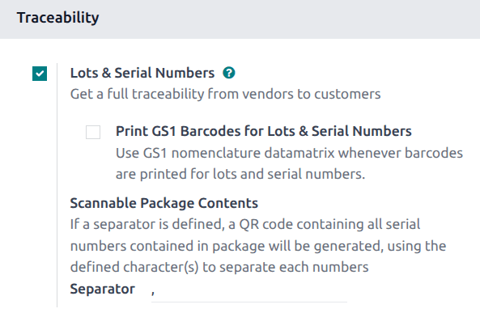
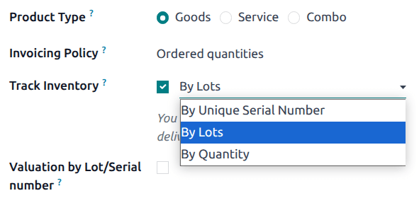
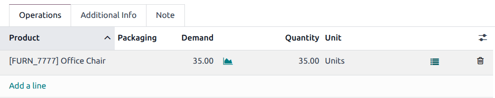
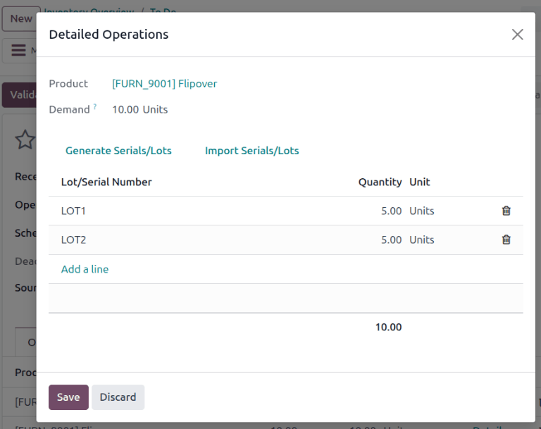
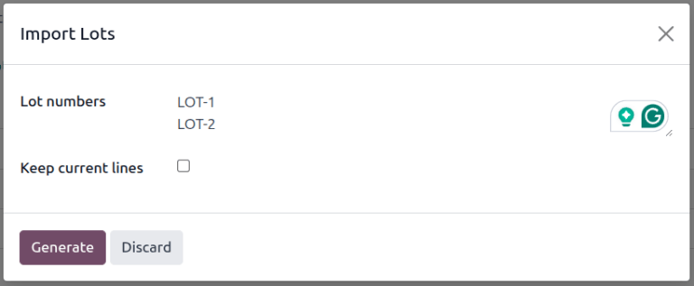
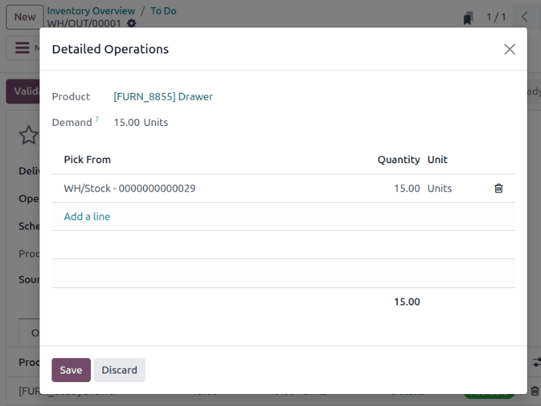
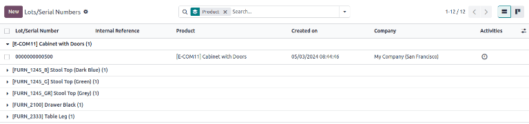
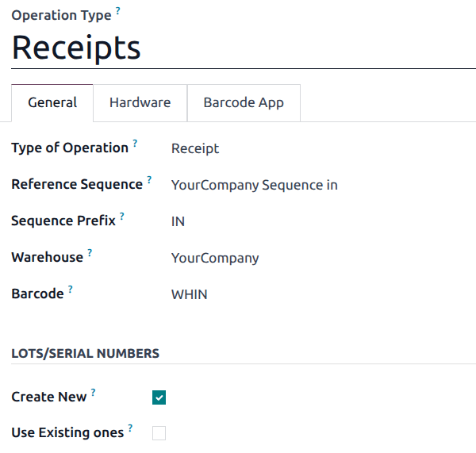
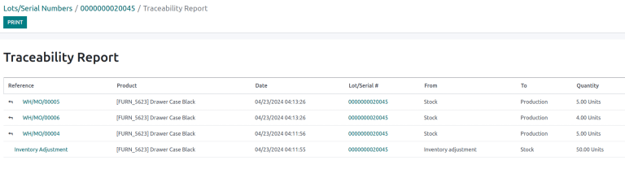

===========
Lot numbers
===========

.. |PO| replace:: :abbr:`PO (Purchase Order)`
.. |SO| replace:: :abbr:`SO (Sales Order)`
.. |DO| replace:: :abbr:`DO (Delivery Order)`
.. |list| replace:: :icon:`fa-list` :guilabel:`(list)`

*Lots* are one of the two ways to identify and track products in Odoo. They typically represent a
specific batch of products that were received, stored, shipped, or manufactured in-house.

Manufacturers assign lot numbers to groups of products sharing common properties, facilitating
end-to-end traceability through their lifecycles.

Lots are useful for managing large quantities of manufactured or received products, aiding in
tracing items back to their group, particularly for product recalls or :doc:`expiration dates
<expiration_dates>`.

.. seealso::
   :doc:`serial_numbers`

Enable lots & serial numbers
============================

To track products using lots, enable the *Lots & Serial Numbers* feature. Go to the
:menuselection:`Inventory app --> Configuration --> Settings`, scroll down to the
:guilabel:`Traceability` section, and tick the checkbox next to :guilabel:`Lots & Serial Numbers`.
Then, click :guilabel:`Save`.

.. seealso::
   - :doc:`Tracking expiration dates <expiration_dates>`
   - :ref:`Print GS1 barcodes for lots and serial numbers <barcode/operations/gs1-lots>`

.. _inventory/management/track_products_by_lots:

Track by lots
=============

Once the :guilabel:`Lots & Serial Numbers` feature is activated, configure individual products to be
tracked using lots. To do this, go to :menuselection:`Inventory app --> Products --> Products`, and
choose a product to configure.

On the product form, go to the :guilabel:`Inventory` tab. In the :guilabel:`Traceability` section,
select the :guilabel:`By Lots` option in the :guilabel:`Tracking` field. Now, new or existing lot
numbers can be assigned to newly-received or manufactured batches of this product.

.. seealso::
   :doc:`expiration_dates`

.. important::
   If a product has stock on-hand prior to activating tracking by lots or serial numbers, a warning
   message appears. Use an :doc:`inventory adjustment <reassign>` to assign lot numbers to existing
   products in stock.

Assign lots for shipping and receiving
======================================

Assign new lot numbers to :ref:`incoming goods <inventory/product_management/assign-lots>` on the
receipt form. When shipping :ref:`outgoing goods
<inventory/product_management/assign-lots-delivery>`, select products with specific lot numbers on
the delivery order form.

.. _inventory/product_management/assign-lots:

On receipts
-----------

Assigning new or existing lot numbers to incoming goods can be done directly on receipts.

To begin, go to the :menuselection:`Purchase` app to `create and confirm
<https://www.youtube.com/watch?v=o_uI718P1Dc>`_ a |PO| for products tracked by lot numbers. Then,
click the :guilabel:`Receipt` smart button that appears at the top of the page to navigate to the
warehouse receipt form.

.. note::
   Alternatively, navigate to an existing receipt by going to the :menuselection:`Inventory` app,
   clicking the :guilabel:`Receipts` Kanban card, and choosing the desired receipt.

.. important::
   Clicking :guilabel:`Validate` before assigning a lot number triggers an error, indicating that a
   lot number **must** be assigned before validating the receipt.

   .. image:: lots/user-error.png
      :align: center
      :alt: Add lot/serial number user error popup.

On the receipt form, on the product line in the :guilabel:`Operations` tab, select the |list| icon
to the right of the product that is tracked by lot numbers.

Doing so opens the :guilabel:`Open: Stock move` pop-up window, where the :guilabel:`Lot/Serial
Number` and :guilabel:`Quantity` are assigned.

The two ways to assign lot numbers: **manually** and **importing**.

Manual assignment
~~~~~~~~~~~~~~~~~

To manually assign lot numbers, click :guilabel:`Add a line`. Input the :guilabel:`Lot/Serial
Number`, :guilabel:`Store To` location for the lot, :guilabel:`Quantity`, and :guilabel:`Destination
Package`, if any.

.. note::
   To assign multiple lot numbers, or store to multiple locations, click :guilabel:`Add a line`, and
   type a new :guilabel:`Lot/Serial Number` for additional quantities. Repeat until the total in the
   :guilabel:`Quantity` column matches the :guilabel:`Demand` at the top.

Import lots
~~~~~~~~~~~

In the :guilabel:`Open: Stock move` pop-up window, click :guilabel:`Import Serials/Lots`, then paste
the bulk lot numbers, in the :guilabel:`Lots/Serial numbers` field.

.. figure:: lots/lots-excel-spreadsheet.png
   :align: center
   :alt: List of lot numbers copied on excel spreadsheet.

   List of lot numbers copied on *Google* spreadsheets.

   Lot numbers pasted to the "Lots/Serial numbers" field, in the **Import Lots** pop-up window.

Tick the :guilabel:`Keep current lines` checkbox to generate *additional* lot numbers in the
:guilabel:`Open: Stock move` pop-up window. To replace the lot numbers in the list, leave the
:guilabel:`Keep current lines` option unticked.

Finally, click :guilabel:`Generate`.

Once all product quantities have been assigned a lot number, click :guilabel:`Save` to close the
pop-up window. Then, click :guilabel:`Validate` on the receipt form.

.. seealso::
   :ref:`Traceability report for lot numbers <inventory/product_management/lot-traceability>`

.. _inventory/product_management/assign-lots-delivery:

On delivery orders
------------------

Odoo makes it possible to specify which lot numbers for a product are chosen for outgoing shipment
on a delivery order form.

To begin, create or select an existing quotation from the :menuselection:`Sales` app. After
confirming the |SO|, the :guilabel:`Delivery` smart button becomes available. Click the
:guilabel:`Delivery` smart button to view the warehouse receipt form for that specific |SO|.

.. note::
   Alternatively, navigate to delivery orders by going to the :menuselection:`Inventory` app, and
   clicking the :guilabel:`Delivery Orders` kanban card.

Clicking the :guilabel:`Delivery` smart button opens the the delivery order form, where lot numbers
are picked for delivery. In the :guilabel:`Operations` tab, click the |list| icon to the right of
the product that is tracked by lot numbers. Clicking that icon reveals a :guilabel:`Open: Stock
move` pop-up window.

In the pop-up window, the chosen lot number and its storage location is displayed in the
:guilabel:`Pick From` column, with the with the full :guilabel:`Quantity` taken from that specific
lot (if there is enough stock in that particular lot).

If there is insufficient stock in that lot, or if partial quantities of the :guilabel:`Demand`
should be taken from multiple lots, change the :guilabel:`Quantity` directly.

.. note::
   The lot automatically chosen for delivery orders varies, depending on the selected removal
   strategy (:abbr:`FIFO (First In, First Out)`, :abbr:`LIFO (Last In, First Out)`, or :abbr:`FEFO
   (First Expiry, First Out)`). It also depends on the ordered quantity, and whether the lot's
   on-hand quantity is enough to fulfill the order.

.. seealso::
   :doc:`../../shipping_receiving/removal_strategies`

Repeat the above steps to select enough lots to fulfill the :guilabel:`Demand`, and click
:guilabel:`Save` to close the pop-up window. Lastly, click the :guilabel:`Validate` button on the
|DO| to deliver the products.

.. seealso::
   :ref:`Traceability report for lot numbers <inventory/product_management/lot-traceability>`

Lot management
==============

Manage and view existing lot numbers for products in the :guilabel:`Lot/Serial Numbers` dashboard by
going to :menuselection:`Inventory app --> Products --> Lots/Serial Numbers`.

By default, lot numbers are grouped by product, and selecting the drop-down menu for each product
displays the existing lot numbers. Select a lot number to :ref:`modify or add details
<inventory/product_management/edit-lot>` linked to the lot. Lot numbers can also be :ref:`created
<inventory/product_management/create-new-lot>` from this page, by clicking the :guilabel:`New`
button.

   Display lot numbers, grouped by products, on the **Lot/Serial Number** dashboard.

.. _inventory/product_management/edit-lot:

Modify lot
----------

Clicking a lot from the :guilabel:`Lot/Serial Number` dashboard reveals a separate page where
additional information can be provided about the lot.

.. tip::
   Odoo automatically generates a new :guilabel:`Lot/Serial Number` to follow the most recent
   number. However, it can be edited, by clicking the line under the :guilabel:`Lot/Serial Number`
   field, and changing the generated number to any desired one.

On the lot number form, the following fields can be modified:

- :guilabel:`Lot/Serial Number`: change the lot number linked to the :guilabel:`Product`
- :guilabel:`Internal Reference`: records an alternative lot/serial number used within the warehouse
  that differs from the one used by the supplier manufacturer.
- :guilabel:`Company`: specify the company where the lot number is available.
- :guilabel:`Description`: add extra details about the lot or serial number in this text field.

.. important::
   On existing lots, the :guilabel:`Product` and :guilabel:`On Hand Quantity` fields **cannot** be
   modified, as the lot numbers are linked with existing stock moves.

.. image:: lots/lot-number.png
   :align: center
   :alt: Show the lot number form.

.. seealso::
   :doc:`Set expiration dates for lots <expiration_dates>`

Add property
~~~~~~~~~~~~

To add custom fields to lots for enhanced traceability, there are two methods of adding properties
on a lot number form:

#. Click the :icon:`fa-cog` :guilabel:`(cog)` icon at the top-left of the page, then select
   :icon:`fa-cogs` :guilabel:`Add Properties` from the drop-down menu.
#. Click the :icon:`fa-plus` :guilabel:`Add a Property` button, located below the existing fields.

Name and :doc:`configure the new field <../../../../productivity/knowledge/properties>`. Once
finished, enter the property value in the new field.

.. example::
   The new property, `Wood type`, is added. The value is recorded as `Cherry wood`.

   .. image:: lots/add-properties.png
      :align: center
      :alt: Show the "Add Properties" button on a lot number form.

.. seealso::
   :doc:`Configuring custom properties <../../../../productivity/knowledge/properties>`

.. _inventory/product_management/create-new-lot:

Reserve lot number for a product
--------------------------------

To create a lot number for a product, begin by going to :menuselection:`Inventory app --> Products
--> Lot/Serial Numbers`, and click :guilabel:`New`.

.. important::
   Creating a lot number reserves it for a product but **does not** assign it. To assign lot
   numbers, refer to the section on :ref:`assigning lot numbers on receipts
   <inventory/product_management/assign-lots>`.

.. tip::
   While Odoo automatically generates a new :guilabel:`Lot/Serial Number` to follow the most recent
   number, it can be edited and changed to any desired number, by clicking the line under the
   :guilabel:`Lot/Serial Number` field on the lot form, and changing the generated number.

Once the new :guilabel:`Lot/Serial Number` is generated, click the blank field next to
:guilabel:`Product` to reveal a drop-down menu. From this menu, select the product to which this new
number will be assigned.

.. example::
   The lot number, `000001`, is created for the product, `Drawer Black`.

   .. image:: lots/new-lot-number.png
      :align: center
      :alt: New lot number creation form with assigned product.

After a new lot number has been created, saved, and assigned to the desired product, the lot number
is saved as an existing lot number linked to the product, and can be selected when :ref:`assigning
lot numbers to products on a receipt <inventory/product_management/assign-lots>`, or when making an
inventory adjustment.

.. example::
   After creating the lot number, `000001` appears as an option for `Drawer Black` when assigning
   lot numbers on the :guilabel:`Inventory Adjustment` page.

   .. image:: lots/inventory-adjustment.png
      :align: center
      :alt: Show how to assign lot numbers on the Inventory Adjustment page.

Manage lots for different operations types
==========================================

By default, new lots can only be created when receiving products, and existing lot numbers cannot
be used. For sales orders, only existing lot numbers can be utilized, and new ones cannot be created
on the delivery order.

To change the ability to use new (or existing) lot numbers on any operation type, go to the
:menuselection:`Inventory app --> Configuration --> Operations Types`, and select the desired
operation type.

On the operation type form, under the :guilabel:`Lots/Serial Numbers` section, tick the
:guilabel:`Create New` checkbox to enable new lot numbers to be created during this operation type.
Choose :guilabel:`Use Existing ones` if only existing lot numbers can be selected.

.. tip::
   For inter-warehouse transfers involving products tracked by lots, it can be useful to enable the
   :guilabel:`Use Existing Lots/Serial Numbers` option for warehouse receipts.

.. _inventory/product_management/lot-traceability:

Traceability
============

Manufacturers and companies can refer to traceability reports to see the entire lifecycle of a
product: where it came from, when it arrived, where it was stored, who it went to (and when).

To see the full traceability of a product, or group by lots, go to the :menuselection:`Inventory app
--> Products --> Lots/Serial Numbers`. Doing so reveals the :menuselection:`Lots/Serial Numbers`
dashboard.

From here, products with lot numbers assigned to them will be listed by default, and can be expanded
to show the lot numbers those products have assigned to them.

To group by lots, begin by removing any filters in the :guilabel:`Search...` bar. Then, click the
:icon:`fa-caret-down` :guilabel:`(caret down)` icon to open a drop-down menu of :guilabel:`Filters`,
:guilabel:`Group By` options, and :guilabel:`Favorites`. Under the :guilabel:`Group By` section,
click the :guilabel:`Add Custom Group` option, and select :guilabel:`Lot/Serial Number` from the
drop-down menu.

Doing so reorganizes all the records on the page to display all existing lots and serial numbers,
and can be expanded to show all quantities of products with that assigned number.

.. image:: lots/group-by-number.png
   :align: center
   :alt: Lots and serial numbers traceability report.

Traceability report
-------------------

To view a full stock moves report for a lot number, select the lot number line from the
:guilabel:`Lots/Serial Number` dashboard. On the lot number form, click the :guilabel:`Traceability`
smart button.

.. seealso::
   :doc:`../product_tracking`
