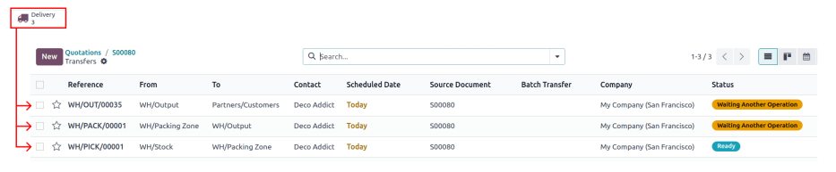

========
Packages
========

.. |SO| replace:: :abbr:`SO (Sales Order)`

A *package* is a physical container holding one or more products. Packages can also be used to store
items in bulk.

Packages are commonly used for the following purposes:

#. :ref:`Relocating products from stock <inventory/warehouses_storage/package-use>` to packing or
   outbound areas for delivery.
#. :ref:`Shipping to customers <inventory/warehouses_storage/package-type>`, in which package types
   are configured to align with shipping carriers' size and weight requirements, streamlining the
   packing process, and ensuring compliance with carrier shipping specifications.
#. Storing items in bulk.

*Package use* is a field on the package form in Odoo that is only visible by enabling the *Batch
Transfers* feature in the settings of the *Inventory* application.

The default package type is *Disposable*, so this feature is **only** required when packages are
intended to be used for batch transfers and/or other internal warehouse moves.

*Package type* is an optional feature used to create packages with defined dimensions and weight
limits. This feature is mainly used to set templates, and ensure packages comply with the shipping
requirements of third-party carriers.

.. note::
   While packages are commonly used in the :doc:`three-step delivery route
   <../../shipping_receiving/daily_operations/delivery_three_steps>`, they can be used in any
   workflow involving storable products.

.. seealso::
   :doc:`Ship one order in multiple packages
   <../../shipping_receiving/advanced_operations_shipping/multipack>`

.. _inventory/warehouses_storage/enable-package:

Configuration
=============

To use packages, first go to :menuselection:`Inventory app --> Configuration --> Settings`. Under
the :guilabel:`Operations` heading, activate the :guilabel:`Packages` feature. Then, click
:guilabel:`Save`.

.. image:: package/enable-pack.png
   :align: center
   :alt: Activate the *Packages* setting in Inventory > Configuration > Settings.

.. _inventory/warehouses_storage/package-use:

Package use
===========

.. note::
   The following section is **only** necessary when packages are intended to be used for cluster
   pickings.

.. seealso::
   :doc:`Cluster picking <../../warehouses_storage/advanced_operations_warehouse/cluster_picking>`

First, navigate to :menuselection:`Inventory app --> Configuration --> Settings`, and activate the
:guilabel:`Batch Transfers` feature, located in the :guilabel:`Operations` section. Doing so makes
the *Package Use* field appear on a package form.

.. image:: package/enable-batch.png
   :align: center
   :alt: Activate the *Batch Transfers* feature in Inventory > Configuration > Settings.

Then, go to the package form to configure the package intended for batch picking. To do that,
navigate to :menuselection:`Inventory app --> Products --> Packages`.

On this page, add new packages by clicking :guilabel:`New`, or select an existing package. Doing so
opens the package form, which contains the following fields:

- :guilabel:`Package Reference` (required): name of the package.
- :guilabel:`Package Type`: used for :ref:`configuring shipping boxes to ship to the customer
  <inventory/warehouses_storage/package-type>`.

  .. note::
     :guilabel:`Package Type` is unnecessary for configuring batch transfer packages.

- :guilabel:`Shipping Weight`: used to input the weight of the package after measuring it on a
  scale.
- :guilabel:`Company`: specify a company to make the package available **only** at the selected
  company. Leave the field blank if the package is available at all companies.
- :guilabel:`Location`: current location of the package.
- :guilabel:`Pack Date`: the date the package was created.
- :guilabel:`Package Use`: choose :guilabel:`Reusable` for packages used for moving products within
  the warehouse; :guilabel:`Disposable` for packages used to ship products to customers.

.. image:: package/package.png
   :align: center
   :alt: Display package form to create a cluster pack.

Add to batch
------------

.. important::
   The following example uses packages in a :doc:`three-step delivery
   <../../shipping_receiving/daily_operations/delivery_three_steps>` workflow.

   This workflow requires the :guilabel:`Packages`, :guilabel:`Storage Locations`, and
   :guilabel:`Multi-Step Routes` features to be enabled in :menuselection:`Inventory app -->
   Configuration --> Settings`.

   On the warehouse configuration page (:menuselection:`Inventory app --> Configuration -->
   Warehouses`), the :guilabel:`Outgoing Shipments` option **must** be set to :guilabel:`Pack goods,
   send goods in output and then deliver (3 steps)`.

After confirming a sales order, selecting the :guilabel:`Delivery` smart button displays the three
tasks to complete the delivery.

To create a batch transfer, navigate to :menuselection:`Inventory app --> Operations --> Internal`
and select the checkboxes next to the pick operations that are to be added to the batch.

After the pick operations are selected, navigate to the :guilabel:`Actions ⚙️ (gear)` icon button,
and select :guilabel:`Add to batch` from the list of drop-down menu options.

.. image:: package/create-batch.png
   :align: center
   :alt: Add pickings to batch.

Doing so opens an :guilabel:`Add to batch` pop-up window. Click :guilabel:`Confirm` to finish
creating the batch.

.. seealso::
   :ref:`More info about the fields in the 'Add to batch' window
   <inventory/warehouses_storage/add-batch-transfers>`

Pack items
----------

After creating the batch, open the batch transfer (:menuselection:`Inventory app --> Operations -->
Batch Transfers`), and select a reusable package (created in the :ref:`previous step
<inventory/warehouses_storage/package-use>`) in the :guilabel:`Destination Package` field to place
items in the package.

.. example::
   The reusable package, `CLUSTER-PACK-1`, is assigned to the :guilabel:`Destination Package` field
   of all items in the batch transfer, `BATCH/00003`.

  .. image:: package/assign-package.png
     :align: center
     :alt: Assign pickings to a package through the "Destination Package" field.

Alternatively, click the :guilabel:`Put in Pack` button to create a new package, and place all the
items in the batch in that newly-created package.

.. note::
   Ensure the new package's :guilabel:`Package Use` field is set to :guilabel:`Reusable` by clicking
   the package's :guilabel:`➡️ (right arrow)` icon to open the package form.

   .. image:: package/pack-internal-link.png
      :align: center
      :alt: Show internal link

.. example::

   Clicking :guilabel:`Put in Pack` creates a new package, `PACK0000002`, and assigns all items to
   it in the :guilabel:`Destination Package` field.

  .. image:: package/put-in-pack.png
     :align: center
     :alt: Image of the "Put in Pack" button being clicked.

.. _inventory/warehouses_storage/package-type:

Package type
============

Create package types at :menuselection:`Inventory app --> Configuration --> Package Types` to set
custom dimensions and weight limits. This feature is mainly used to set templates, and ensure
packages comply with the shipping requirements of third-party carriers.

.. seealso::
   :doc:`Shipping carriers <../../shipping_receiving/setup_configuration/third_party_shipper>`

On the :guilabel:`Package Types` list, clicking :guilabel:`New` opens a blank package type form. The
fields of the form are as follows:

- :guilabel:`Package Type` (required): define the package type's name.
- :guilabel:`Size`: define the dimensions of the package in millimeters (mm). The fields, from left
  to right, define the :guilabel:`Length`, :guilabel:`Width`, and :guilabel:`Height`.
- :guilabel:`Weight`: record the theoretical weight of the package type. This value is a placeholder
  for when the weight of the contained products is not available.
- :guilabel:`Max Weight`: maximum shipping weight allowed in the package.
- :guilabel:`Barcode`: define a barcode to identify the package type from a scan.
- :guilabel:`Company`: specify a company to make the package type available **only** at the selected
  company. Leave the field blank if it is available at all companies.
- :guilabel:`Carrier`: specify the intended shipping carrier for this package type.
- :guilabel:`Carrier Code`: define a code that is linked to the package type.

.. image:: package/package-type.png
   :align: center
   :alt: Package type for FedEx's 25 kilogram box.
