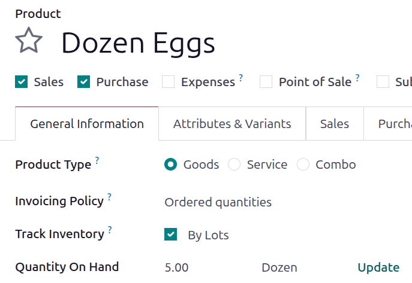

===========================
Reassign lot/serial numbers
===========================

Changing a product's tracking settings to use lots or serial numbers, *after* storing products in
Odoo without them, can lead to inconsistent records. Follow this documentation to learn how to use
an inventory adjustment to assign lot or serial numbers to products that were **not** originally
assigned any.

<<<<<<< af7ec4de3b3b6c107224c9e521bbd45d6d0de1d7
||||||| 54acafa49b4784f9412a7389255ed54c8afd51b3
.. image:: reassign/warning.png
   :align: center
   :alt: Warning message: products in stock have no lot/serial number.

=======
To enable lots and serial numbers, go to :menuselection:`Inventory app --> Configuration -->
Settings`, then in the :guilabel:`Traceability` section,  select :guilabel:`Lots & Serial Numbers`.

>>>>>>> 7541b37c39a0152a55be666752c84481b60fa2b2
.. note::
   This document outlines the process of using two inventory adjustments: one to remove incorrect
   records *without* lot numbers, and another to save the quantities *with* the lot numbers.

<<<<<<< af7ec4de3b3b6c107224c9e521bbd45d6d0de1d7
Change product tracking and perform inventory adjustments
=========================================================
||||||| 54acafa49b4784f9412a7389255ed54c8afd51b3
.. seealso::
   - :doc:`Set up and use lot numbers <lots>`
   - :doc:`Use serial numbers <serial_numbers>`

Change on-hand quantity to zero
===============================
=======
.. important::
   After an item is entered into inventory, that product **cannot** be tracked. Only *unpurchased*
   or *unsold* inventoried items can have tracking enabled and have lots and serial numbers added.

   Additionally, the :guilabel:`Track Inventory` option **must** be enabled for the product to
   follow the process outlined in this document.

Change product tracking and perform inventory adjustments
=========================================================
>>>>>>> 7541b37c39a0152a55be666752c84481b60fa2b2

To change the product's settings to track by lots or serial numbers, begin by navigating to
:menuselection:`Inventory app --> Products --> Products`, and select the intended product.

<<<<<<< af7ec4de3b3b6c107224c9e521bbd45d6d0de1d7
Next, change the :guilabel:`Track Inventory` setting to :guilabel:`By Lots` or :guilabel:`By Unique
Serial Number`.

.. image:: reassign/quantity-on-hand-product.png
   :alt: Enable Track Inventory By Lots or By Unique Serial Number.

Click the :guilabel:`Quantity On Hand` value. The :guilabel:`Locations` page for the product opens.

In the :guilabel:`Inventoried Quantity` column, change the value to zero.
||||||| 54acafa49b4784f9412a7389255ed54c8afd51b3
Next, click the product's :guilabel:`On Hand` smart button to open the :guilabel:`Update Quantity`
page. In the :guilabel:`On Hand Quantity` column, change the value to zero.
=======
Change the :guilabel:`Track Inventory` value to :guilabel:`By Lots` or :guilabel:`By Unique Serial
Number`. A message appears that explains that an inventory adjustment is required to add lot or
serial numbers to existing inventory.

Hover over the :guilabel:`Quantity On Hand` field and an :guilabel:`Update` link appears.

Click the :guilabel:`Update` link and an :guilabel:`Update Quantity` page opens. Update the
:guilabel:`On Hand Quantity` field to `0`, then click the :guilabel:`Save` button.
>>>>>>> 7541b37c39a0152a55be666752c84481b60fa2b2

.. note::
   If the product is stored in multiple locations, make sure the **total** on hand quantity at
   **all** locations is zero.

.. image:: reassign/remove-quant.png
<<<<<<< af7ec4de3b3b6c107224c9e521bbd45d6d0de1d7
   :alt: On the Locations page, update the Inventoried Quantity field.
||||||| 54acafa49b4784f9412a7389255ed54c8afd51b3
   :align: center
   :alt: Show the Inventory Adjustments model, highlighting the "On Hand Quantity" field.
=======
   :alt: The Update Quantity page, highlighting the On Hand Quantity field.
>>>>>>> 7541b37c39a0152a55be666752c84481b60fa2b2

<<<<<<< af7ec4de3b3b6c107224c9e521bbd45d6d0de1d7
Click the :guilabel:`New` button to add the products back into the inventory. Specify a
:guilabel:`Lot/Serial Number` and the :guilabel:`Inventoried Quantity`.

.. image:: reassign/quantity-lot-serial-number.png
   :alt: Fill in the Lot/Serial Number and Inventoried Quantity field.
||||||| 54acafa49b4784f9412a7389255ed54c8afd51b3
Change traceability setting
===========================

Return to the product form (:menuselection:`Inventory app --> Products --> Products`), and switch to
the :guilabel:`Inventory` tab. In the :guilabel:`Traceability` section, change the
:guilabel:`Tracking` option from :guilabel:`No Tracking` to :guilabel:`By Lots` or :guilabel:`By
Unique Serial Number`.

.. seealso::
   :doc:`expiration_dates`

.. image:: reassign/tracking.png
   :align: center
   :alt: Enable lots and serial numbers.

Restore on-hand quantity
========================

After manually changing the on-hand quantity to zero and changing the :guilabel:`Tracking` setting
to lots or serial numbers, restore the quantities by clicking the :guilabel:`On Hand` smart button
from the desired product form.

On the :guilabel:`Update Quantity` page, because the on-hand quantity had been previously changed to
zero, a :guilabel:`No Stock On Hand` warning appears on the page. From here, click the
:guilabel:`New` button in the top-left corner. Doing so reveals a new, modifiable line on the
:guilabel:`Update Quantity` page. Then, input a desired lot number in the :guilabel:`Lot/Serial
Number` field, and adjust the :guilabel:`On Hand Quantity` to its original value.

.. seealso::
   :doc:`../../warehouses_storage/inventory_management/count_products`

.. image:: reassign/update-quantity.png
   :align: center
   :alt: Fill in the "Lot/Serial Number" and "On Hand Quantity" field.
=======
Then, click the :guilabel:`New` button. Add a lot or serial number in the :guilabel:`Lot/Serial
Number` field, and specify a quantity. Click the :guilabel:`Save` button. Repeat this process for
all lots or serial numbers for the product in the inventory.

.. image:: reassign/update-quantity.png
   :alt: Fill in the Lot/Serial Number and On Hand Quantity fields.
>>>>>>> 7541b37c39a0152a55be666752c84481b60fa2b2

.. tip::
<<<<<<< af7ec4de3b3b6c107224c9e521bbd45d6d0de1d7
   To find the original quantity, and adjust the :guilabel:`Inventoried Quantity` accordingly, after
   assigning a new lot or serial number, click the :icon:`fa-history` :guilabel:`History` button on
   the far-right.
||||||| 54acafa49b4784f9412a7389255ed54c8afd51b3
   To find the original quantity, and adjust the :guilabel:`On Hand Quantity` accordingly, after
   assigning a new lot or serial number, click the :icon:`fa-pencil` :guilabel:`(pencil)` icon in
   the :guilabel:`On Hand Quantity` column. Then, click the :icon:`fa-history` :guilabel:`History`
   button on the far-right.
=======
   To find the original quantity, and adjust the :guilabel:`On Hand Quantity` accordingly, click the
   :icon:`fa-history` :guilabel:`History` button on the far-right of the edited line.
>>>>>>> 7541b37c39a0152a55be666752c84481b60fa2b2

   .. image:: reassign/adjustment.png
<<<<<<< af7ec4de3b3b6c107224c9e521bbd45d6d0de1d7
      :alt: Show the History button on the Locations page.
||||||| 54acafa49b4784f9412a7389255ed54c8afd51b3
      :align: center
      :alt: Show the "History" button on the Inventory Adjustments page.
=======
      :alt: Show the History button on the Inventory Adjustments page.
>>>>>>> 7541b37c39a0152a55be666752c84481b60fa2b2

   The inventory adjustment that changed the on-hand quantity to zero is displayed in the
   :guilabel:`Quantity` field.

    .. image:: reassign/history.png
       :alt: Show the history entry.

.. seealso::
   - :doc:`Set up and use lot numbers <lots>`
   - :doc:`Use serial numbers <serial_numbers>`
   - :doc:`../../warehouses_storage/inventory_management/count_products`
