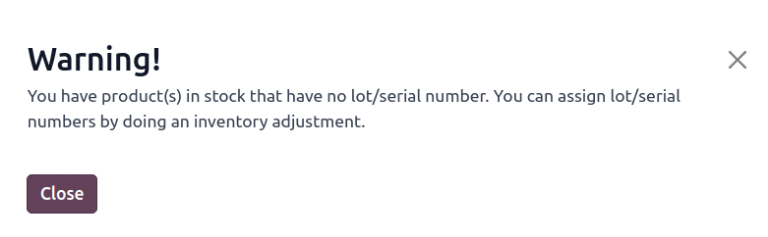
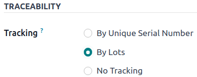
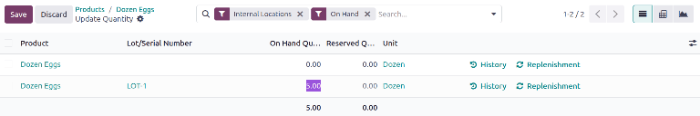

===========================
Reassign lot/serial numbers
===========================

Changing a product's tracking settings to use lots or serial numbers, *after* storing products in
Odoo without them, can lead to inconsistent records. Follow this documentation to learn how to use
an inventory adjustment to assign lot or serial numbers to products that were not originally
assigned lots.

.. note::
   This document outlines the process of using two inventory adjustments: one to remove incorrect
   records *without* lot numbers, and another to save the quantities *with* the lot numbers.

.. seealso::
   - :doc:`Set up and use lot numbers <lots>`
   - :doc:`Set up serial numbers <create_sn>`
   - :doc:`Use serial numbers <serial_numbers>`

Change on-hand quantity to zero
===============================

To change the product's settings to track by lots or serial numbers, begin by navigating to
:menuselection:`Inventory app --> Products --> Products`, and select the intended product.

Next, click the product's :guilabel:`On Hand` smart button to open the :guilabel:`Update Quantity`
page. In the :guilabel:`On Hand Quantity` column, change the value to zero.

.. note::
   If the product is stored in multiple locations, make sure the **total** on hand quantity at
   **all** locations is zero.

.. image:: reassign/remove-quant.png
   :align: center
   :alt: Show the Inventory Adjustments model, highlighting the "On Hand Quantity" field.

Change traceability setting
===========================

Return to the product form (:menuselection:`Inventory app --> Products --> Products`), and switch to
the :guilabel:`Inventory` tab. In the :guilabel:`Traceability` section, change the
:guilabel:`Tracking` option from :guilabel:`No Tracking` to :guilabel:`By Lots` or :guilabel:`By
Unique Serial Number`.

.. seealso::
   :doc:`expiration_dates`

Restore on-hand quantity
========================

After manually changing the on-hand quantity to zero and changing the :guilabel:`Tracking` setting
to lots or serial numbers, restore the quantities by clicking the :guilabel:`On Hand` smart button
from the desired product form.

On the :guilabel:`Update Quantity` page, because the on-hand quantity had been previously changed to
zero, a :guilabel:`No Stock On Hand` warning appears on the page. From here, click the
:guilabel:`New` button in the top-left corner. Doing so reveals a new, modifiable line on the
:guilabel:`Update Quantity` page. Then, input a desired lot number in the :guilabel:`Lot/Serial
Number` field, and adjust the :guilabel:`On Hand Quantity` to its original value.

.. seealso::
   :doc:`../../warehouses_storage/inventory_management/count_products`

.. tip::
   To find the original quantity, and adjust the :guilabel:`On Hand Quantity` accordingly, after
   assigning a new lot or serial number, click the :icon:`fa-pencil` :guilabel:`(pencil)` icon in
   the :guilabel:`On Hand Quantity` column. Then, click the :icon:`fa-history` :guilabel:`History`
   button on the far-right.

   .. image:: reassign/adjustment.png
      :align: center
      :alt: Show the "History" button on the Inventory Adjustments page.

   The inventory adjustment that changed the on-hand quantity to zero is displayed in the
   :guilabel:`Quantity` field.

    .. image:: reassign/history.png
       :align: center
       :alt: Show the history entry.
