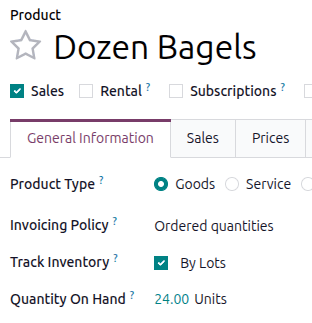
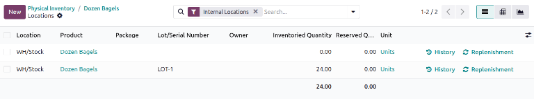

===========================
Reassign lot/serial numbers
===========================

Changing a product's tracking settings to use lots or serial numbers, *after* storing products in
Odoo without them, can lead to inconsistent records. Follow this documentation to learn how to use
an inventory adjustment to assign lot or serial numbers to products that were not originally
assigned lots.

.. note::
   This document outlines the process of using two inventory adjustments: one to remove incorrect
   records *without* lot numbers, and another to save the quantities *with* the lot numbers.

Change product tracking and perform inventory adjustments
=========================================================

To change the product's settings to track by lots or serial numbers, begin by navigating to
:menuselection:`Inventory app --> Products --> Products`, and select the intended product.

Next, change the :guilabel:`Track Inventory` setting to :guilabel:`By Lots` or :guilabel:`By Unique
Serial Number`.

Click the :guilabel:`Quantity On Hand` value. The :guilabel:`Locations` page for the product opens.

In the :guilabel:`Inventoried Quantity` column, change the value to zero.

.. note::
   If the product is stored in multiple locations, make sure the **total** on hand quantity at
   **all** locations is zero.

.. image:: reassign/remove-quant.png
   :alt: On the Locations page, update the Inventoried Quantity field.

Click the :guilabel:`New` button to add the products back into the inventory. Specify a
:guilabel:`Lot/Serial Number` and the :guilabel:`Inventoried Quantity`.

.. tip::
   To find the original quantity, and adjust the :guilabel:`Inventoried Quantity` accordingly, after
   assigning a new lot or serial number, click the :icon:`fa-history` :guilabel:`History` button on
   the far-right.

   .. image:: reassign/adjustment.png
      :alt: Show the History button on the Locations page.

   The inventory adjustment that changed the on-hand quantity to zero is displayed in the
   :guilabel:`Quantity` field.

    .. image:: reassign/history.png
       :alt: Show the history entry.

.. seealso::
   - :doc:`Set up and use lot numbers <lots>`
   - :doc:`Use serial numbers <serial_numbers>`
   - :doc:`../../warehouses_storage/inventory_management/count_products`
