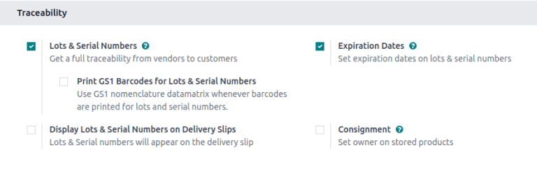
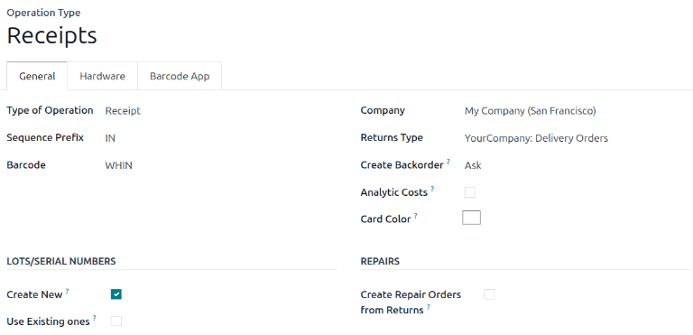
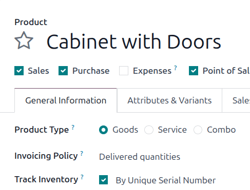
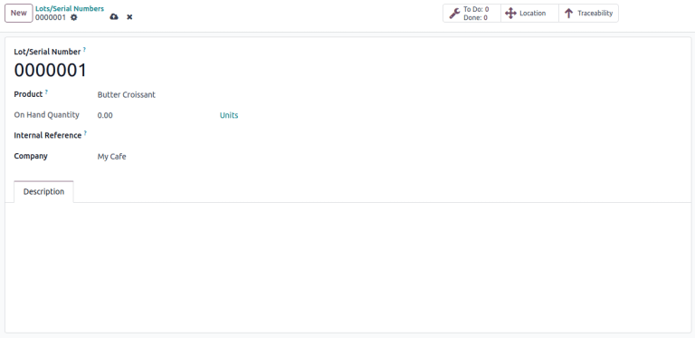
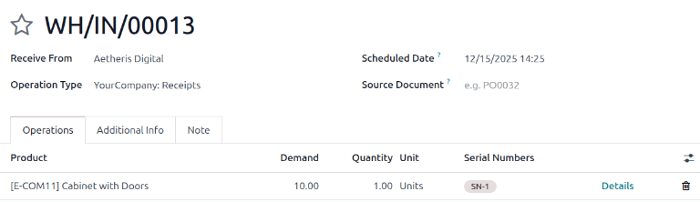
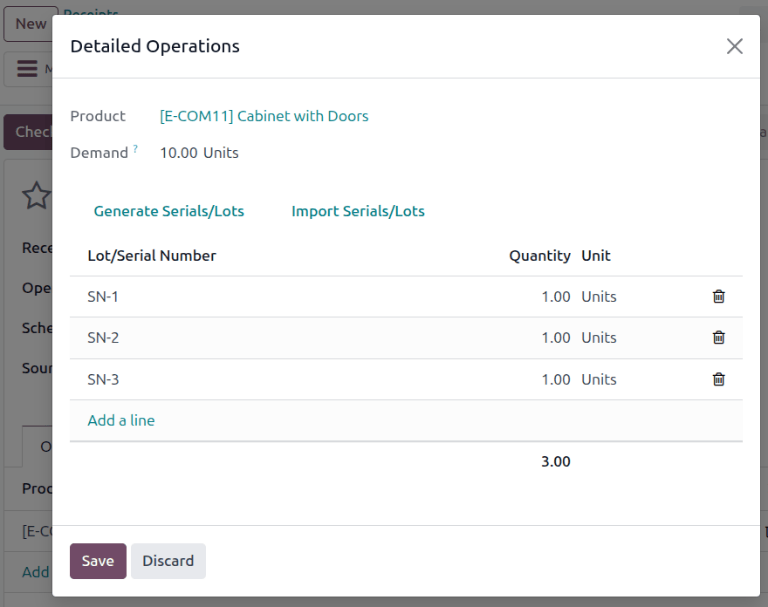
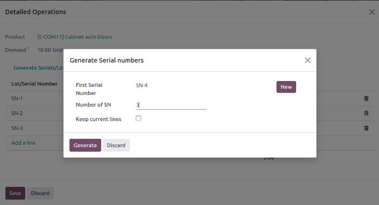
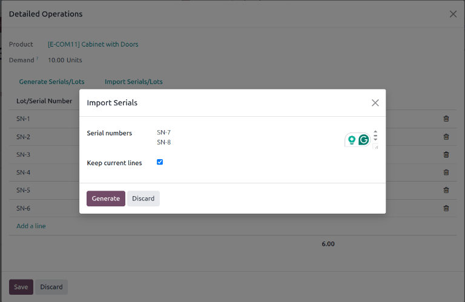
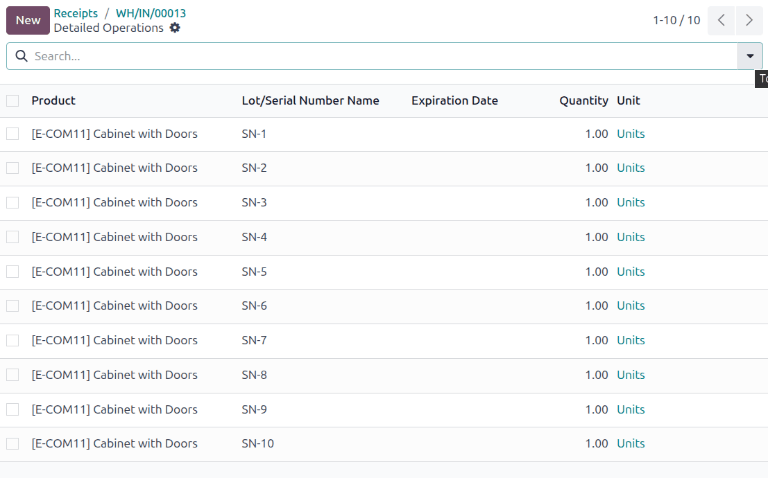
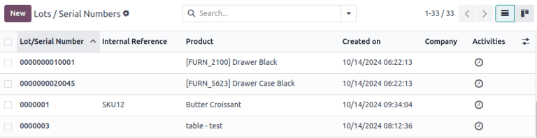

==============
Serial numbers
==============

*Serial numbers* are one of the two ways to identify and track products in Odoo, along with
:doc:`lots <lots>`. A serial number is a unique identifier assigned to a product to distinguish it
from other products in a series. Serial numbers can consist of several character types: they can
contain numbers, letters, other typographical characters, or any mix of these character types.

The goal of assigning serial numbers allows for the tracking of individual products and their
:doc:`expiration dates <expiration_dates>` and location throughout the supply chain. For instance,
serial numbers can help manufacturers locate products to provide after-sales services or in the
event of a recall.

.. seealso::
   `Odoo Tutorials: Serial Numbers <https://www.youtube.com/watch?v=ZP-gMz2X5AY>`_

.. _inventory/product_management/enable-lots:

Enable lots & serial numbers
============================

To track products using serial numbers, two settings need to be enabled: the :ref:`Lots & Serial
Numbers traceability setting <inventory/product_management/traceability-setting>`, and :ref:`serial
number usage by operation type <inventory/product_management/operation-type-setting>`.

.. _inventory/product_management/traceability-setting:

Traceability setting
--------------------

The *Lots & Serial Numbers* traceability feature *must* be enabled first to track
products. To do so, go to :menuselection:`Inventory app --> Configuration --> Settings`, scroll down
to the :guilabel:`Traceability` section, and tick the :guilabel:`Lots & Serial Numbers` checkbox.
Remember to click the :guilabel:`Save` button to save changes.

.. _inventory/product_management/operation-type-setting:

By operation type
-----------------

Next, specify whether the ability to create new or use existing serial numbers should be turned on
for particular operation types (such as shipping or receiving goods). In other words, this setting
allows for serial number tracking on warehouse receipts and delivery orders.

.. example::
   Enabling the *Create New* option for receipts allows new serial numbers to be assigned
   as items are received. However, for delivery orders, it is often disabled to prevent workers from
   accidentally assigning serial numbers that do not exist in inventory.

To enable the creation of new serial numbers on an operation, navigate to :menuselection:`Inventory
app --> Configuration --> Operations Types`.

From the :guilabel:`Operations Types` page, select the desired operation type (e.g.
:guilabel:`Receipts`, :guilabel:`Delivery Orders`, or :guilabel:`Manufacturing`), and select the
:guilabel:`Create New` option in the :guilabel:`Lots/Serial Numbers` section of the operation type's
configuration page.

.. _inventory/product_management/detailed-operations:

Configure serial number tracking on individual products
=======================================================

Once the :ref:`Lots & Serial Numbers setting <inventory/product_management/traceability-setting>`
has been activated, individual products can now be tracked using serial numbers. To track a product,
go to :menuselection:`Inventory app --> Products --> Products`, and select the desired product.

In the :guilabel:`General Information` tab on the product form, make sure the box next to
:guilabel:`Track Inventory` is checked. Then, select :guilabel:`By Unique Serial Number`, and click
:guilabel:`Save` to save the changes. Now, existing or new serial numbers can now be selected and
assigned to newly-received or manufactured batches of this product.

.. _inventory/product_management/assign-sn:

Assign serial numbers
=====================

In Odoo, serial numbers can be assigned at several times and places:

- When a product is :ref:`already in stock <inventory/product_management/already-in-stock>`
- Via the :ref:`Moves smart button <inventory/product_management/moves-button>` on a receipt
- Via the :ref:`Open: Stock move window <inventory/product_management/stock-move>` on a receipt
- :doc:`During a manufacturing order
  <../../../manufacturing/basic_setup/configure_manufacturing_product>` for a product tracked by
  lots/serial numbers
- When :doc:`making an inventory adjustment
  <../../warehouses_storage/inventory_management/count_products>`

.. _inventory/product_management/already-in-stock:

Create new serial numbers for products already in stock
-------------------------------------------------------

New serial numbers can be created for products already in stock with no assigned serial number. To
do so, go to :menuselection:`Inventory --> Products --> Lots/Serial Numbers`, and click
:guilabel:`New`. Doing so reveals a blank lot/serial number form. On this form, a new
:guilabel:`Lot/Serial Number` is generated automatically.

.. tip::
   While Odoo automatically generates a new lot/serial number to follow the most recent number, it
   can be edited and changed to any desired number, by clicking the line under the
   :guilabel:`Lot/Serial Number` field, and changing the generated number.

Once the :guilabel:`Lot/Serial Number` is generated, click the blank field next to
:guilabel:`Product` to reveal a drop-down menu. From this menu, select the product to which this new
number will be assigned.

This form also provides the option to adjust the :guilabel:`On Hand Quantity`, to assign a unique
:guilabel:`Internal Reference` number (for additional traceability), and to assign this specific
lot/serial number configuration to a specific company in the :guilabel:`Company` field. A detailed
description of this specific lot/serial number can also be added in the :guilabel:`Description` tab
below.

.. tip::
   The :guilabel:`Internal Reference` number field is a space for manufacturers to input an
   additional unique number to allow for easier tracking. For instance, SKU values may be used
   here.

When all desired configurations are complete, click the :guilabel:`Save` button to save all changes.

After a new serial number has been created, assigned to the desired product, and saved, navigate
back to the product form, by going to :menuselection:`Inventory app --> Products --> Products`, and
selecting the product that this newly-created serial number was just assigned to.

On that product's detail form, click the :guilabel:`Lot/Serial Numbers` smart button to view the new
serial number.

.. _inventory/product_management/incoming-outgoing-products:

Create serial numbers to incoming or outgoing products
------------------------------------------------------

Serial numbers can be assigned to both incoming and outgoing goods. The receipt and delivery order
forms mirror one another; the instructions below can be followed to assign serial numbers in either
form.

- **Incoming goods:** Assign serial numbers directly on the **receipt**. Receipts can be accessed by
  navigating to :menuselection:`Inventory app --> Operations --> Receipts`.
- **Outgoing goods:** Assign serial numbers directly on the **delivery order**. Receipts can be
  accessed by navigating to :menuselection:`Inventory app --> Operations --> Deliveries`.

.. important::
   Before assigning serial numbers on receipts or delivery orders, be sure that the ability to
   :ref:`create new serial numbers by operations type
   <inventory/product_management/operation-type-setting>` is enabled.

Lots/serial number field
~~~~~~~~~~~~~~~~~~~~~~~~

Serial numbers can be entered directly into the :guilabel:`Serial Numbers` field on a receipt or
delivery order.

.. tip::
   To make the :guilabel:`Serial Numbers` field visible on a receipt or delivery order, click the
   :icon:`oi-settings-adjust` :guilabel:`(Adjust Settings)` icon, and in the drop-down menu, tick
   the :guilabel:`Serial Numbers` checkbox.

   .. figure:: serial_numbers/field-visible.png
      :alt: Allow Serial Numbers field to show on a receipt or delivery order.

      Example **Serial Numbers** field on a delivery order.

.. _inventory/product_management/stock-move:

Stock move pop-up window
~~~~~~~~~~~~~~~~~~~~~~~~

For various methods of assigning serial numbers individually or in bulk, click the :icon:`fa-list`
:guilabel:`(list)` icon in the product line of a receipt.

Add a line
**********

In the :guilabel:`Open: Stock move` pop-up window, manually enter serial numbers in the
:guilabel:`Lot/Serial Number` column. This method is best reserved for adding only one or a few
serial numbers.

.. _inventory/product_management/generate-serials:

Generate Serials/Lots
*********************

Assign multiple serial numbers at once by clicking the :guilabel:`Generate Serials/Lots` button in
the :guilabel:`Open: Stock move` pop-up window.

Doing so opens a new popup, :guilabel:`Generate Serial numbers`, which contains a few fields:

- :guilabel:`First SN`: Input the first serial number that should start the sequence. From there,
  Odoo automatically detects what pattern should be followed to generate more serial numbers.
- :guilabel:`Number of SN`: Specify the desired number of serial numbers to generate.

  .. note::
     The number of serials generated will be reflected in the :guilabel:`Quantity` field on a
     receipt or delivery order. Even if the number of serial numbers generated exceeds the
     :guilabel:`Demand` value, Odoo still allows the quantity (based on the serial numbers) to be
     delivered or received.

     .. image:: serial_numbers/stock-move-generate-quantity-tip.png
        :alt: Show how the quantity of serial numbers alters the delivery order quantity.

- :guilabel:`Keep current lines` checkbox: Check this box to keep existing serial numbers that may
  have been previously added. To replace existing serial numbers in the list, leave the box
  unchecked.

After filling out these fields, click the :guilabel:`Generate` button. The newly generated serials
now appear in the :guilabel:`Open: Stock move` window. By clicking :icon:`fa-cloud-upload`
:guilabel:`(Save)`, the :guilabel:`Quantity` and the :guilabel:`Serial Numbers` fields on the
delivery order or receipt update automatically.

Import Serials/Lots
*******************

Another option for assigning multiple serial numbers at once is to click the :guilabel:`Import
Serials/Lots` button in the :guilabel:`Open: Stock move` pop-up window.

.. important::
   If the import button is not visible, ensure the :guilabel:`Create New` box is checked in the
   :ref:`receipt's configuration page <inventory/product_management/operation-type-setting>`.

Doing so opens the :guilabel:`Import Serials` pop-up window. Enter each serial number on a separate
line in the :guilabel:`Lots/Serial numbers` text field.

As when :ref:`generating serials <inventory/product_management/generate-serials>`, check the
:guilabel:`Keep current lines` box to keep existing serial numbers, or leave it unchecked to
overwrite them.

.. tip::
   To expedite this process, copy/paste serial numbers from an existing spreadsheet and add them to
   the :guilabel:`Lots/Serial numbers` text field.

Finally, click :guilabel:`Generate`.

.. example::
   For a receipt with a :guilabel:`Demand` of `3.00` products, one product has already been assigned
   a serial number in the :guilabel:`Open: Stock move` pop-up window.

   So, in the :guilabel:`Import Lots` pop-up window, two serial numbers, `124` and `125` are
   assigned to the remaining products by entering the following in the :guilabel:`Lots/Serial
   numbers` input field:

   .. code-block::

      124
      125

   The :guilabel:`Keep current lines` option is selected to add these two serial numbers **in
   addition** to the serial number, `123`, that has already been assigned.

   .. image:: serial_numbers/import-serial.png
      :alt: Show example of correctly inputting serial numbers in the text field.

.. _inventory/product_management/moves-button:

Detailed operations
~~~~~~~~~~~~~~~~~~~

Accessible from both receipt and delivery order forms, the *Detailed Operations* page shows a
detailed view of product movements, including information about serial numbers, exact locations,
expiration dates, etc. This level of detail permits more precise tracking, for example, when
handling perishable or regulated goods.

To access this page, first :ref:`select a warehouse receipt or delivery order
<inventory/product_management/incoming-outgoing-products>`. Then, click on the :icon:`fa-bars`
:guilabel:`Moves` smart button at the top of the page.

In the :guilabel:`Lot/Serial Number` column, manually type (or select from the drop-down menu)
the desired serial numbers for each individual product.

When finished, click the receipt/delivery order's breadcrumbs, and the assigned serial numbers are
automatically saved.

Traceability & reporting
========================

Manufacturers and companies can refer to the *Lots/Serial Numbers* dashboard and traceability
reports to see the entire lifecycle of a product: when and where it originated, where it was stored,
and who it was shipped to.

Lots/Serial Numbers dashboard
-----------------------------

To see the full traceability of a product, or group by serial numbers, go to
:menuselection:`Inventory app --> Products --> Lots/Serial Numbers`. Doing so reveals the
:guilabel:`Lots/Serial Numbers` dashboard.

Reporting
~~~~~~~~~

On the :guilabel:`Lots/Serial Numbers` dashboard, products with serial numbers assigned to them are
listed by default. Click the :icon:`fa-caret-right` :guilabel:`(expand)` icon to show which serial
numbers are assigned to the chosen product.

To group by serial numbers (or lots), first remove any default filters from the search bar in the
upper-right corner. Then, click the :icon:`fa-caret-down` :guilabel:`(down arrow)` icon and select
:guilabel:`Add Custom Group`, which reveals a mini drop-down menu. From this mini drop-down menu,
select :guilabel:`Lot/Serial Number`, and click :guilabel:`Apply`.

Doing so reveals all existing serial numbers and lots. Each row can be expanded to show all
quantities of product assigned to that serial/lot number. For unique serial numbers that are not
reused, there should be just one product per serial number.

.. tip::
   For additional information regarding an individual serial (or lot) number, click the line
   item for the serial number to reveal that specific :guilabel:`Serial Number` form. From this
   form, click the :guilabel:`Location` and :guilabel:`Traceability` smart buttons to see all stock
   on-hand using that serial number, and any operations made using that serial number.

.. seealso::
   :doc:`Reassign <reassign>`

   In addition to using the :guilabel:`Lots/Serial Numbers` dashboard, there are several other
   reporting templates that display the :guilabel:`Lot/Serial Number` field or the ability to filter
   by serial number. Go to :menuselection:`Inventory app --> Reporting` to access:

   - :guilabel:`Locations` report
   - :guilabel:`Moves History` report
   - :guilabel:`Moves Analysis` report
