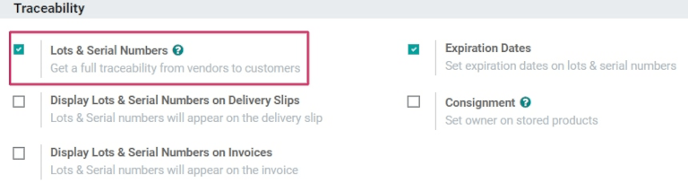
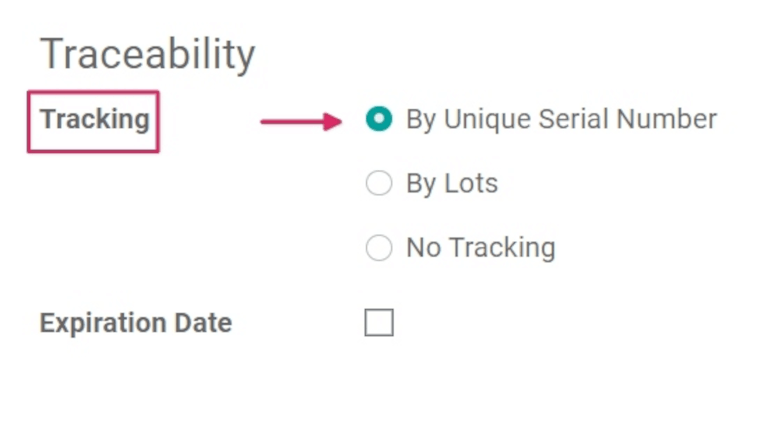
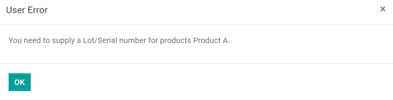
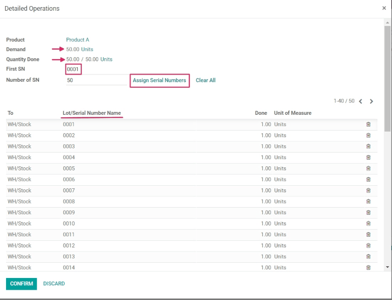
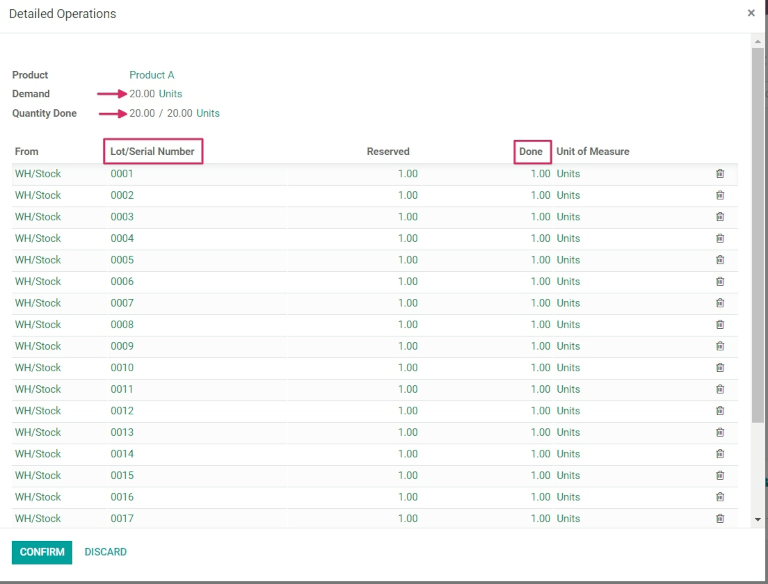
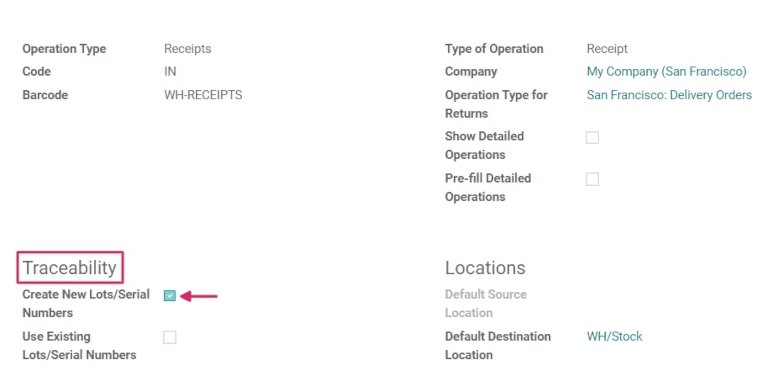

====================================
Use serial numbers to track products
====================================

*Serial numbers* are one of the two ways to identify and track products in Odoo. A serial number is
a unique identifier assigned incrementally (or sequentially) to an item or product, used to
distinguish it from other items and products.

Serial numbers can consist of many different types of characters: they can be strictly numerical,
they can contain letters and other typographical symbols, or they can be a mix of all of the above.

The goal of assigning serial numbers to individual products is to make sure that every item's
history is identifiable when it travels through the supply chain. This can be especially useful for
manufacturers that provide after-sales services to products that they sell and deliver.

.. seealso::
   :doc:`/applications/inventory_and_mrp/inventory/product_management/product_tracking/lots`

Enable lots & serial numbers
============================

To track products using serial numbers, the :guilabel:`Lots & Serial Numbers` feature must be
enabled. To enable this, go to :menuselection:`Inventory app --> Configuration --> Settings`, scroll
down to the :guilabel:`Traceability` section, and click the box next to :guilabel:`Lots & Serial
Numbers`. Remember to click the :guilabel:`Save` button to save changes.

.. _inventory/serial_numbers/configure:

Configure serial number tracking on products
============================================

Once the :guilabel:`Lots & Serial Numbers` setting has been activated, individual products can now
be tracked using serial numbers. To configure this, go to :menuselection:`Inventory app --> Products
--> Products`, and choose a desired product to track.

Once on the product form, click :guilabel:`Edit`, and click the :guilabel:`Inventory` tab.

Once on the product form, click :guilabel:`Edit`, navigate to the :guilabel:`Inventory` tab, and
scroll to the :guilabel:`Traceability` section. Then, select the :guilabel:`By Unique Serial Number`
option, and click :guilabel:`Save` to save the changes. Existing or new serial numbers can now be
selected and assigned to newly-received or manufactured batches of this product.

.. warning::
   If a product doesn't have a serial number assigned to it, a user error pop-up window will appear.
   The error message states that the product(s) in stock have no lot/serial number. However, a
   lot/serial number can be assigned to the product by making an inventory adjustment.

Create new serial numbers for products already in stock
-------------------------------------------------------

New serial numbers can be created for products already in stock with no assigned serial number. To
do this, go to :menuselection:`Inventory --> Products --> Lots/Serial Numbers`, and click
:guilabel:`Create`. Doing so reveals a blank lots/serial numbers form. On this form, a new
:guilabel:`Lot/Serial Number` is generated automatically.

.. tip::
   While Odoo automatically generates a new lot/serial number to follow the most recent number, it
   can be edited and changed to any desired number, by clicking the line under the
   :guilabel:`Lot/Serial Number` field, and changing the generated number.

Once the :guilabel:`Lot/Serial Number` is generated, click the blank field next to
:guilabel:`Product` to reveal a drop-down menu. From this menu, select the product to which this new
number will be assigned.

This form also provides the option to adjust the :guilabel:`Quantity`, to assign a unique
:guilabel:`Internal Reference` number (for traceability purposes), and to assign this specific
lot/serial number configuration to a specific website in the :guilabel:`Website` field (if working
in a multi-website environment).

A detailed description of this specific lot/serial number can also be added in the
:guilabel:`Description` tab below.

When all desired configurations are complete, click the :guilabel:`Save` button to save all changes.

.. image:: serial_numbers/serial-numbers-new-serial-number.png
   :align: center
   :alt: New serial number created for existing product stock.

After a new serial number has been created, assigned to the desired product, and saved, navigate
back to the product form, by going to :menuselection:`Products --> Products`, and selecting the
product that this newly-created serial number was just assigned to.

On that product's detail form, click the :guilabel:`Lot/Serial Numbers` smart button to view the new
serial number.

Manage serial numbers for shipping and receiving
================================================

Serial numbers can be assigned for both **incoming** and **outgoing** goods. For incoming goods,
serial numbers are assigned directly on the purchase order form. For outgoing goods, serial numbers
are assigned directly on the sales order form.

Manage serial numbers on receipts
---------------------------------

Assigning serial numbers to **incoming** goods can be done directly from the purchase order (PO).

To create a :abbr:`PO (purchase order)`, go to the :menuselection:`Purchase app --> Create`. Doing
so reveals a new, blank request for quotation (RFQ) form.

On this :abbr:`RFQ (request for quotation)` form, fill out the necessary information, by adding a
:guilabel:`Vendor`, and by adding the desired products to the :guilabel:`Product` lines, by clicking
:guilabel:`Add a product`, under the :guilabel:`Products` tab.

Choose the desired quantity of the product to order, by changing the number in the
:guilabel:`Quantity` column.

When the necessary configurations are complete, click :guilabel:`Confirm Order`. This will convert
the :abbr:`RFQ (request for quotation)` to a purchase order.

Then, click the :guilabel:`Receipt` smart button to be taken to the warehouse receipt form page for
that specific :abbr:`PO (purchase order)`.

.. warning::
   Clicking :guilabel:`Validate` before assigning a serial number to the ordered product quantities
   will cause a :guilabel:`User Error` pop-up to appear. The pop-up requires entry of a lot or
   serial number for the ordered products. The :abbr:`RFQ (request for quotation)` **cannot** be
   validated without a serial number being assigned.

From here, click the :guilabel:`Additional Options` menu, represented by a `hamburger` icon (four
horizontal lines, located to the right of the :guilabel:`Unit of Measure` column in the
:guilabel:`Operations` tab). Clicking that icon reveals a :guilabel:`Detailed Operations` pop-up.

In this pop-up, configure a number of different fields, including the assignation of a serial number
(or serial numbers) under the :guilabel:`Lot/Serial Number Name` column, located at the bottom of
the pop-up.

There are three ways to do this: manually assigning serial numbers, automatically assigning serial
numbers, and copy/pasting serial numbers from a spreadsheet.

Assign serial numbers manually
~~~~~~~~~~~~~~~~~~~~~~~~~~~~~~

To assign serial numbers manually, click :guilabel:`Add a line` from the :guilabel:`Detailed
Operations` pop-up, and first choose the location where the product will be stored under the
:guilabel:`To` column.

Then, type a new :guilabel:`Serial Number Name`, and set the :guilabel:`Done` quantity in the
appropriate columns.

Repeat this process for the quantity of products shown in the :guilabel:`Demand` field, and until
the :guilabel:`Quantity Done` field displays the correct (matching) number of products processed.

Assign serial numbers automatically
~~~~~~~~~~~~~~~~~~~~~~~~~~~~~~~~~~~

If a large quantity of products need individual serial numbers assigned to them, Odoo can
automatically generate and assign serial numbers to each of the individual products.

To accomplish this, start with the :guilabel:`First SN` field in the :guilabel:`Detailed Operations`
pop-up window, and type the first serial number in the desired order to be assigned.

Then, in the :guilabel:`Number of SN` field, type the total number of items that need
newly-generated unique serial numbers assigned to them.

Finally, click :guilabel:`Assign Serial Numbers`, and a list will populate with new serial numbers
matching the ordered quantity of products.

Copy/paste serial numbers from a spreadsheet
~~~~~~~~~~~~~~~~~~~~~~~~~~~~~~~~~~~~~~~~~~~~

To copy and paste serial numbers from an existing spreadsheet, first populate a spreadsheet with all
of the serial numbers received from the supplier (or manually chosen upon receipt). Then, copy and
paste them in the :guilabel:`Lot/Serial Number Name` column. Odoo will automatically create the
necessary number of lines based on the amount of numbers pasted in the column.

From here, the :guilabel:`To` locations and :guilabel:`Done` quantities can be manually entered in
each of the serial number lines.

.. image:: serial_numbers/serial-numbers-excel-spreadsheet.png
   :align: center
   :alt: List of serial numbers copied in Excel spreadsheet.

.. tip::
   For purchase orders that include large quantities of products to receive, the best method of
   serial number assignment is to automatically assign serial numbers using the :guilabel:`Assign
   Serial Numbers` button located on the :abbr:`PO (purchase order)`. This prevents any serial
   numbers from being reused or duplicated, and improves traceability reporting.

Once all product quantities have been assigned a serial number, click the :guilabel:`Confirm` button
to close the pop-up. Then, click :guilabel:`Validate`.

A :guilabel:`Traceability` smart button appears upon validating the receipt. Click the
:guilabel:`Traceability` smart button to see the updated :guilabel:`Traceability Report`, which
includes: a :guilabel:`Reference` document, the :guilabel:`Product` being traced, the
:guilabel:`Lot/Serial #`, and more.

Once all product quantities have been assigned a serial number, click :guilabel:`Confirm` to close
the popup, and click :guilabel:`Validate`. A :guilabel:`Traceability` smart button will appear upon
validating the receipt. Click the :guilabel:`Traceability` smart button to see the updated
:guilabel:`Traceability Report`, which includes: a :guilabel:`Reference` document, the
:guilabel:`Product` being traced, the :guilabel:`Lot/Serial #`, and more.

Manage serial numbers on delivery orders
----------------------------------------

Assigning serial numbers to **outgoing** goods can be done directly from the sales order (SO).

To create an :abbr:`SO (sales order)`, navigate to the :menuselection:`Sales` app, and click the
:guilabel:`Create` button. Doing so reveals a new, blank quotation form. On this blank quotation
form, fill out the necessary information, by adding a :guilabel:`Customer`, and adding products to
the :guilabel:`Product` lines (in the :guilabel:`Order Lines` tab), by clicking :guilabel:`Add a
product`.

Then, choose the desired quantity to sell by changing the number in the :guilabel:`Quantity` column.

Once the quotation has been filled out, click the :guilabel:`Confirm` button to confirm the
quotation. When the quotation is confirmed, the quotation becomes an :abbr:`SO (sales order)`, and a
:guilabel:`Delivery` smart button appears.

Click the :guilabel:`Delivery` smart button to view the warehouse receipt form for that specific
:abbr:`SO (sales order)`.

From here, click the :guilabel:`Additional Options` menu, represented by a `hamburger` icon (four
horizontal lines, located to the right of the :guilabel:`Unit of Measure` column in the
:guilabel:`Operations` tab). Clicking that icon reveals a :guilabel:`Detailed Operations` pop-up.

In the pop-up, a :guilabel:`Lot/Serial Number` will be chosen by default, with each product of the
total :guilabel:`Reserved` quantity listed with their unique serial numbers (most likely listed in
sequential order).

To manually change a product's serial number, click the drop-down menu under :guilabel:`Lot/Serial
Number`, and choose (or type) the desired serial number. Then, mark the :guilabel:`Done` quantities,
and click :guilabel:`Confirm` to close the pop-up.

Finally, click the :guilabel:`Validate` button to deliver the products.

Upon validating the delivery order, a :guilabel:`Traceability` smart button appears. Click the
:guilabel:`Traceability` smart button to see the updated :guilabel:`Traceability Report`, which
includes: a :guilabel:`Reference` document, the :guilabel:`Product` being traced, the
:guilabel:`Date`, and the :guilabel:`Lot/Serial #` assigned.

The :guilabel:`Traceability Report` can also include a :guilabel:`Reference` receipt from the
previous purchase order (PO), if any of the product quantities shared a serial number assigned
during receipt of that specific :abbr:`PO (purchase order)`.

Manage serial numbers for different operations types
====================================================

By default in Odoo, the creation of new serial numbers is only allowed upon **receiving** products
from a purchase order. **Existing** serial numbers cannot be used. For sales orders, the opposite is
true: new serial numbers cannot be created on the delivery order, only existing serial numbers can
be used.

To change the ability to use new (or existing) serial numbers on any operation type, go to
:menuselection:`Inventory app --> Configuration --> Operations Types`, and select the desired
:guilabel:`Operation Type`.

For the :guilabel:`Receipts` operation type, found on the :guilabel:`Operations Types` page, the
:guilabel:`Use Existing Lots/Serial Numbers` option can be enabled, by selecting
:guilabel:`Receipts` from the :guilabel:`Operations Types` page, clicking :guilabel:`Edit`, and then
clicking the checkbox beside the :guilabel:`Use Existing Lots/Serial Numbers` option (in the
:guilabel:`Traceability` section). Lastly, click the :guilabel:`Save` button to save the changes.

For the :guilabel:`Delivery Orders` operation type, located on the :guilabel:`Operations Types`
page, the :guilabel:`Create New Lots/Serial Numbers` option can be enabled, by selecting
:guilabel:`Delivery Orders` from the :guilabel:`Operations Types` page, clicking :guilabel:`Edit`,
and clicking the checkbox beside the :guilabel:`Create New Lots/Serial Numbers` option (in the
:guilabel:`Traceability` section). Be sure to click :guilabel:`Save` to save changes.

Serial number traceability
==========================

Manufacturers and companies can refer to the traceability reports to see the entire lifecycle of a
product: where it came from (and when), where it was stored, and who it went to.

To see the full traceability of a product, or group by serial numbers, go to
:menuselection:`Inventory app --> Products --> Lots/Serial Numbers`. Doing so reveals the
:guilabel:`Lots/Serial Numbers` dashboard.

From here, products with serial numbers assigned to them will be listed by default, and can be
expanded to show what serial numbers have been specifically assigned to them.

To group by serial numbers (or lots), first remove any default filters from the search bar in the
upper-right corner. Then, click :guilabel:`Group By`, and select :guilabel:`Add Custom Group`, which
reveals a mini drop-down menu. From this mini drop-down menu, select :guilabel:`Lot/Serial Number`,
and click :guilabel:`Apply`.

Doing so reveals all existing serial numbers and lots, and can be expanded to show all quantities of
products with that assigned number. For unique serial numbers that are not reused, there should be
just one product per serial number.

.. image:: serial_numbers/serial-numbers-reporting-page.png
   :align: center
   :alt: Serial numbers reporting page with drop-down lists.

.. tip::
   For additional information regarding an individual serial number (or lot number), click the line
   item for the serial number to reveal that specific serial number's :guilabel:`Serial Number`
   form. From this form, click the :guilabel:`Location` and :guilabel:`Traceability` smart buttons
   to see all stock on-hand using that serial number, and any operations made using that serial
   number.

.. seealso::
   :doc:`/applications/inventory_and_mrp/inventory/product_management/product_tracking/differences`
