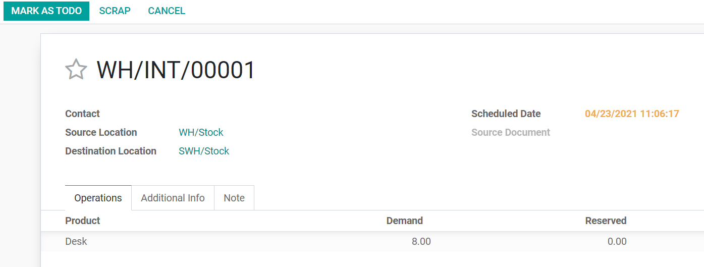
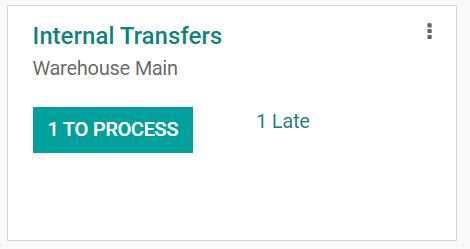
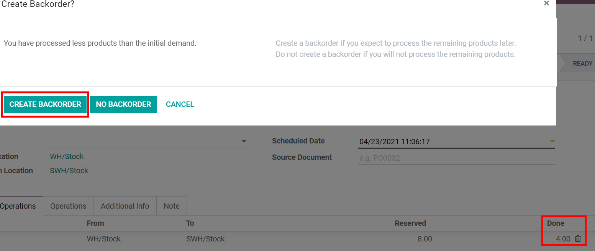

=========================
Inter-warehouse transfers
=========================

When owning several warehouses, goods might need to be transferred from one warehouse to another.
This type of transfer is called an *inter-warehouse transfer*. While physically performing the
inter-warehouse transfer might be simple, the administrative part can be complex. Fortunately, Odoo
comes with an intuitive flow that helps save time when registering inter-warehouse transfers.

Create an internal transfer
===========================

The following paragraphs detail a sample inter-warehouse transfer, referred to as an *internal
transfer*, use case. The sample use case assumes that the user has already configured their second
warehouse.

To transfer eight units of a product from the first warehouse to another one, proceed as follows:

From the :guilabel:`Inventory` dashboard, select an internal movement operation of one of the two
warehouses. To do so, click on the three vertical dots icon on the top right corner of the
operation card and select :guilabel:`Planned Transfer`.

.. image:: inter_warehouse/internal-transfer-choice.png
   :align: center
   :alt: View of the choice between planned transfer and immediate transfer.

On the new planned transfer form, select the :guilabel:`Source Location` (in this case, the first
warehouse) and the :guilabel:`Destination Location` (in this case, the second warehouse).

Next, add the products that will be transferred by clicking on :guilabel:`Add a line`, then click
on :guilabel:`Save` and :guilabel:`Mark as ToDo` once done. After that, Odoo puts the transfer in
the :guilabel:`Waiting` status. Then, click on :guilabel:`Reserve` to reserve the number of
products in the source warehouse.

.. note::
   If :guilabel:`Immediate Transfer` was selected instead of :guilabel:`Planned Transfer`, Odoo
   processes the transfer automatically after the :guilabel:`Validate` button is clicked on the
   internal transfer form.

It is also possible to manually transfer each product:

#. On the :guilabel:`Inventory` dashboard, open the souce location's internal transfer operation
   page.

#. Open the desired transfer order form.

.. image:: inter_warehouse/internal-transfers-list.png
   :align: center
   :alt: View of the pending internal transfers list.

#. Click on the pencil icon in the lower right corner to open the operation details window. In this
   new window, the quantity of products can be manually set.

.. note::
   To process the transfer order partially (e.g., a part of the products can't be shipped yet due
   to an unexpected event), Odoo automatically asks if a *backorder* should be created.

   - Create a backorder if it is expected that the remaining products will be processed later.
   - Do not create a backorder if the remaining products will not be supplied/received.
