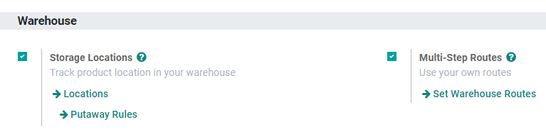
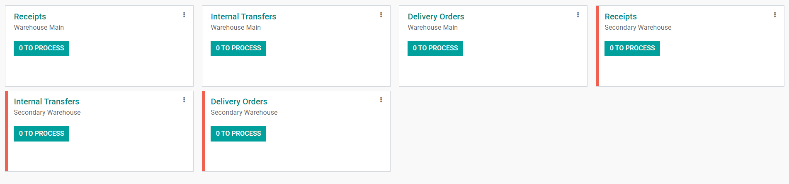
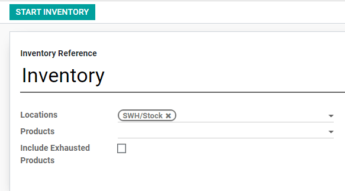
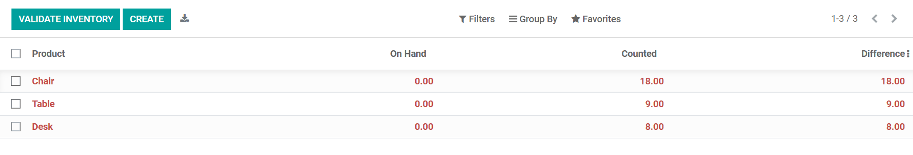
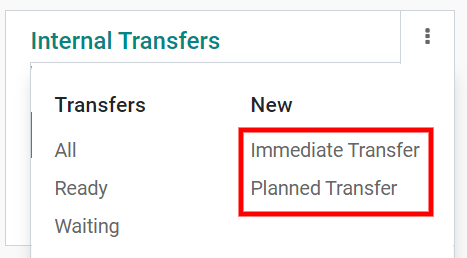

=========================
Inter-warehouse transfers
=========================

When owning several warehouses, you might need to transfer goods from one warehouse to another.
Proceeding to such behavior is called *inter-warehouse transfers*. If this action is physically
easy to perform, the administrative part can be arduous. Fortunately, Odoo comes with an intuitive
flow that helps save time when registering those transfers.

Configuration
=============

First of all, go to :menuselection:`Configuration --> Settings` and enable **Storage Locations**.
Then, hit save.

.. important::
   If you want to manage several routes within your warehouses, then enable **Multi-Step Routes**
   and check :doc:`use-routes`.

Creating a new warehouse
========================

The next step is to create your new warehouse. To do so, go to :menuselection:`Configuration -->
Warehouse Management --> Warehouses` and click on **Create**.

Fill out a **Warehouse Name** and a **Short Name**. The short name is five characters maximum.

.. important::
   The **Short Name** appears on your transfer orders and other warehouse documents. We recommend
   using an understandable one (e.g.: WH/[first letters of location]).

Now, go back to your dashboard. There, new operations related to your warehouse have been
automatically generated.

Creating a new inventory
========================

If you create a new warehouse, you might already have an existing inventory in it. In that case, you
should create an inventory in Odoo. If this is not the case, you can skip this step.

Into the inventory application, select :menuselection:`Operations --> Inventory Adjustment`.
Then, create a new inventory by clicking on **Create**. Fill in the **Inventory Reference**,
**Date** and make sure to select the right warehouse and location.

Next, click on **Start Inventory**. You will be able to input your existing products in the new
window. Select add an item and indicate the **Real Quantity** available in the warehouse.
The theoretical quantity can not be changed as it represents a computed one from purchase and sales
orders.

.. tip::
   Don't forget to validate your inventory once you have recorded the state of all your products.

Create an internal transfer
===========================

The final step is to create your internal transfer. If you want to transfer eight units of a product
from your first warehouse to another one, proceed as follows:

From your dashboard, select an internal movement of one of the two warehouses. To do so, click on
:menuselection:`Manage  --> Planned Transfer`.

On the new window, select the source location zone (in this case, your "old" warehouse) and the
destination location zone (in this case, your "new" warehouse).

Add the products you want to transfer by clicking on **Add an Item**, then click on **Save** and
**Mark as TODO** once you are done.

.. image:: inter_warehouse/planned-internal-transfer.png
   :align: center
   :alt: View of the internal transfer form.

If you selected **Immediate Transfer**, Odoo processes the transfer automatically after you clicked
on **Validate**.

If you select **Mark as TODO**, Odoo puts the transfer in **Waiting Availability** status.
Click on **Reserve** to reserve the number of products in your source warehouse.

It is also possible to manually transfer each product:

- Via your dashboard, select the transfer order in the source location.

.. image:: inter_warehouse/in-progress-internal-transfer.png
   :align: center
   :alt: View of the dashboard with a zoom of the pending internal transfer.

- Select the right transfer order.

.. image:: inter_warehouse/internal-transfers-list.png
   :align: center
   :alt: View of the pending internal transfers list.

- Click on the little pencil logo in the lower right corner to open the operation details window.
  In this new window you can manually indicate how many products you process.

.. note::
   If you decide to process the transfer order partially (e.g., a part of the products can't be
   shipped yet due to an unexpected event), Odoo automatically asks if you wish to create a
   **backorder**.

   - Create a backorder if you expect to process the remaining products later.
   - Do not create a backorder if you will not supply/receive the remaining products.