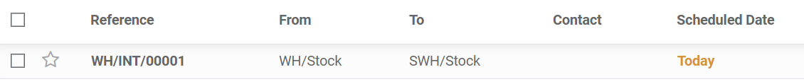

=========================
Inter-warehouse transfers
=========================

When owning several warehouses, you might need to transfer goods from one warehouse to another.
Proceeding to such behavior is called *inter-warehouse transfers*. If this action is physically
easy to perform, the administrative part can be arduous. Fortunately, Odoo comes with an intuitive
flow that helps save time when registering those transfers.

Create an internal transfer
===========================
If you want to transfer eight units of a product
from your first warehouse to another one, proceed as follows:

From your dashboard, select an internal movement of one of the two warehouses. To do so, click on
:menuselection:`Manage  --> Planned Transfer`.

.. image:: inter_warehouse/internal-transfer-choice.png
   :align: center
   :alt: View of the choice between planned transfer and immediate transfer.

On the new window, select the source location zone (in this case, your "old" warehouse) and the
destination location zone (in this case, your "new" warehouse).

Add the products you want to transfer by clicking on **Add an Item**, then click on **Save** and
**Mark as TODO** once you are done.

.. image:: inter_warehouse/planned-internal-transfer.png
   :align: center
   :alt: View of the internal transfer form.

If you selected **Immediate Transfer**, Odoo processes the transfer automatically after you clicked
on **Validate**.

If you select **Mark as TODO**, Odoo puts the transfer in **Waiting Availability** status.
Click on **Reserve** to reserve the number of products in your source warehouse.

It is also possible to manually transfer each product:

- Via your dashboard, select the transfer order in the source location.

- Select the right transfer order.

- Click on the little pencil logo in the lower right corner to open the operation details window.
  In this new window you can manually indicate how many products you process.

.. image:: inter_warehouse/backorder.png
   :align: center
   :alt: View of a backorder pop-up window because all products are not moved at the same time.

.. note::
   If you decide to process the transfer order partially (e.g., a part of the products can't be
   shipped yet due to an unexpected event), Odoo automatically asks if you wish to create a
   **backorder**.

   - Create a backorder if you expect to process the remaining products later.
   - Do not create a backorder if you will not supply/receive the remaining products.
