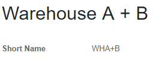
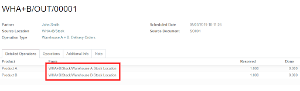

=======================================
Taking stock from different warehouses
=======================================

When you plan to deliver a customer, you don’t know in advance if the products will come from Warehouse A or Warehouse B. You may, in some cases, need to take stock from different warehouses. With *Odoo*, you can configure this by using the concept of virtual warehouses. Let us show you how to set those virtual warehouses.

Set up virtual warehouses
===========================

Let’s say you have two warehouses: Warehouse A and Warehouse B. Create a new warehouse, that will be a virtual one. It will allow you to take the stock from A or B. To do so, go to your inventory app settings and enable the multi-warehouses feature. Then, go to the warehouses menu and click on create.

.. note::
   The *Storage Location* feature will be automatically enabled. Good news, because you will need it later in the process.

Now, you have to make sure that the main stock locations of warehouse A and warehouse B are children locations of the main stock location of warehouse A + B. Go to the locations menu, and edit the main location of your two warehouses. Then, change their parent location to main location of warehouse A+B.

.. image:: stock_warehouses/ware2.png
   :align: center

Sell a product from the virtual warehouse
==========================================

Let’s say you have two products, one stored in warehouse A and one stored in warehouse B. Now, you can create a new quotation for one of each product. Go to other information and choose Warehouse A+B in the shipping information. 

.. image:: stock_warehouses/ware3.png
   :align: center

Once you have done it, you can convert it to a sales order. Then, a delivery order will be automatically generated, with a product reserved in warehouse A and one in warehouse B.

