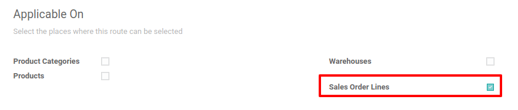
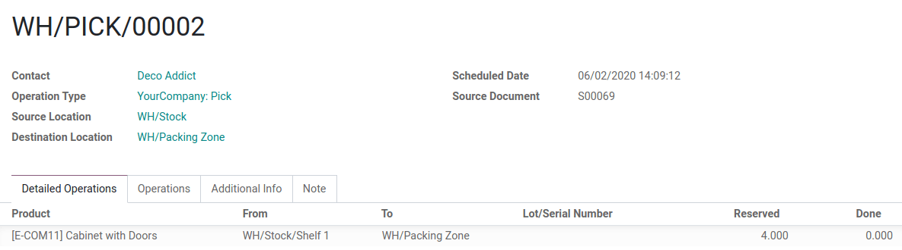

.. _use-routes:

================================
Using Routes and Pull/Push Rules
================================

In inventory management, the supply chain strategy determines when
products should be fabricated, delivered to distribution centers, and
made available in the retail channel.

This kind of strategic process can be configured using *Routes*,
featuring *Pull and Push Rules*. Once everything is properly
configured, the inventory app can automatically generate transfers
following the instructions given by the rules. Yes, Odoo simplifies your
life.

Inside the warehouse
====================

Let’s imagine a generic warehouse plan, where you can find receiving
docks, a quality control area, storage locations, picking and
packing areas, and shipping docks. All products go
through all these locations, which also trigger all the route's rules.

.. image:: use-routes/stock-example.png
   :align: center
   :alt: view of a generic warehouse with stock and quality control area

In this example, vendor trucks unload pallets of ordered goods at receiving docks.
Operators then scan the products in the receiving area. Some of these products are sent to a
quality control area (those devoted to being used during the manufacturing process, for
example), while others are directly stored in their respective locations.

.. image:: use-routes/push-to-rule-example.png
   :align: center
   :alt: view of a generic push to rule when receiving products

Here is an example of a fulfillment route. In the morning, items are picked
for all the orders that need to be prepared during the day. These items
are picked from storage locations and moved to the picking area, close
to where the orders are packed. Then, the orders are packed in their
respective boxes and conveyors bring them close to the shipping docks,
ready to be delivered to customers.

.. image:: use-routes/pull-from-rule-example.png
   :align: center
   :alt: view of a generic pull from rule when preparing deliveries

How does it work?
=================

Pull Rules
----------

With *Pull Rules*, a demand for some products triggers procurements,
while *Push Rules* are triggered by products arriving in a specific
location.

We can say that *Pull Rules* are used to fulfill a customer
order, a sale order. So, Odoo generates a need at the *Customer
Location* for each product in the order. Because *Pull Rules*
are triggered by a need, Odoo looks for a *Pull Rule* defined on the
*Customer Location*. In our case, a delivery order pull rule that
transfers products from the *Shipping Area* to the *Customer
Location* is found, and a transfer between the two locations is created.

Then, Odoo finds another pull rule that tries to fulfill the need for
the *Shipping Area*: the *Packing Rule* that transfers products from
the *Packing Area* to the *Shipping Area*. And, finally, other rules
are triggered until a transfer between the *Stock* and the *Picking
Area* is created.

.. note::
   All these transfers are pre-generated by Odoo, starting from the end and going backwards.
   While working, the operator process these transfers in the opposite order: first the picking,
   then the packing, then the delivery order.

.. _inventory/routes/concepts/use-routes/push:

Push Rules
----------

On the other hand, *Push Rules* are much easier to understand. Instead
of pre-generating documents based on needs, they are live-triggered when
products arrive in a specific location. *Push Rules* basically say: "when a
product arrives at a specific location, move it to another location."

A simple example would be: when a product arrives in the *Receipt
Area*, move them to the *Storage Location*. As different rules can be
applied to different products, you can assign different storage
locations for different products.

Another rule could be: when products arrive at a location, move them to the
*Quality Control Area*. Then, once the quality check is done, move
them to their *Storage Location*.

.. note::
   *Push Rules* can be triggered only if no *Pull Rule* pre-generated
   the upstream transfers.

.. important::
   Sets of rules like those are called routes. The grouping on the rule
   defines how products are grouped in the same transfer or not. For
   example, during the picking operation, all orders are grouped in one
   transfer, whereas the packing operation respects the grouping per
   customer order.

Use Routes and Rules
====================

Since *Routes* are a collection of *Push and Pull Rules*, Odoo
helps you manage advanced routes configuration such as:

-  Manage product manufacturing chains;
-  Manage default locations per product;
-  Define routes within your warehouse according to business needs, such
   as quality control, after-sales services, or supplier returns;
-  Help rental management by generating automated return moves for
   rented products.

To configure a route such as one of those above, open the **Inventory
Application** and go to :menuselection:`Configuration --> Settings`.
Then, enable the *Multi-Step Routes* feature.

.. image:: use-routes/multi-steps-routes-feature.png
   :align: center
   :alt: activation of the multi-steps feature in Odoo Inventory

.. note::
   The *Storage Locations* feature is automatically activated with the
   *Multi-Step Routes*.

Once this first step is completed, you have the choice between
pre-configured routes or custom ones. Both are explained below.

Pre-configured Routes
---------------------

Odoo’s pre-configured routes are available in the warehouses’ menu. To
find it, go to :menuselection:`Inventory --> Configuration -->
Warehouses`. There, open your warehouse and edit it to see the
pre-configured routes for incoming and outgoing shipments.

.. image:: use-routes/example-preconfigured-warehouse.png
   :align: center
   :alt: preconfigured warehouse in Odoo Inventory

Some more advanced routes, such as pick-pack-ship, are already
configured to make your life easier. Those are based on your choice for
shipments. Once you made your choice, head to :menuselection:`Inventory -->
Configuration --> Routes` to see the routes Odoo generated for you.

.. image:: use-routes/preconfigured-routes.png
   :align: center
   :alt: view of all the preconfigured routes Odoo offers

Opening one of those routes allows you to see on what you can apply the route.
Here, all the selected product categories in the
*YourCompany* warehouse are set up to follow the 3-steps route.

.. image:: use-routes/routes-example.png
   :align: center
   :alt: view of a route example applicable on category and warehouse

Easier for many businesses, this process might not fit yours. Thus,
you can configure custom routes in which you can define your own
rules, but also the source and destination location of each action. As
an example, here are the rules for the pre-configured route.

.. image:: use-routes/rules-example.png
   :align: center
   :alt: rules example with push & pull actions in Odoo Inventory

Custom Routes
-------------

To create a custom route, go to :menuselection:`Inventory -->
Configuration --> Routes`, click on create, and choose the
places where this route can be selected. Of course, combinations are
available.

.. image:: use-routes/advanced-custom-route.png
   :align: center
   :alt: view of a pick - pack - ship route as an example

Each place has a different behavior, so it is important to tick only the
useful ones and adapt each route accordingly.

When applying the route on a product category
(:menuselection:`Inventory --> Configuration --> Product Categories`),
all the rules configured in the route are applied to **every**
product of the category. For example, this can be useful if you use the
dropshipping process for all the products from the same category.

.. image:: use-routes/routes-logistic-tab.png
   :align: center
   :alt: view of a route applied to the "all" product category

The same behavior applies to the warehouses. If you tick *Warehouses*,
all the transfers occurring inside the chosen warehouse, and meeting the
conditions of the linked rules, then follow that route.

.. image:: use-routes/applicable-on-warehouse.png
   :align: center
   :alt: view of the route menu when selecting applicable on warehouse

For the *Sales Order Lines*, it is more or less the opposite. You have
to choose the route yourself when creating a quotation. This is pretty useful if
some products go through different routes.

If you work with this kind of route, it is important to keep in mind
that it must be selected on the sales order, such as below.

.. image:: use-routes/add-routes-to-sales-lines.png
   :align: center
   :alt: view of the menu allowing to add new lines to sales orders

Then, the route can be chosen on each line of the document.

.. image:: use-routes/sales-order-lines-routes-application.png
   :align: center
   :alt: view of the routes added to the sales orders

Finally, there are routes that can be applied to products. Those work more or less
like the product categories: once selected, you have to
manually set on which product it must be applied.

.. image:: use-routes/applicable-on-products.png
   :align: center
   :alt: view of the menu when selecting applicable on products

To do so, go to :menuselection:`Inventory --> Master Data -->
Products` and open the one on which you want to apply the route. Then
go to the *Inventory tab* and select the route you’ve created.

.. image:: use-routes/on-product-route.png
   :align: center
   :alt: view of a product form, where the route must be selected

If, prima facie, the routes’ configuration can appear quite easy, don’t
forget that we haven’t set up any rule yet. If not harder to set up, those
are vital to have working routings.

Rules
~~~~~

The rules are to be defined on the routes. To do so, go to
:menuselection:`Inventory --> Configuration --> Routes`, then to the *Rules* section,
and click on *Add a line* button.

.. image:: use-routes/add-new-rules.png
   :align: center
   :alt: view of the rules menu, where it is possible to add new rules

The available rules trigger various actions. If Odoo offers *Push* and
*Pull* rules, others are also available. Here are some explanations for
all of them:

-  **Pull From**: this rule is triggered by a need for the product
   in a specific location. The need can come from a sale order
   which has been validated or from a manufacturing order which
   requires a specific component. When the need appears in the
   destination location, Odoo generates a picking to fulfill this need.
-  **Push To**: this rule is triggered by the arrival of some
   products in the defined source location. In the case you move
   products to the source location, Odoo generates a picking to move
   those products to the destination location.
-  **Pull & Push**: this rule allows generating pickings in the two
   situations explained above. This means that when products are
   required at a specific location, a transfer is created from the previous location to fulfill
   that need. This creates a need in the previous location and a rule is triggered to fulfill
   it. Once the second need is fulfilled, the products are pushed to the destination location and all the
   needs are fulfilled.
-  **Buy**: when products are needed at the destination location, a
   request for quotation is created to fulfill the need.
-  **Manufacture**: when products are needed in the source location,
   a manufacturing order is created to fulfill the need.

.. image:: use-routes/pull-from-rule-stock-to-packing.png
   :align: center
   :alt: overview of a transfer requested between the stock and the packing zone

You must also define the *Operation Type*. This
operation allows defining which kind of picking is created from the
rule. With our above screenshot, the created picking is, for example, an
internal transfer.

On the other hand, the *Supply Method*, allows defining what happens at
the source location:

-  **Take From Stock**: the products are taken from the available
   stock of the source location;
-  **Trigger Another Rule**: the system tries to find a stock rule
   to bring the products to the source location. The available stock
   is ignored.
-  **Take From Stock, if Unavailable, Trigger Another Rule**: the
   products are taken from the available stock of the source
   location. If there is no stock available, the system tries to
   find a rule to bring the products to the source location.

In the *Scheduling* section, you can determine how Odoo behaves when
one of the chain's pickings is rescheduled. In case you decide to
**Propagate Rescheduling**, the next move is also to be rescheduled.
If you prefer having the choice to reschedule the next move,
you can decide to receive an alert in the form of a
*next activity*.

What about a full flow?
=======================

Do you remember our Pick - Pack - Ship custom route? Let’s use it to
try a full flow with an advanced custom route.

First, a quick look at our rules and their supply methods: we have three
rules, all **Pull From** rules. The supply methods are the
following:

-  **Take From Stock**: When products are needed in WH/Packing Zone,
   *Picks* (internal transfers from WH/Stock to WH/Packing Zone)
   are created from WH/Stock to fulfill the need.
-  **Trigger Another Rule**: When products are needed in WH/Output,
   *Packs* (internal transfers from WH/Packing Zone to WH/Output)
   are created from WH/Packing Zone to fulfill the need.
-  **Trigger Another Rule**: When products are needed in Partner
   Locations/Customers, Delivery Orders are created from WH/Output
   to fulfill the need.

.. image:: use-routes/transfers-overview.png
   :align: center
   :alt: overview of all the transfers created by the pick - pack - ship route

This means that, when a customer orders products, a delivery order is
created to fulfill the order.

.. image:: use-routes/operations-on-transfers.png
   :align: center
   :alt: view of the operations created by a pull from transfer

.. note::
   If the source document is the same sale order, the status is not the
   same. In fact, the status is **Waiting Another Operation** if the
   previous transfer in the list is not done yet.

.. image:: use-routes/waiting-status.png
   :align: center
   :alt: view of the transfers various status at the beginning of the process

To prepare the order, conveyors need products packed at the output area,
so an internal transfer is requested from the packing zone.

.. image:: use-routes/detailed-operations-2.png
   :align: center
   :alt: view of the detailed operations for a transfer between the packing and output zones

Obviously, the packing zone needs products ready to be packed. So, an
internal transfer is requested to the stock and employees can gather the
required products from the warehouse.

As explained in this documentation introduction, the last step in the
process (here the delivery order) is the first to be triggered, which
then triggers other rules until we reach the first step in the process
(here, the internal transfer from to stock to the packing area). Now,
everything is ready to be processed so the customer can get the ordered
items.

In our case, the product is delivered to the customer when all the rules
have been triggered and the transfers done.

.. image:: use-routes/transfers-status.png
   :align: center
   :alt: view of the transfers' status when all the process is done
