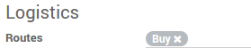
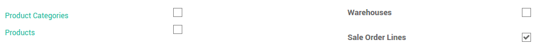
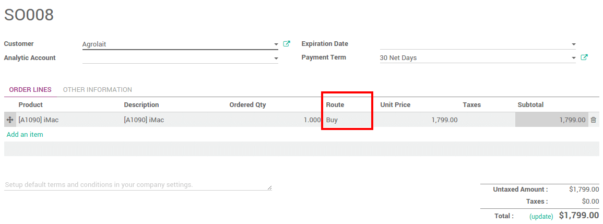
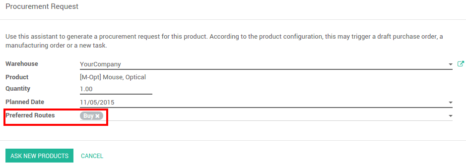

==================
How to use routes?
==================

Overview
========

A route is a collection of procurement rules and push rules. Odoo can
manage advanced push/pull routes configuration, for example:

-   Manage product manufacturing chains

-   Manage default locations per product

-   Define routes within your warehouse according to business needs, such
    as quality control, after sales services or supplier returns

-   Help rental management, by generating automated return moves for
    rented products

Configuration
=============

Procurement rules are part of the routes. Go to the **Inventory**
application, :menuselection:`Configuration --> Settings` and tick 
**Advance routing of products using rules**.

.. image:: media/use_routes01.png
    :align: center

Pre-configured routes
=====================

Odoo has some pre-configured routes for your warehouses.

In the Inventory application, go to 
:menuselection:`Configuration --> Warehouses`.

In the **Warehouse Configuration** tab, **Incoming Shipments** and **Outgoing
Shippings** options set some routes according to your choices.

.. image:: media/use_routes02.png
    :align: center

Custom Routes
=============

In the **Inventory** application, go to 
:menuselection:`Configuration --> Routes`.

.. image:: media/use_routes03.png
    :align: center

First, you have to select the places where this route can be selected.
You can combine several choices.

Routes applied on warehouses
----------------------------

If you tick **Warehouses**, you have to choose on which warehouse it will
be applied. The route will be set for all transfer in that warehouse
that would meet the conditions of the procurement and push rules.

.. image:: media/use_routes04.png
    :align: center

Routes applied on products 
---------------------------

If you tick **Products**, you have to manually set on which product it
will be applied.

.. image:: media/use_routes05.png
    :align: center

Open the product on which you want to apply the routes 
(:menuselection:`Inventory --> Control --> Products`). 
In the Inventory Tab, select the route(s):

.. image:: media/use_routes06.png
    :align: center

Routes applied on Product Category
----------------------------------

If you tick **Product Categories**, you have to manually set on which
categories it will be applied.

.. image:: media/use_routes07.png
    :align: center

Open the product on which you want to apply the routes
(:menuselection:`Configuration --> Product Categories`). 
Select the route(s) under the **Logistics** section :

Routes applied on Sales Order lines
-----------------------------------

If you tick **Sales order lines**, you have to manually set the route
every time you make a sale order.

In order to make it work, you also have to activate the use of the
routes on the sales order.

In the Sales application, go to 
:menuselection:`Configuration --> Settings` and tick
**Choose specific routes on sales order lines (advanced)**.

.. image:: media/use_routes10.png
    :align: center

You can now choose the routes for each lines of your sales orders:

Procurement and push rules
==========================

Please refer to the documents:

-  :doc:`procurement_rule`

-  :doc:`push_rule`

Procurement configuration
=========================

When doing a procurement request, you can force the route you want to
use. On the product (:menuselection:`Inventory Control --> Products`), 
click on **Procurement Request**. Choose the route you want to use next to
**Preferred Routes**:

Make-to-Order Route
===================

If you work with no stock, or with minimum stock rules, it is better to
use the **Make To Order** route. Combine it with the route **Buy** or
**Manufacture** and it will trigger automatically the purchase order or
the Manufacturing Order when your products are out-of-stock.

.. seealso::
    * :doc:`push_rule`
    * :doc:`inter_warehouse`
    * :doc:`cross_dock`