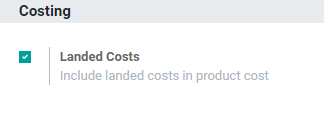
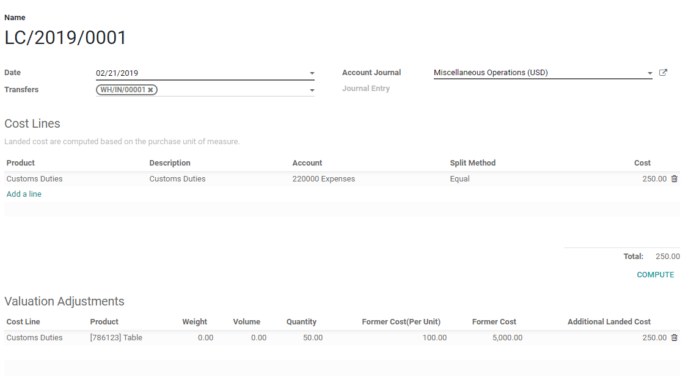

============================================================================
How to integrate additional costs in the cost of the product? (landed costs)
============================================================================

Overview
========

The landed cost feature in Odoo allows to include additional costs (shipment,
insurance, customs duties, etc.) into the cost of the product.

.. note::
    Landed costs can only be applied to products with a FIFO costing method and
    an automated inventory valuation (which requires the accounting application
    to be installed).

Configuration
=============

First, you need to activate the landed costs feature in
:menuselection:`Inventory --> Configuration --> Settings`.

Add costs to products
======================

Go in :menuselection:`Inventory --> Operations --> Landed Costs` and click on the
**Create** button. You then have to select the transfers on which you want to
attribute additional costs and the costs lines you want to add up. Once it's
done, click on the **Compute** button to see how the costs lines will be split
accross your transfers lines.

To confirm, click on the **Validate** button.
