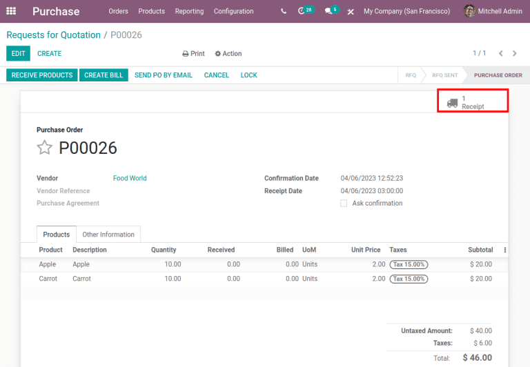
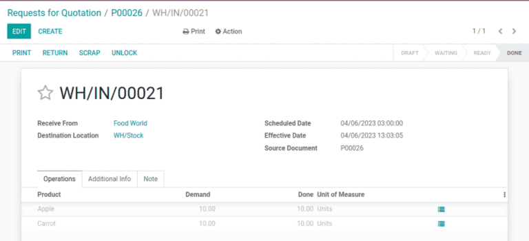
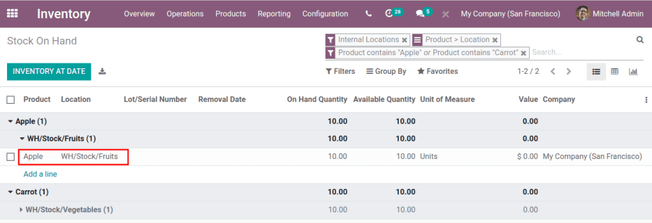

=============
Putaway rules
=============

Putaway is the process of routing products to appropriate storage locations upon shipment arrival.
Odoo can accomplish this seamlessly using *putaway rules*, which dictate how products move through
specified warehouse locations.

Upon shipment arrival, operations are generated based on putaway rules to efficiently move products
to specified locations and ensure easy retrieval. Putaway rules can also prevent volatile substances
from being stored in close proximity by directing them to different locations determined by the
warehouse manager.

.. seealso::
   - :ref:`How push rules work <inventory/routes/concepts/use-routes/push>`
   - :ref:`Warehouse locations <inventory/warehouses/location-definition>`

Enable putaway rules
====================

Begin by navigating to :menuselection:`Inventory app --> Configuration --> Settings`, then activate
the :guilabel:`Multi-Step Routes` checkbox under the :guilabel:`Warehouse` heading. By doing so, the
:guilabel:`Storage Locations` setting is automatically enabled as well. Finally, click
:guilabel:`Save`.

.. image:: putaway/multi-step-routes.png
   :align: center
   :alt: In configs, for the Inventory app, check multi-step routes box to enable Putaway rules.

Put away products
=================

Putaway rules are commonly used to move products to specific locations for easy retrieval. Thus,
products are grouped in the same *product category* when a single putaway rule captures the group's
storage needs.

To manage where specific products are routed for storage, navigate to :menuselection:`Inventory app
--> Configuration --> Putaway Rules`. Use the :guilabel:`Create` button to configure a new putaway
rule on a :guilabel:`Product` or :guilabel:`Product Category` that the rule affects.

In the same line, the :guilabel:`When product arrives in` location is where the putaway rule is
triggered to create an operation to move the product to the :guilabel:`Store to` location. The
:guilabel:`Store to` location must be a sublocation of the first (e.g. `WH/Stock/Fruits` is a
specific, named location inside `WH/Stock` to make the products stored here easier to find).

.. example::
   Ensure all apples are stored in the fruits section by filling the field :guilabel:`Store to` with
   the location `WH/Stock/Fruits` when the :guilabel:`Product`, `Apple` arrives in `WH/Stock`.
   Repeat this for all products and hit :guilabel:`Save`.

   .. image:: putaway/create-putaway-rules.png
      :align: center
      :alt: Create putaway rules for apples and carrots.

.. note::
   It is also possible to create and manage putaway rules for a single product by going to the
   product page and clicking the :guilabel:`Putaway Rules` smart button at the top of the page. If
   the button is not visible at first glance, select the :guilabel:`More` button at the top right to
   view additional smart buttons.

.. _inventory/routes/strategies/putaway/internal-stock-moves:

.. tip::
   Check whether putaway rules work as intended using the summary of internal product movements. In
   the :menuselection:`Inventory` app, select :menuselection:`Reporting --> Product Moves` and
   enable the :guilabel:`Internal` search filter on the :guilabel:`Filters` drop-down menu under the
   search bar at the top of the page. In this view, confirm that products are moved to the
   :guilabel:`Store to` location detailed in the putaway rule. More details in :ref:`this section
   <inventory/routes/strategies/putaway/wrong-location>`.

Use putaway rules
-----------------

Once a putaway rule is configured, the product it specifies is automatically routed to the
:guilabel:`Store to` location upon arriving in the :guilabel:`When product arrives in` location.

For example, on a putaway rule with the :guilabel:`When product arrives in` location set to
`WH/Stock`, internal stock moves are automatically created when products first enter the warehouse.
To trigger this putaway rule, begin by creating a :ref:`purchase order
<inventory/purchase/manage_deals/manage>` (PO) to bring products into the warehouse.

To create a :guilabel:`Request for Quotation` (RFQ), go to the :menuselection:`Purchase` app, and
click :guilabel:`Create`. Then, add products to the :abbr:`RFQ (Request for Quotation)` by clicking
:guilabel:`Add a line`, and selecting the desired product(s) from the drop-down menu in the
:guilabel:`Product` column.

Once ready, click :guilabel:`Confirm`. Doing so turns the :abbr:`RFQ (Request for Quotation)` into a
:abbr:`PO (Purchase Order)`. Next, click :guilabel:`Send by Email` to send the :abbr:`PO (Purchase
Order)` to the vendor, if needed.

Begin receiving the incoming shipment by selecting the :guilabel:`Receipt` smart button on the
:abbr:`PO (Purchase Order)`. Click :guilabel:`Receive products` and then :guilabel:`Validate` to
move products into the warehouse. Since the putaway rule is set to trigger when products arrive in
stock, internal transfers are automatically created when products arrive in the
:guilabel:`Destination Location`, `WH/Stock`. This ensures products entering the warehouse are
stored in specific locations suitable for their storage needs.

Verify stock moves
==================

Confirm whether the putaway rule worked as intended and that the products have been moved to the
correct location using the :guilabel:`Stock On Hand` dashboard. View all products in stock in
:menuselection:`Inventory app --> Reporting --> Inventory Report`. By default, the products are
grouped by location.

Select a product's collapsable drop-down menu, which displays the current location(s) of the
product. Then, select a :guilabel:`Location` drop-down menu to view a list of all stock movements in
and out of each location. Each of these lines are records of a stock move, called a *stock move
line*.

.. _inventory/routes/strategies/putaway/wrong-location:

Trace products in wrong locations
---------------------------------

To trace products and associated documents for warehouse operations, use the :guilabel:`Product
Moves` report in :menuselection:`Inventory app --> Reporting --> Product Moves`. View a product's
warehouse operation history by selecting a product's drop-down menu. Each stock move line contains
details about any movement of stock, such as manufacturing orders, inventory adjustments, or
internal transfers. Click on a stock move line to view all the information in a comprehensive
report.

The stock move line is useful because the :guilabel:`Reference` displays the warehouse operation
associated to the :guilabel:`Product`. Use the :guilabel:`From` and :guilabel:`To` location and
associated :guilabel:`Source` documents to trace the product path and identify the type of
operation.

.. tip::
   It is also possible to view the stock moves of a product directly from the product page. Open the
   desired product page by navigating to :menuselection:`Inventory --> Products --> Products` and
   select the product. From there, click on the :guilabel:`Product Moves` smart button, then click
   the product's collapsable drop-down menu from the list. This displays the stock moves history of
   the product.

.. _inventory/strategies/putaway/stock-moves:

.. example::
   A putaway rule was purposely set up incorrectly on `Apple`, so the product was moved from
   `WH/Stock` to `WH/Stock/Shelf 1` instead of the expected location, `WH/Stock/Fruits`. To trace
   the path the apple moved and identify the cause of the wrong stock move, open the
   :guilabel:`Product Moves` report in :menuselection:`Inventory app --> Reporting --> Product
   Moves`. The apple's drop-down menu, when opened, displays a list of stock moves of the apple.
   line to open a report that is useful to trace the path the product moved and identify the cause
   of the wrong stock move.

   The :guilabel:`To` field displays where the product currently is, `WH/Stock/Shelf 1`, which is
   the wrong location. The :guilabel:`From` location is the vendor's location, which is expected
   since the :guilabel:`Source` of the stock move is a :abbr:`PO (Purchase Order)`.

   The :guilabel:`Reference` operation, `WH/IN/00015`, which is a warehouse reception of products
   from the vendor, would further explain why the apples were moved to the wrong location.

   .. image:: putaway/stock-move-report.png
      :align: center
      :alt: Open stock move report

To follow an operation identified from the :guilabel:`Product Moves` report, navigate to
:menuselection:`Inventory --> Operations --> Transfers`. This is the page that displays all
warehouse transfers— internal or external. Search for and click on the corresponding
:guilabel:`Reference` operation to view the document explaining why the product was moved to the
wrong location.

.. tip::
   When there are too many records, use either the :guilabel:`Filters` or :guilabel:`Group by`
   features to sort and :ref:`find desired records
   <inventory/routes/strategies/putaway/use-advanced-filters>`. It is useful to search exclusively
   for the receipt operation type because putaway rules store products *into* a specific stock
   location.

.. example::
   Continuing to diagnose why the product, `Apple`, was placed in `WH/Stock/Shelf 1`, navigate to
   the list of all transfers in :menuselection:`Inventory --> Operations --> Transfers`. Click on
   the list item where the :guilabel:`Reference` field matches the `WH/IN/00015` operation
   identified in the :ref:`previous example <inventory/strategies/putaway/stock-moves>` to open the
   receipt.

   .. image:: putaway/transfers.png
      :align: center
      :alt: In the Transfers page in the Inventory app, select the desired transfer to view the
            record.

   This receipt describes which products were received from the supplier, with the affiliated
   :abbr:`PO (Purchase Order)` linked in the :guilabel:`Source Document` field. On the warehouse
   reception document, the field :guilabel:`Destination Location` shows where the product is
   received upon entering the warehouse.

   Clicking on the :guilabel:`≣ (Detailed Operations)` icon to the right of the product line opens a
   window that shows the product was moved to the wrong location. Based on this information it can
   be gathered that the putaway rule was triggered but the location was set incorrectly. Rectify
   this in :menuselection:`Inventory --> Configuration --> Putaway Rules`.

   .. image:: putaway/detailed-operations.png
      :align: center
      :alt: Click Detailed Operations button on the right of warehouse transfers page to the right
            of the WH reception document.

   .. image:: putaway/automated.png
      :align: center
      :alt: Show putaway rule in detailed operations popup.

.. _inventory/routes/strategies/putaway/use-advanced-filters:

Advanced filter search
----------------------

Keep track of and trace products on the :guilabel:`Product Moves` report by navigating to
:menuselection:`Inventory app --> Reporting --> Product Moves` and use the :guilabel:`Filters` and
:guilabel:`Group by` features to stay updated on warehouse operations.

Transfers based on putaway rules can be found by toggling on the :guilabel:`Internal` filter as
mentioned in this :ref:`tip <inventory/routes/strategies/putaway/internal-stock-moves>` previously.
Other useful filters and groupbys intended for reporting on the company's internal operations
include:

#. Filter by :guilabel:`Incoming` and :guilabel:`To Do` to display shipments from vendors yet to be
   processed.

   .. image:: putaway/product-moves-to-do.png
      :align: center
      :alt: Filter warehouse transfer records by Incoming shipments and processes ToDo.

#. Use custom filters to search for a specific product by its name, :ref:`lot/serial number
   <inventory/management/lots-serial-numbers>` or barcode. Create a custom filter by clicking on
   :guilabel:`Filters`. Click :guilabel:`Add Custom Filter`, fill in the identifying information,
   and click :guilabel:`Apply`. Now that the custom filter is active, click on the
   :guilabel:`Filters` button again to create any additional filters.
#. Group by :guilabel:`Date`: View all product moves on a specific date.
#. Group by :guilabel:`From`: Create a custom filter that displays all locations that currently
   store at least 1 product. This is useful to view all the locations and sublocations to optimize
   storage space.
#. :guilabel:`Favorite` the current search with filters applied. This feature is useful to apply the
   filters promptly, especially if this search is often used.

   .. image:: putaway/save-favorites.png
      :align: center
      :alt: Use the star button under the search bar to save current search as a favorite view.
