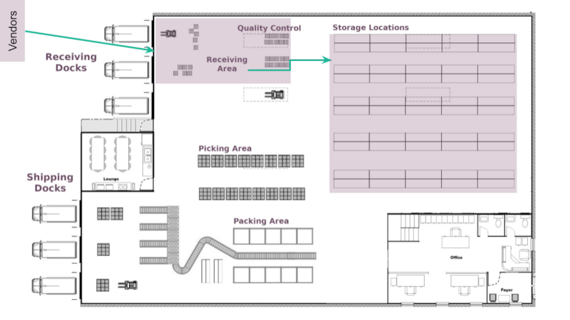
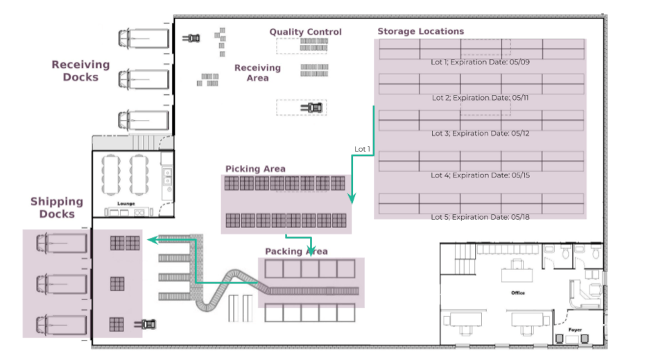
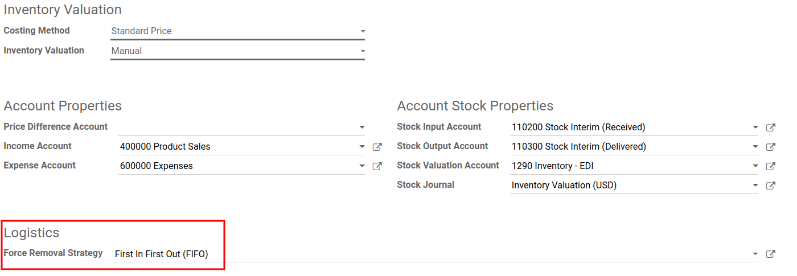
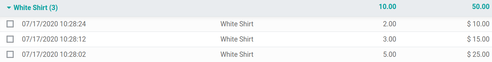
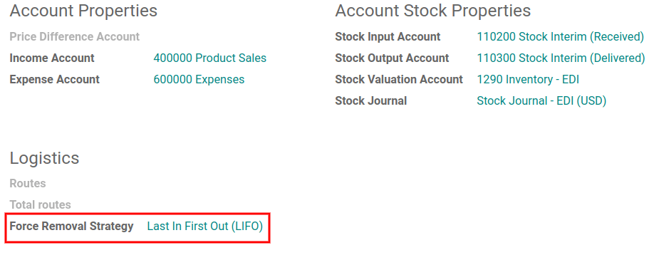

================================================================
What is a Removal Strategy (FIFO, LIFO, FEFO, Closest location)?
================================================================

Usually, *Removal Strategies* are defined in picking operations to select the best products,
optimize the distance for the worker, for quality control purposes, or to first move products
with the closest expiration date.

When a product movement needs to be done, Odoo finds available products that can be assigned to
the transfer. The way Odoo assigns these products depends on the *Removal Strategy* defined in
the *Product Category* or on the *Location*.

What happens inside the warehouse?
==================================

Imagine a generic warehouse plan, with receiving docks and areas, storage locations, picking and
packing areas, and shipping docks. All products go through all these locations, but some rules,
such as removal strategies, can have an effect on which products are taken for the pickings.

.. image:: removal/empty-dock.png
   :align: center
   :alt: Empty stock waiting for deliveries at the docks.

Here, vendor trucks unload pallets of goods at the docks. Then, operators scan the products in the
receiving area with the reception date and, if the product has an expiration date, the expiration
date. After that, products are stored in their respective locations.

Next, several orders for the same product are made, but in this example, the goods weren't received
on the same day and they don't have the same expiration date. In that situation, logically, sending
those with the closest date first is preferred. Depending on the chosen removal strategy, Odoo
generates a transfer with the products that fit the settings the best.

         account.

.. note::
   To pick for delivery, the product's lot/serial number can be found on the transfer form.

How does it work?
=================

First In, First Out (FIFO)
--------------------------

When using a *First In, First Out* (FIFO) strategy, a demand for some products triggers a removal
rule, which requests a transfer for the lot/serial number that has entered the stock first.

For example, imagine there are three lots of nails in the warehouse. Those three have the following
lot numbers: :guilabel:`00001`, :guilabel:`00002`, :guilabel:`00003`, each with five boxes of nails
in it.

:guilabel:`00001` entered the stock on the 23rd of May, :guilabel:`00002` on the 25th of
May, and :guilabel:`00003` on the 1st of June. A customer orders six boxes on the 11th of June.
With the :abbr:`FIFO (First In, First Out)` removal strategy selected, a transfer is requested for
the five boxes of :guilabel:`00001` and one of the boxes in :guilabel:`00002`, because
:guilabel:`00001` entered the stock before the others. The box from :guilabel:`00002` is taken next
because it has the oldest reception date after :guilabel:`00001`.

So, for every order of a product with the :abbr:`FIFO (First In, First Out)` strategy selected,
Odoo requests a transfer for the products that have been in the stock for the longest period.

Last In, First Out (LIFO)
-------------------------

Similar to :abbr:`FIFO (First In, First Out)`, the *Last In, First Out* (LIFO) strategy moves
products based on the date they entered the stock. Here, a demand for some products triggers a
removal rule that requests a transfer for the lot/serial number that has entered the stock most
recently.

For example, imagine there are three lots of screws in the warehouse. Those three have the following
numbers: :guilabel:`10001`, :guilabel:`10002`, and :guilabel:`10003`, each with 10 boxes of screws
in it.

:guilabel:`10001` entered the stock on the 1st of June, :guilabel:`10002` on the 3rd of June, and
:guilabel:`10003` on the 6th of June. A customer orders seven boxes on the 8th of June. With the
:abbr:`LIFO (Last In, First Out)` removal strategy selected, a transfer is requested for seven
boxes of :guilabel:`10003` because that lot is the last one to have entered the stock.

Basically, for every order of a product with the :abbr:`LIFO (Last In, First Out)` strategy used,
a transfer for the last lot to have entered the stock is requested.

.. note::
   The :abbr:`LIFO (Last In, First Out)` strategy is banned in many countries and can lead to only
   having old or obsolete products in the stock.

First Expire, First Out (FEFO)
------------------------------

The *First Expired, First Out* (FEFO) strategy is a bit different from the other two removal
strategies. For :abbr:`FEFO (First Expired, First Out)`, the expiration date is important, not the
date the product entered the stock.

For example, imagine there are three lots of six-egg boxes (in this specific case, don't forget to
use :doc:`units of measure <../../management/products/uom>`). Those three lots have the following
numbers: :guilabel:`20001`, :guilabel:`20002`, and :guilabel:`20003`, each with five boxes in it.

:guilabel:`20001` entered the stock on the 1st of July and expires on the 15th of July,
:guilabel:`20002` entered on the 2nd and expires on the 14th of July, and :guilabel:`20003` entered
on the 4th and expires on the 21st of July. A customer orders six boxes on the 5th of July. With
the :abbr:`FEFO (First Expired, First Out)` strategy selected, a transfer is requested for the five
boxes of :guilabel:`20002` and one from :guilabel:`20001`. The transfer for all the boxes in lot
:guilabel:`20002` is because they have the closest expiration date. The transfer also requests one
box from :guilabel:`20001` because has the next closest expiration date after lot
:guilabel:`20002`.

Basically, for every sales order of a product with the :abbr:`FEFO (First Expired, First Out)`
strategy, a transfer is requested for the product that has the nearest expiration date from the
order date.

Closest Location
----------------

The *Closest Location* strategy is completely different from the other removal strategies. It is
not related to the date of entry in the warehouse, but rather the location of the product. It is
commonly used for products that do not deteriorate with time.

The aim is to avoid making the warehouse worker take a long journey to the bottom of the stock when
the product is also located at a near location. This method is only available if the
:guilabel:`Storage Locations` setting is on. The closest location is actually the one that comes
first in the alphabetic order.

Use removal strategies
======================

To differentiate some units from others, the units need to be tracked, either by *lot* or by
*serial number*. To do so, go to :menuselection:`Inventory --> Configuration --> Settings`. Then,
activate the :guilabel:`Storage Location`, :guilabel:`Multi-Step Routes`, and :guilabel:`Lots &
Serial Numbers` settings.

.. image:: removal/enabled-features.png
   :align: center
   :alt: Features to enable in order to properly use removal strategies.

.. note::
   To work with the :abbr:`FEFO (First Expired, First Out)` strategy, also activate the
   :guilabel:`Expiration Dates` feature.

Next, go to :menuselection:`Inventory --> Configuration --> Product Categories` to define the
removal strategy on a product category.

FIFO (First In, First Out)
--------------------------

As explained, a :abbr:`FIFO (First In, First Out)` removal strategy implies that products stocked
first move out first. Companies should use this method if they are selling products with short
demand cycles, such as clothes, and to ensure they are not stuck with outdated styles in stock.

In this example, there are three lots of white shirts. The shirts are from the
:guilabel:`All/Clothes` category, where *FIFO* is set as the removal strategy. In the stock
location (:guilabel:`WH/Stock`), the user can find the three lots available.

Lot :guilabel:`000001` contains five shirts, :guilabel:`000002` contains three shirts, and
:guilabel:`000003` contains two shirts.

As seen above, :guilabel:`000001` entered the stock first. Now, create a sales order of six white
shirts to check that those products from lot :guilabel:`000001` are the first ones to move out.

On the delivery order linked to the picking, the oldest lot numbers should have been reserved
thanks to the :abbr:`FIFO (First In, First Out)` strategy.

.. image:: removal/reserved-lots-FIFO.png
   :align: center
   :alt: Two lots being reserved for a sales order with the FIFO strategy.

LIFO (Last In, First Out)
-------------------------

With a *LIFO* strategy, that's quite the opposite. In fact, the products that are received last
move out first. :abbr:`LIFO (Last In, First Out)` is mostly used for products without a shelf life.

In this example, let's use the white shirts again to test the :abbr:`LIFO (Last In, First Out)`
strategy. First, open the product category via :menuselection:`Inventory --> Configuration -->
Product Categories` and change the removal strategy to :abbr:`LIFO (Last In, First Out)`.

Then, create a sales order for four white shirts and check that the reserved products are from lots
:guilabel:`000003` and :guilabel:`000002`.

.. image:: removal/reserved-lots-LIFO.png
   :align: center
   :alt: Two lots being reserved for sale with the LIFO strategy.

.. important::
   Don't forget that the :abbr:`LIFO (Last In, First Out)` strategy is banned in many countries!

FEFO (First Expired, First Out)
-------------------------------

With the :abbr:`FEFO (First Expired, First Out)` removal strategy, the way products are picked is
not based on the reception date. In this particular case, they are dispatched according to their
expiration date.

.. note::
   For have more information about expiration dates, please have a look at :doc:`the related doc
   <../../management/lots_serial_numbers/expiration_dates>`.

By activating the :guilabel:`Expiration Dates` feature, it becomes possible to define different
expiration dates on the serial/lot numbers that will be used in :abbr:`FEFO (First Expired, First
Out)`. These expiration dates can be set by going to :menuselection:`Inventory --> Products -->
Lots/Serial Numbers`.

.. image:: removal/removal-date.png
   :align: center
   :alt: View of the removal date for 0000001.

Lots are picked based on their removal date, from earliest to latest. Lots without a removal date
defined are picked after lots with removal dates.

.. note::
   Other dates are for informational and reporting purposes only. If not removed from the stock,
   lots that are past the expiration dates may still be picked for delivery orders!

To use the :abbr:`FEFO (First Expired, First Out)` strategy, go to :menuselection:`Inventory -->
Configuration --> Product Categories` and set :abbr:`FEFO (First Expired, First Out)` in the
:guilabel:`Force Removal Strategy` field.

.. image:: removal/first-expiry-first-out.png
   :align: center
   :alt: View of the FEFO strategy being set up as forced removal strategy.

For this particular case, the stock has hand cream. There are three lots of them.

+-----------------------+---------------+-----------------------+
| **Lot / Serial No**   | **Product**   | **Expiration Date**   |
+=======================+===============+=======================+
| 0000001               | Hand Cream    | 09/30/2019            |
+-----------------------+---------------+-----------------------+
| 0000002               | Hand Cream    | 11/30/2019            |
+-----------------------+---------------+-----------------------+
| 0000003               | Hand Cream    | 10/31/2019            |
+-----------------------+---------------+-----------------------+

When a sales order for 25 units of Hand Cream is created, Odoo automatically reserves the lots with
the closest expiration date, :guilabel:`0000001` and :guilabel:`0000003`.

.. image:: removal/reserved-hand-cream.png
   :align: center
   :alt: Two hand cream lots reserved for sell with the FEFO strategy.
