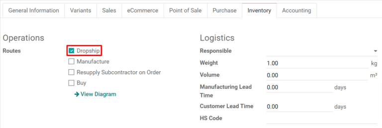

=============================================================
Use dropshipping to ship directly from suppliers to customers
=============================================================

Dropshipping is an order fulfillment strategy that allows sellers to have items shipped directly
from suppliers to customers. Normally, a seller purchases a product from a supplier, stores it in
their inventory, and ships it to the end customer once an order is placed. With dropshipping, the
supplier is responsible for storing and shipping the item. This benefits the seller by reducing
inventory costs, including the price of operating warehouses.

Configure products to be dropshipped
====================================

To use dropshipping as a fulfillment strategy, navigate to the :menuselection:`Purchase` app and
select :menuselection:`Configuration --> Settings`. Under the :guilabel:`Logistics` heading, click
the :guilabel:`Dropshipping` checkbox, and :guilabel:`Save` to finish.

Next, go to the :menuselection:`Sales` app, click :menuselection:`Products --> Products` and choose
an existing product or select :guilabel:`Create` to configure a new one. On the :guilabel:`Product`
page, make sure that the :guilabel:`Can be Sold` and :guilabel:`Can be Purchased` checkboxes are
enabled.

.. image:: dropshipping/sold-purchased-checkboxes.png
   :align: center
   :alt: Enable the "Can be Sold" and "Can be Purchased" checkboxes on the product form.

Click on the :guilabel:`Purchase` tab and specify a vendor and the price that they sell the product
for. Multiple vendors can be added, but the vendor at the top of the list will be the one
automatically selected for purchase orders.

.. image:: dropshipping/product-vendor-config.png
   :align: center
   :alt: The product form with a vendor specified.

Finally, select the :guilabel:`Inventory` tab and enable the :guilabel:`Dropship` checkbox in the
:guilabel:`Routes` section.

Fulfill orders using dropshipping
=================================

When a customer completes an online purchase for a dropshipped product, a sales order will be
automatically created with an associated request for quotation (:abbr:`RFQ (Request for Quotation)`)
for the supplier. Sales orders can be viewed in the :menuselection:`Sales` app by selecting
:menuselection:`Orders --> Orders`. Click the :guilabel:`Purchase` smart button at the top right of
a sales order to view the associated :abbr:`RFQ (Request for Quotation)`.

.. tip::
   Dropship sales orders can also be created manually through the :menuselection:`Sales` app by
   selecting :menuselection:`Orders --> Orders --> Create` and adding a product configured for
   dropshipping.

.. image:: dropshipping/dropship-sales-order.png
   :align: center
   :alt: A dropship sales order with the Purchase smart button in the top right corner.

Once the :abbr:`RFQ (Request for Quotation)` is confirmed, it becomes a purchase order and a
dropship receipt is created and linked to it. The receipt can be viewed by clicking the
:guilabel:`Receipt` smart button in the top right corner of the purchase order form.

.. image:: dropshipping/dropship-purchase-order.png
   :align: center
   :alt: A dropship purchase order with the Receipt smart button in the top right corner.

The dropship receipt will list the supplier in the :guilabel:`Receive From` section and the customer
in the :guilabel:`Destination Location` section. Upon delivery of the product to the customer, click
on the :guilabel:`Validate` button at the top left of the dropship receipt to confirm the delivered
quantity.

.. image:: dropshipping/validate-dropship-receipt.png
   :align: center
   :alt: Validate the dropship receipt after delivery.

To view all dropship orders, simply navigate to the :menuselection:`Inventory` :guilabel:`Overview`
dashboard and click the teal :guilabel:`# TO PROCESS` button on the :guilabel:`Dropship` card.

.. image:: dropshipping/view-all-dropship-orders.png
   :align: center
   :alt: Click the green button on the Dropship card to view all dropship orders.
