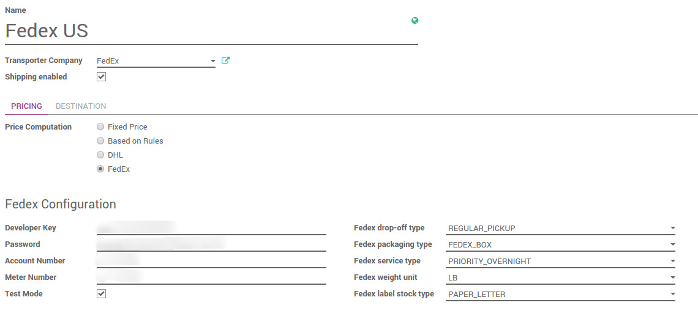

=============================
How to print shipping labels?
=============================

Overview
========

Odoo can handle various delivery methods, including third party shippers
linked with the transportation company tracking system. It allows you to
manage the transport company, the real prices and the destination. And
finally, you will be able to print the shipping labels directly from
Odoo.

Configuration
=============

Install the shipper company connector module
--------------------------------------------

In the **Inventory** module, click on :menuselection:`Configuration --> Settings`.
Under **Shipping Connectors**, flag the transportation companies you want to
integrate :

.. image:: labels/labels03.png
   :align: center

Then click on **Apply**.

Configure the delivery method
-----------------------------

To configure your delivery methods, go to the **Inventory** module, click on
:menuselection:`Configuration --> Delivery Methods`.

The delivery methods for the chosen shippers have been automatically
created.

In the **Pricing** tab, the name of the provider means that the delivery
will be handled and computed by the shipper system.

The configuration of the shipper is split into two columns :

-   The first one is linked to **your account** (develop key, password,...).
    For more information, please refer to the provider website.

-   The second column varies according to the **provider**. You can choose
    the packaging type, the service type, the weight unit...

-  Uncheck **Test Mode** when you are done with the testings.

Company configuration
---------------------

In order to compute the right price, the provider needs your company
information. Be sure your address and phone number are correctly
encoded.

.. image:: labels/labels02.png
   :align: center

To check your information, go to the **Settings** application and click on
**General Settings**. Click on the first link **Configure your company data**.

Product configuration
---------------------

The shipper companies need the weight of your product, otherwise the
price computation cannot be done.

Go the **Sales** module, click on :menuselection:`Sales --> Products`.
Open the products you want to ship and set a weight on it.

.. image:: labels/labels06.png
   :align: center

.. tip::
    The weight on the product form is expressed in kilograms.
    Don't forget to do the conversion if you are used to the imperial
    measurement system.

How to print shipping labels?
=============================

The delivery order created from the sale order will take the shipping
information from it, but you can change the carrier if you want to.

If you create a delivery transfer from the inventory module, you can add
the third party shipper in the additional info tab.

.. image:: labels/labels05.png
   :align: center

Click on **Validate** to receive the tracking number and **the label(s)**.

The label to stick on your package is available in the history
underneath :

.. image:: labels/labels04.png
   :align: center

Click on it to open the document and print it :

.. image:: labels/labels07.png
   :align: center

.. note::
    If you are doing multi-packages shippings, most of the time,
    there will be one label per package. Each label will appear in the
    delivery history.

.. seealso::
    * :doc:`invoicing`
    * :doc:`multipack`
