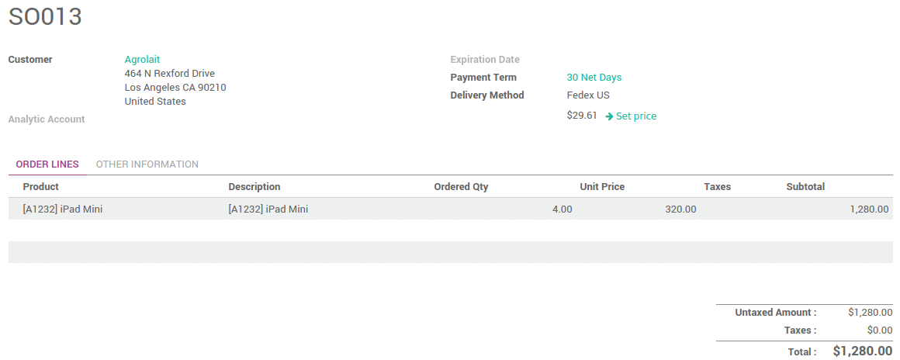
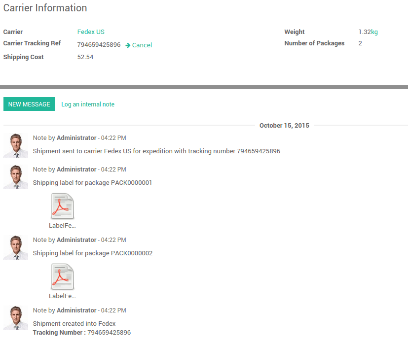

=========================================================
How to manage multiple packs for the same delivery order?
=========================================================

Overview
========

By default, Odoo considers that your delivery is composed of one
package. But you can easily ship your deliveries with more than one
package. It is fully integrated with the third-party shippers.

Configuration
=============

To configure the use of packages, go to the menu
:menuselection:`Inventory --> Configuration --> Settings`. 
Locate the **Packages** section and tick **Record
packages used on packing: pallets, boxes,...**

.. image:: media/multipack03.png
   :align: center

Click on **Apply** when you are done.

Sale process
============

Sale order
----------

Click on a **Delivery Method** to choose the right one.

The price is computed when you **save** the sale order or when you click on
**Set price**.

Multi-packages Delivery
-----------------------

The delivery created from the sale order will take the shipping
information from it.

.. image:: media/multipack07.png
   :align: center

From here, you can split your delivery into multiple packages.

Choose the quantity you want to put in the first pack in the **Done**
column, then click on the link **Put in Pack**.

.. image:: media/multipack02.png
   :align: center

It will automatically create a pack with the requested quantity.

Do the same steps for the other pieces you want to pack in.

.. image:: media/multipack04.png
   :align: center

Click on **Validate** when you are done.

Multi-packages with a 3rd party-shipper
---------------------------------------

Once the delivery order is validated, you will receive the tracking
number. The **carrier Tracking ref** field will automatically be filled.
Click on the **Tracking** button to check your delivery on the provider
website.

.. image:: media/multipack05.png
   :align: center

The **labels** to stick on your packages are available in the history
underneath:

.. seealso::
    * :doc:`invoicing`
    * :doc:`labels`
