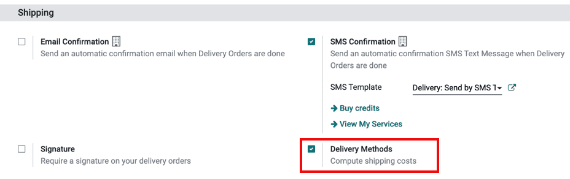
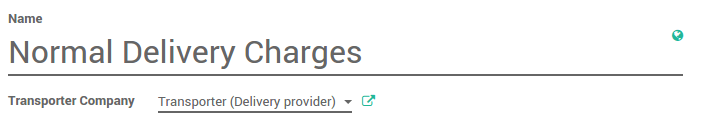
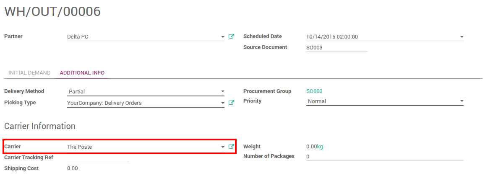

===============================
How to setup a delivery method?
===============================

Overview
========

Odoo can handle various delivery methods, but it is not activated by
default. Delivery methods can be used for your sale orders, your
deliveries but also on your e-commerce.

Delivery methods allow you to manage the transport company, the price
and the destination. You can even integrate Odoo with external shippers
to compute the real price and the packagings.

Configuration
=============

Install the inventory module
----------------------------

Delivery methods are handled by the **Delivery costs** module. Go to
**Apps** and search for the module. You should remove the **Apps** filter in
order to see it :

.. note::
    If you want to integrate delivery methods in your e-commerce,
    you'll have to install the **eCommerce Delivery** module.

Configure the delivery method
-----------------------------

To configure your delivery methods, go to the **Inventory** module,
click on :menuselection:`Configuration --> Delivery Methods`.

First set a name and a transporter company.

Then you'll have to set the pricing. It can be fixed or based on rules.

-  If the price is fixed, tick **Fixed price**. You'll just have to define
   the price. If you want the delivery to be free above a certain
   amount, tick the option **Free if Order total is more
   than** and set a price.

.. image:: delivery_method/setup06.png
   :align: center

-  If the price varies according to rules, tick **Based on Rules**. Click
   on **add an item to a pricing rule**. Choose a condition based on
   either the weight, the volume, the price or the quantity.

.. image:: delivery_method/setup04.png
   :align: center

Finally you can limit the delivery method to a few destinations. The
limit can be applied to some countries, states or even zip codes. This
feature limits the list of countries on your e-commerce.

.. image:: delivery_method/setup02.png
   :align: center

.. note::
    You can integrate Odoo with external shippers in order to compute the
    real price and packagings, and handle the printing the shipping labels.
    See :doc:`third_party_shipper`

Delivery process
================

Sale order
----------

.. image:: delivery_method/setup07.png
   :align: center

You can now choose the **Delivery Method** on your sale order. If you want
to invoice the price of the delivery charge on the sale order, click on
**Set price**, it will add a line with the name of the delivery method as
a product.

Delivery
--------

You can add or change the delivery method on the delivery itself.

On the delivery, check the **Carrier Information**. The carrier is the
chosen delivery method.

.. seealso::
    * :doc:`third_party_shipper`
    * :doc:`../operation/invoicing`
