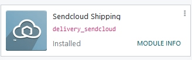
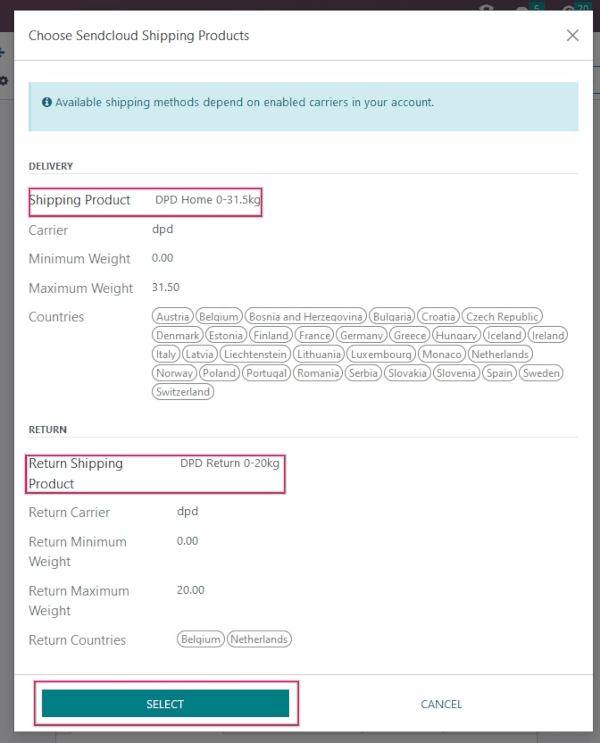

==========================================
Set up Sendcloud shipping services in Odoo
==========================================

Sendcloud is a shipping service aggregator that facilitates the integration of European
shipping carriers with Odoo. Once integrated, users can select shipping carriers on inventory
operations in their Odoo database.

.. seealso::
   `Sendcloud integration documentation <https://support.sendcloud.com/hc/en-us/articles
   /360059470491-Odoo-integration>`_

Setup in Sendcloud
==================

Create an account and activate carriers
---------------------------------------

To get started, go to `Sendcloud's platform <https://www.sendcloud.com>`_ to configure the account
and generate the connector credentials. Log in with the Sendcloud account, or create a new one if
needed.

.. note::
   For new account creation, Sendcloud will ask for a :abbr:`VAT (Value-Added Tax Identification)`
   number or :abbr:`EORI (Economic Operators' Registration and Identification)` number. After
   completing the account setup, activate (or deactivate) the shipping carriers that will be used
   in the Odoo database.

.. important::
   Odoo integration of Sendcloud works on free Sendcloud plans *only* if a bank account is linked,
   since Sendcloud won't ship for free. To use shipping rules or individual custom carrier contacts,
   a paid plan of Sendcloud is required.

Warehouse configuration
-----------------------

Once logged into the Sendcloud account, navigate to :menuselection:`Settings --> Shipping -->
Addresses`, and fill in the field for :guilabel:`Warehouse address`.

.. image:: sendcloud_shipping/settings-shipping.png
   :align: center
   :alt: Adding addresses in the Sendcloud settings.

To allow Sendcloud to process returns as well, a :guilabel:`Return Address` is required. Under the
:guilabel:`Miscellaneous section`, there is a field called :guilabel:`Address Name (optional)`. The
Odoo warehouse name should be entered here, and the characters should be exactly the same.

.. example::

   | **SendClould configuration**
   | :guilabel:`Miscellaneous`
   | :guilabel:`Address Name (optional)`: `Warehouse #1`
   | :guilabel:`Brand`: `Default`

   | **Odoo warehouse configuration**
   | :guilabel:`Warehouse`: `Warehouse #1`
   | :guilabel:`Short Name`: `WH`
   | :guilabel:`Company`: `My company (San Francisco)`
   | :guilabel:`Address`: `My Company (San Francisco)`

   Notice how the inputs for the :guilabel:`Warehouse` field, for both the Odoo configuration and
   the Sendcloud configuration, are the exact same.

Generate Sendcloud credentials
------------------------------

In the Sendcloud account, navigate to :menuselection:`Settings --> Integrations` in the menu on the
right. Next, search for :guilabel:`Odoo Native`. Then, click on :guilabel:`Connect`.

After clicking on :guilabel:`Connect`, the page redirects to the :guilabel:`Sendcloud API` settings
page, where the :guilabel:`Public and Secret Keys` are produced. The next step is to name the
:guilabel:`Integration`. The naming convention is as follows: `Odoo CompanyName`, with the user's
company name replacing `CompanyName` (e.g. `Odoo StealthyWood`).

Then, check the box next to :guilabel:`Service Points` and select the shipping services for this
integration. After saving, the :guilabel:`Public and Secret Keys` are generated.

.. image:: sendcloud_shipping/public-secret-keys.png
   :align: center
   :alt: Configuring the Sendcloud integration and receiving the credentials.

Setup in Odoo
=============

Install the Sendcloud shipping module
-------------------------------------

After the Sendcloud account is set up and configured, it's time to configure the Odoo database.
To get started, go to Odoo's :guilabel:`Apps` module,  search for the :guilabel:`Sendcloud
Shipping` integration, and install it.

Sendcloud shipping connector configuration
------------------------------------------

Once installed, activate the :guilabel:`Sendcloud Shipping` module in :menuselection:`Inventory -->
Configuration --> Settings`. The :guilabel:`Sendcloud Connector` setting is found under the
:guilabel:`Shipping Connectors` section.

After activating the :guilabel:`Sendcloud Connector`, click on the :guilabel:`Sendcloud Shipping
Methods` link below the listed connector. Once on the :guilabel:`Shipping Methods` page, click
:guilabel:`Create`.

.. tip::
   :guilabel:`Shipping Methods` can also be accessed by going to :menuselection:`Inventory -->
   Configuration --> Delivery --> Shipping Methods`.

Fill out the following fields in the :guilabel:`New Shipping Method` form:

- :guilabel:`Shipping Method`: type `Sendcloud DPD`.
- :guilabel:`Provider`: select :guilabel:`Sendcloud` from the drop-down menu.
- :guilabel:`Delivery Product`: set the product that was configured for this shipping method or
  create a new product.
- In the :guilabel:`SendCloud Configuration` tab, enter the :guilabel:`Sendcloud Public Key`.
- In the :guilabel:`SendCloud Configuration` tab, enter the :guilabel:`Sendcloud Secret Key`.
- Manually :guilabel:`Save` the form by clicking the cloud icon next to the :guilabel:`Shipping
  Methods / New` breadcrumbs.

After configuring and saving the form, follow these steps to load the shipping products:

- In the :guilabel:`SendCloud Configuration` tab of the :guilabel:`New Shipping Method` form, click
  on the :guilabel:`Load your SendCloud shipping products` link.
- Select the shipping products the company would like to use for deliveries and returns.
- Click :guilabel:`Select`.

.. example::
   Sample Sendcloud shipping products configured in Odoo:

   | :guilabel:`DELIVERY`
   | :guilabel:`Shipping Product`: `DPD Home 0-31.5kg`
   | :guilabel:`Carrier`: `DPD`
   | :guilabel:`Minimum Weight`: `0.00`
   | :guilabel:`Maximum Weight`: `31.50`

   :guilabel:`Countries`: `Austria` `Belgium` `Bosnia` `Herzegovina` `Bulgaria` `Croatia` `Czech`
   `Republic` `Denmark` `Estonia` `Finland` `France` `Germany` `Greece` `Hungary` `Iceland`
   `Ireland` `Italy` `Latvia` `Liechtenstein` `Lithuania` `Luxembourg` `Monaco` `Netherlands`
   `Norway` `Poland` `Portugal` `Romania` `Serbia` `Slovakia` `Slovenia` `Spain` `Sweden`
   `Switzerland`

   | :guilabel:`RETURN`
   | :guilabel:`Return Shipping Product`: `DPD Return 0-20kg`
   | :guilabel:`Return Carrier`: `DPD`
   | :guilabel:`Return Minimum Weight`: `0.00`
   | :guilabel:`Return Maximum Weight`: `20.00`
   | :guilabel:`Return Countries`: `Belgium` `Netherlands`

.. tip::
   Sendcloud does not provide test keys when a company tests the sending of a package in Odoo. This
   means if a package is created, the configured Sendcloud account will be charged, unless the
   associated package is canceled within 24 hours of creation.

   Odoo has a built-in layer of protection against unwanted charges when using test environments.
   Within a test environment, if a shipping method is used to create labels, then those labels are
   immediately canceled after the creation — this occurs automatically. The test and production
   environment settings can be toggled back and forth from the :guilabel:`Smart Buttons`.

Generate a label with Sendcloud
-------------------------------

When creating a quotation in Odoo, add shipping and a :guilabel:`Sendcloud shipping product`. Then,
:guilabel:`Validate` the delivery. Shipping label documents are automatically generated in the
chatter, which include the following:

#. :guilabel:`Shipping label(s)` depending on the number of packages.
#. :guilabel:`Return label(s)` if the Sendcloud connector is configured for returns.
#. :guilabel:`Customs document(s)` should the destination country require them.

Additionally, the tracking number is now available.

.. important::
   When return labels are created, Sendcloud will automatically charge the configured Sendcloud
   account.

FAQ
===

Shipment is too heavy
---------------------

If the shipment is too heavy for the Sendcloud service that is configured, then the weight is split
to simulate multiple packages. Products will need to be put in different :guilabel:`Packages` to
:guilabel:`Validate` the transfer and generate labels.

:guilabel:`Rules` can also be set up in Sendcloud to use other shipping methods when the weight is
too heavy. However, note that these rules will not apply to the shipping price calculation on the
calculation on the sales order.

When using a personal carrier contract
--------------------------------------

When using a personal carrier contract in Sendcloud, if the the price is not accurately reflected
when creating a quotation in Odoo, then the pricing information needs to be updated in Sendcloud.

Measuring volumetric weight
---------------------------

Many carriers have several measures for weight. There is the actual weight of the products in the
parcel, and there is the *volumetric weight* (:dfn:`Volumetric weight is the volume that a package
occupies when in transit. In other words it is the physical size of a package`).

.. tip::
   Check to see if selected carrier(s) already have defined formulas to compute the volumetric
   weight.

.. seealso::
   `Sendcloud: How to calculate & automate parcel volumetric weight <https://support.sendcloud.com/
   hc/en-us/articles/360059644051-How-to-calculate-automate-parcel-volumetric-weight>`_

Unable to calculate shipping rate
---------------------------------

First, verify that product being shipped has a weight that is supported by the selected shipping
method. If this is set, then verify that the destination country (from the customer address) is
supported by the carrier. The country of origin (warehouse address) should also be supported by
the carrier.
