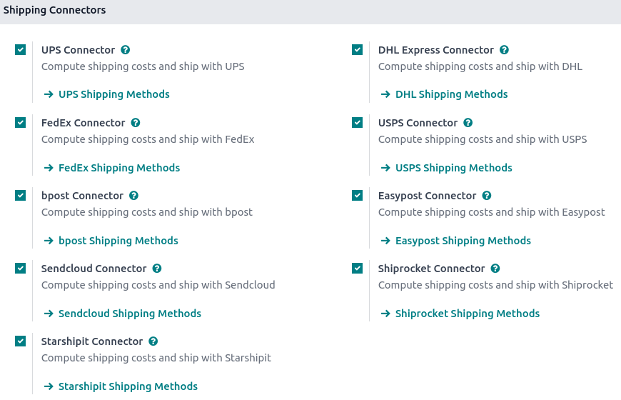
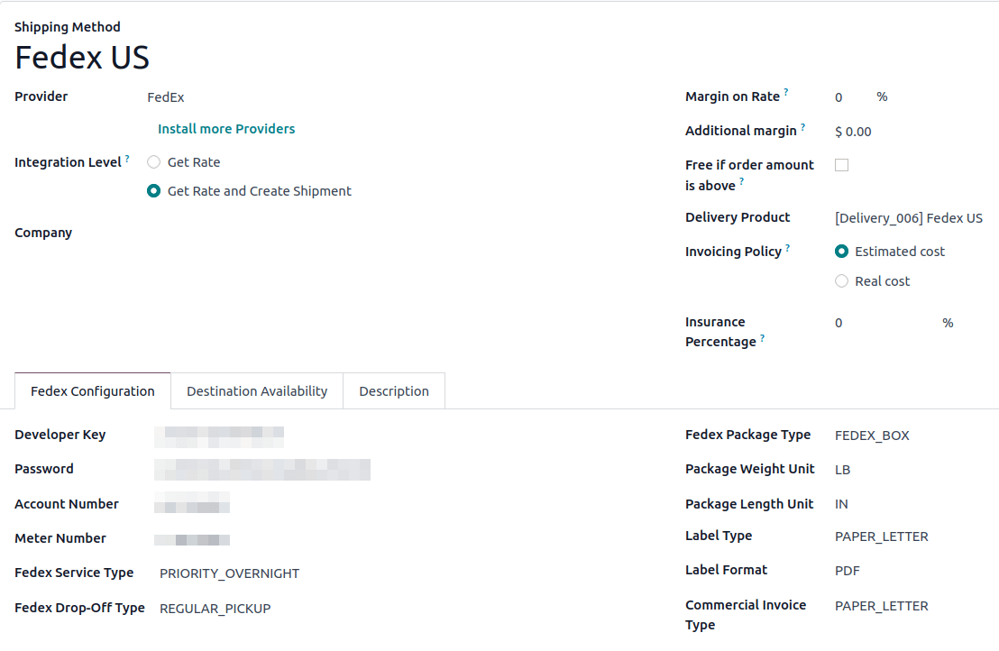
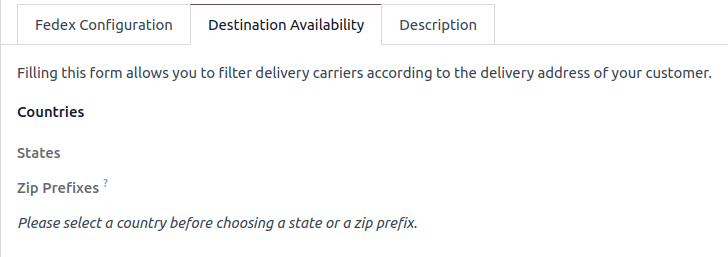
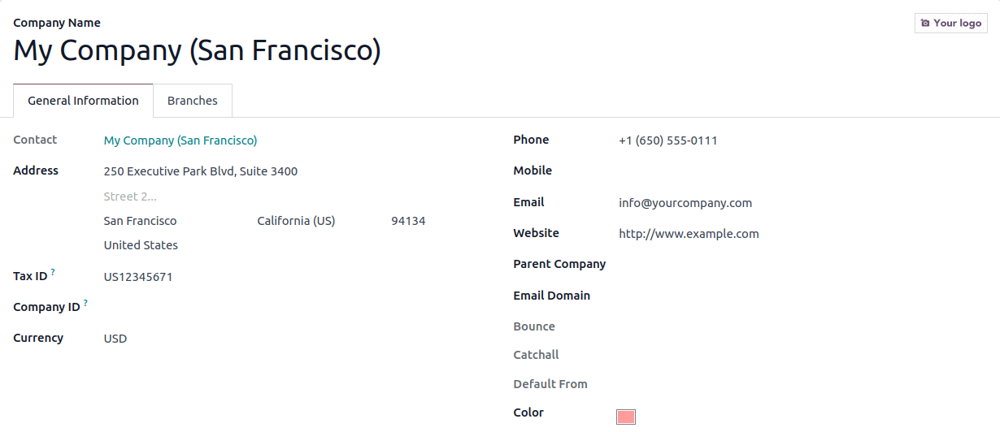
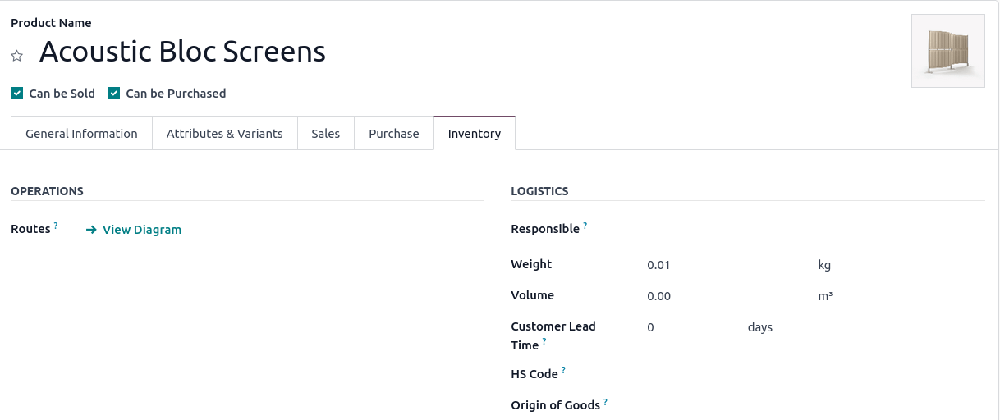
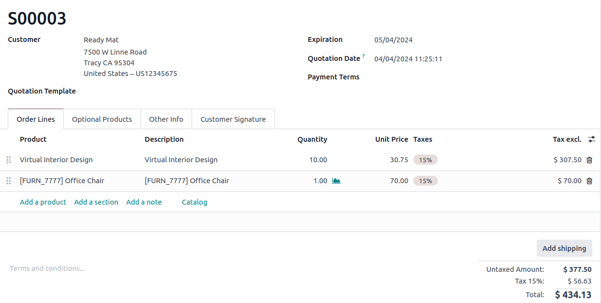
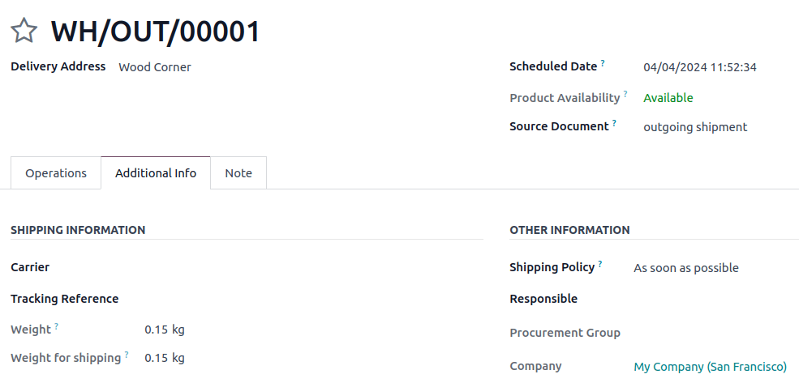
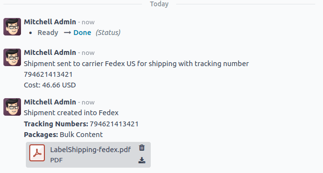

=======================================
How to integrate a third party shipper?
=======================================

Overview
========

Odoo can handle various delivery methods, including third-party
shippers. Odoo can be linked with the transportation company tracking
system. It will allow you to manage the transport company, the real
prices, and the destination.

Configuration
=============

Install the shipping company connector module
---------------------------------------------

In the inventory module, click on :menuselection:`Configuration --> Settings`.
Under **Shipping Connectors**, flag the transportation companies you want to
integrate :

Then click on **Save**.

.. note::
    If you want to integrate delivery methods in your e-commerce,
    you'll have to install the **eCommerce Delivery** module.

Configure the delivery method
-----------------------------

To configure your delivery methods, go to the **Inventory** module, click on
:menuselection:`Configuration --> Delivery Methods`.

The delivery methods for the chosen shippers have been automatically
created. Most of the time, there will be **2** delivery methods for the same
provider: one for **international** shipping and the other for **domestic**
shipping.

You can create other methods with the same provider with other
configuration, for example the **Packaging Type**.

You can change the **Name** of the delivery method. This is the name that
will appear on your ecommerce.

Toggle the **Published** smart button when you are ready to use it.

The configuration of the shipper is split into two columns:

-  The first one is linked to **your account** (developer key, password,...).
   For more information, please refer to the provider website.

-  The second column varies according to the **provider**. You can choose
   the packaging type, the service type, the weight unit...

-  Toggle the **Test Mode** smart button when you are done with the testings.

If you want to invoice the price of the delivery charge on the sale
order, click on **Set price**, it will add a line with the name of the
delivery method as a product. It may vary from the real price.

Otherwise, the real price (computed when the delivery is validated) will
automatically be added to the invoice. For more information, please read
the document :doc:`../operation/invoicing`

Finally, you can limit the delivery method to a few destinations. You can
limit it to some countries, states, or even zip codes. This feature
limits the list of countries on your e-commerce. It is useful for the
domestic providers. For example, USPS US only delivers from the United
States to the United States.

Company configuration
---------------------

To compute the right price, the provider needs your company
information. Be sure your address and phone number are correctly
encoded.

To check your information, go to the **Settings** application and click on
**Update Info** in the Companies section.

Product configuration
---------------------

The shipper companies need the weight of your product, otherwise the
price computation cannot be done.

Go to the menu :menuselection:`Sales --> Products --> Products`. Open the products you
want to ship and set a weight the Inventory page.

Sale process
============

Sale order
----------

You can now choose the carrier on your sale order. Click on the **Add
shipping** button to choose the right one.

The price is computed when you click on **Get rate** in the popup menu.

Delivery
--------

The delivery created from the sale order will take the shipping
information from it. You can change the carrier if you want to.

If you create a delivery transfer from the inventory module, you can add
the third-party shipper in the additional info tab.

The weight is computed based on the product's weight. The shipping cost
will be computed once the transfer is validated.

Click on **Validate** to receive the tracking number. The **Tracking Reference**
field will automatically be filled. Click on the **Tracking** smart button
to check your delivery on the provider's website.

The label to stick on your package is available in the history
underneath :

Troubleshooting
===============

Here are a few tips to troubleshoot common issues you may encounter.

Debug mode
----------

When you are on the Delivery Method form view, you will see a Debug smart
button when applicable. Clicking the smart button will toggle debug mode
on or off for that specific method.

What this does is every time this delivery method is called upon, a log
will be created. This occurs once when Odoo sends the information to the
provider and once more when Odoo receives the response from the provider.

The information itself can be found in the menu
:menuselection:`Settings --> Technical --> Database Structure --> Logging`.

.. note::
   This menu can only be accessed while in :doc:`../../../../general/developer_mode`

Company information
-------------------

Sometimes the company info is not set correctly or is different on the shipping provider side of
things. It is important to make sure that the company information in Odoo matches exactly as it is
on your shipping provider.

Carrier service type
--------------------

If you are unable to ship, ensure that the exact type and parameters of your shipment are valid on
the shipping provider side of things. Ensure that on the carrier side of things, you can create the
exact same shipment with no issues.

Pricing mismatch
----------------

This can occur if you are not in production mode. Create the same type of shipment on the carriers
backend and on Odoo and check debug logging.

.. note::
   Still having issues? `submit a support ticket <https://www.odoo.com/help>`_

.. seealso::
    * :doc:`../operation/invoicing`
    * :doc:`../operation/labels`
