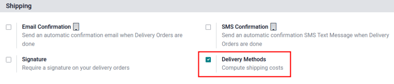
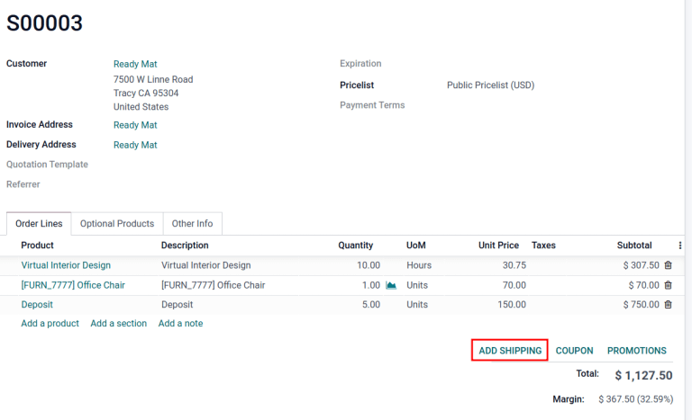
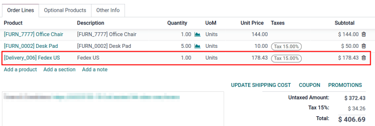
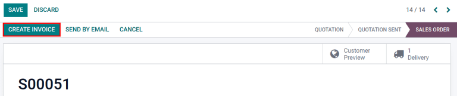
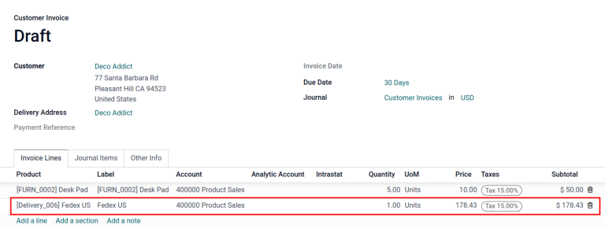
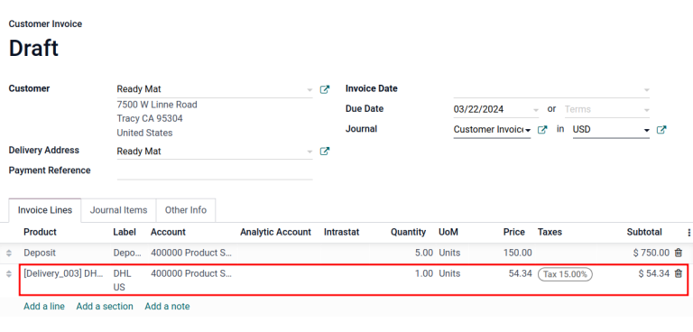

=======================
Shipping cost invoicing
=======================

Invoicing customers for shipping after delivery ensures accurate charges based on real-time shipping
factors like distance, weight, and method.

In Odoo, shipping costs can be invoiced in two ways:

#. Agree with the customer on a fixed cost and :ref:`include it in the sale order.
   <inventory/shipping/invoice-so>`

#. :ref:`Invoice shipping costs to the customer post-delivery
   <inventory/shipping/invoice-shipping>`, reflecting the actual expenses incurred by the business.

Configuration
=============

To set prices to delivery methods, go to :menuselection:`Inventory app --> Configuration -->
Settings`. Under the :guilabel:`Shipping` section, enable the :guilabel:`Delivery Methods` feature.
Then, click :guilabel:`Save`.

Add shipping method
===================

Next, configure the the price of each delivery method by going to :menuselection:`Inventory app -->
Configuration --> Shipping Methods` and click the :guilabel:`Create` button. Doing so opens a form
to provide details about the shipping provider, including:

- :guilabel:`Shipping Method` (*required*) the name of the delivery method (e.g. `flat-rate
  shipping`, `same day delivery`, etc.).
- :guilabel:`Provider` (*required*): choose the delivery service, like FedEx, if using a
  third-party carrier Ensure the integration with the shipping carrier is properly installed and
  select the provider from the drop-down menu.

  .. seealso::
     :doc:`../setup_configuration/third_party_shipper`

- :guilabel:`Company`: if the shipping method should apply to a specific company, select it from the
  drop-down menu. Leave the field blank to apply the method to all companies.

- :guilabel:`Website`: configure shipping methods for an e-commerce page. Select the applicable
  website from the drop-down menu, or leave it blank to apply the method to all web pages.

- :guilabel:`Delivery Product` (*required*): the product listed on the :ref:`sales order line
  <inventory/shipping/invoice-on-so>` as the delivery charge.
- :guilabel:`Free if order amount is above`: checking this box enables free shipping if the customer
  spends above the specified amount.

.. _inventory/shipping/invoice-so:

Invoice cost on sales order
===========================

To invoice shipping costs on the sales order, before the item is delivered, go to the
:menuselection:`Sales app` and select the desired sales order.

On the sales order, click the :guilabel:`Add Shipping` button at the bottom-right corner.

In the :guilabel:`Add a shipping method` pop-up window, choose the intended carrier in the
:guilabel:`Shipping Method` field.

Then, click the :guilabel:`Get Rate` button to the calculate shipping price based on real-time
shipping data Odoo's shipping carrier integration.

The :guilabel:`Cost` is automatically calculated using the weight of the items in the order.
Finally, click the :guilabel:`Add` button to close the window.

.. image:: invoicing/add-a-shipping-method.png
   :align: center
   :alt: Calculate shipping by selecting a shipping method.

.. _inventory/shipping/invoice-on-so:

On the sales order, the delivery product appears in the :guilabel:`Order Lines` tab, with the
:guilabel:`Unit Price` set as the shipping cost calculated in the :guilabel:`Add a shipping method`
pop-up window.

Finally, after the product is delivered, click the :guilabel:`Create invoice` button, and an invoice
is created that includes the shipping cost that was added earlier.

Then, click the :guilabel:`Create and View Invoice` button, and a draft invoice is generated, with
the shipping cost included in the :guilabel:`Invoice Lines` tab.

.. _inventory/shipping/invoice-shipping:

Invoice real shipping costs
===========================

To modify the invoice to reflect the real cost of shipping, follow the steps :ref:`above
<inventory/shipping/invoice-so>` to create an invoice with a delivery product with a :guilabel:`Unit
Price` of zero.

Then, on a draft invoice, modify the :guilabel:`Unit Price` to reflect the real shipping cost.
Finally, invoice the customer the adjusted shipping cost by clicking :guilabel:`Confirm`.

.. seealso::
   - :doc:`../setup_configuration/third_party_shipper`
   - :doc:`../setup_configuration/labels`
