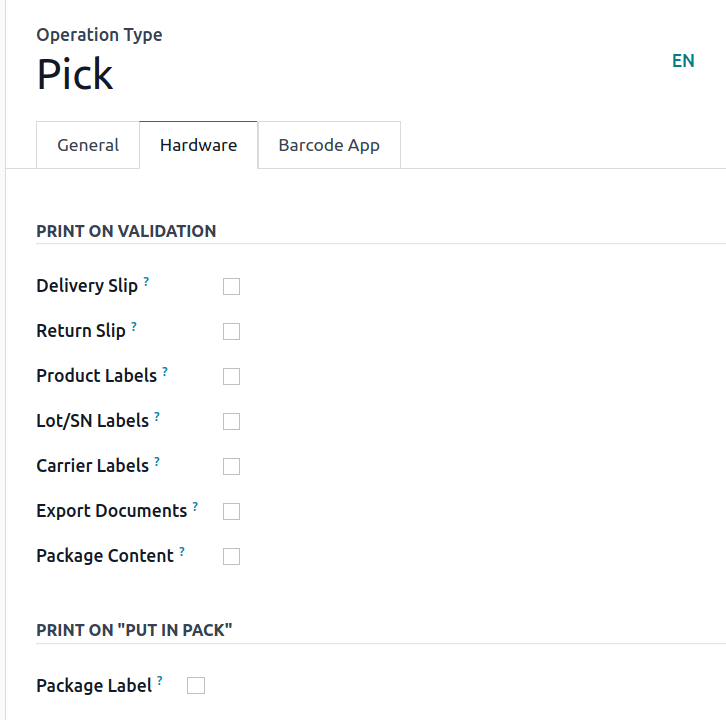

=======================
Printable delivery PDFs
=======================

Automatically print delivery-related PDFs documents and labels in Odoo, containing package recipient
details, contents, or handling instructions.

The following PDFs can be configured to print upon validating an *Inventory* operation (e.g.
receipt, picking, delivery orders, quality checks):

#. :ref:`Delivery slip <inventory/shipping_receiving/delivery-slip>`
#. :ref:`Return slip <inventory/shipping_receiving/return-slip>`
#. :ref:`Product labels of items in the order <inventory/shipping_receiving/product-labels>`
#. :ref:`Lot and serial number labels <inventory/shipping_receiving/lot-sn-labels>`
#. Carrier labels
#. Export documents
#. Package Content
#. Package label

.. _inventory/shipping_receiving/print_setup:

To automatically print these forms, navigate to :menuselection:`Inventory app --> Configuration -->
Operations Types`, and select the desired operation type.

In the :guilabel:`Hardware` tab, tick each of the desired options available in the :guilabel:`Print
on Validation` section to download the PDF of those selected documents automatically after
validating the :guilabel:`Operation Type`. For details on what each of the checkbox options do, jump
to the related section.

.. _inventory/shipping_receiving/delivery-slip:

Delivery slip
=============

A *delivery slip* contains recipient and package details, usually placed inside (or attached to) the
package.

.. seealso::
   - :ref:`Picking list <inventory/warehouses_storage/barcode_picking>`
   - :doc:`Tracking label <labels>`

After :ref:`enabling the Delivery Slip setting <inventory/shipping_receiving/print_setup>` in the
:guilabel:`Hardware` tab configuration options, clicking :guilabel:`Validate` on the desired
operation type downloads a PDF of the delivery slip.

The delivery slip shows products, quantities, the delivery order reference number, and the total
order weight.

.. image:: print_on_validation/delivery-slip.png
   :align: center
   :alt: Example delivery slip.
.. _inventory/shipping_receiving/return-slip:

Return slip
===========

Print a *return slip* to include in a delivery for customer return packages. It identifies the
return, links to the sales order, and includes item details and customer information. It can also
include specific return instructions for the customer.

After :ref:`enabling the Return Slip setting <inventory/shipping_receiving/print_setup>` in the
:guilabel:`Hardware` tab configuration options, clicking :guilabel:`Validate` on the desired
operation type downloads a PDF of the return slip.

The return slip displays the company's return address, along with barcodes for both the order and
the return operation.

.. image:: print_on_validation/return-slip.png
   :align: center
   :alt: Example return slip.
.. _inventory/shipping_receiving/product-labels:

Product labels
==============

Print *product labels* to affix to items in an order, providing essential information, such as
product name, barcode, and price.

After navigating to the intended operation type (:menuselection:`Inventory app --> Configuration -->
Operations Types`), in the :guilabel:`Hardware` tab, tick the :guilabel:`Product Labels` option.

Doing so makes the :guilabel:`Print label as:` drop-down menu visible, where each product label can
be printed as:

- :guilabel:`2 x 7 with price`: PDF displays product name, barcode, and price, fitting two rows and
  seven columns of product labels per page.

  .. spoiler:: Example 2 x 7

     .. image:: print_on_validation/two-seven.png
        :align: center
        :alt: Example 2 x 7 with price.

- :guilabel:`4 x 7 with price`: displays product name, barcode, and price, fitting four rows and
  seven columns of product labels per page.

  .. spoiler:: Example 4 x 7

     .. image:: print_on_validation/four-seven.png
        :align: center
        :alt: Example 4 x 7 with price.

- :guilabel:`4 x 12`: displays product name and barcode. Fits four rows and twelve columns of
  product labels per page.

  .. spoiler:: Example 4 x 12

     .. image:: print_on_validation/four-twelve.png
        :align: center
        :alt: Example 4 x 12.

- :guilabel:`4 x 12 with price`: displays product name, barcode, and price. Fits four rows and
  twelve columns of product labels per page.
- :guilabel:`ZPL Labels`: prints labels in the Zebra Programming Language (ZPL) containing the
  product name and barcode. Readable for Zebra printers to automatically print labels.
- :guilabel:`ZPL Labels with price`: prints labels in the :abbr:`ZPL (Zebra Programming Language)`
  containing the product name, barcode, and price.

.. note::
   Product labels can be manually printed from any delivery order, by clicking the :guilabel:`Print
   Labels` button.
.. _inventory/shipping_receiving/lot-sn-labels:

Lot/SN Labels
=============

Print *lot/SN labels* to affix to items in an order, providing essential information, such as
product name, lot or serial number, and the barcode.

To automatically print this PDF, navigate to the intended operation type's options page
(:menuselection:`Inventory app --> Configuration --> Operations Types`). Then, in the
:guilabel:`Hardware` tab, tick the :guilabel:`Lot/SN Labels` option.

Doing so makes the :guilabel:`Print label as:` drop-down menu visible, where each product label can
be printed as:

- :guilabel:`4 x 12 - One per lot/SN`: PDF with labels for unique lot/serial numbers in the order,
  including product name, lot/serial number, and barcode. Fits four rows and twelve columns per
  page.

  .. spoiler:: Example 4 x 12 - One per lot/SN

     .. figure:: print_on_validation/four-twelve-lots.png
        :align: center
        :alt: Order with only one unique set of lot/serial numbers.

        Labels for an order with only one unique set of lot/serial numbers.

- :guilabel:`4 x 12 - One per unit`: PDF with labels matching the quantity of items, displaying the
  product name, lot/serial number, and barcode. Fits four rows and twelve columns per page.
- :guilabel:`ZPL Labels - One per lot/SN`: prints labels in :abbr:`ZPL (Zebra Programming
  Language)`, containing the product name, lot/serial number, and barcode.
- :guilabel:`ZPL Labels - One per unit`: prints labels with the quantity of items in :abbr:`ZPL
  (Zebra Programming Language)`, containing the product name, lot/serial number, and barcode.

