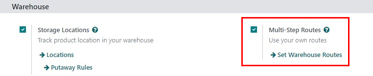
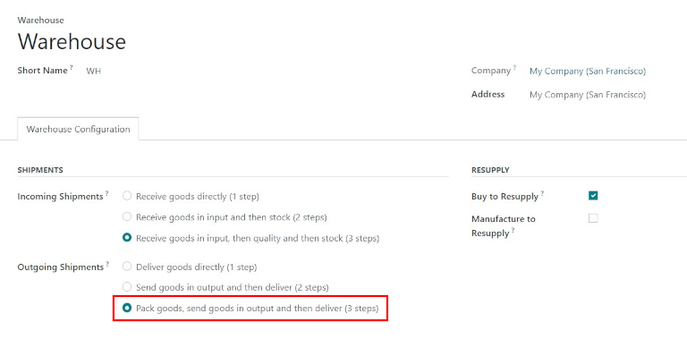
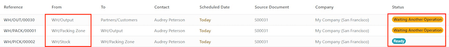
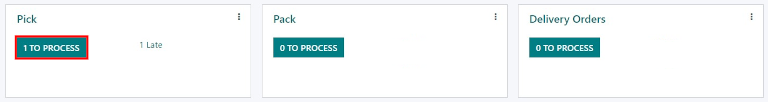
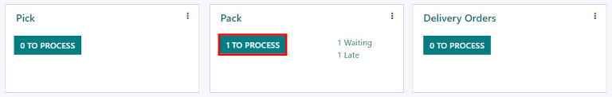
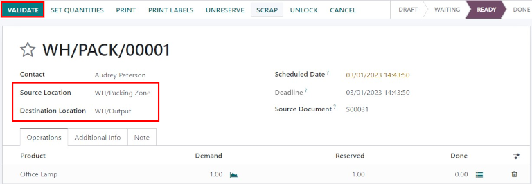
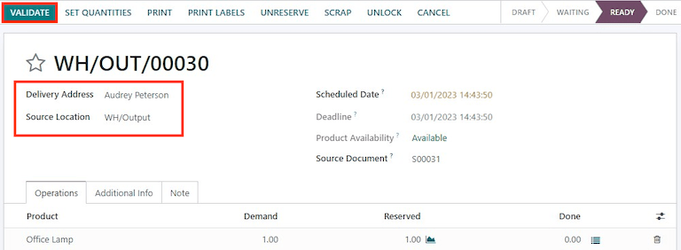

=================================
Process deliveries in three steps
=================================

.. _inventory/delivery_three_steps:

Some companies process large amounts of deliveries every day, many of which include multiple
products or require special packaging. To make this efficient, a packing step is needed before
shipping out products. For this, Odoo has a three step process for delivering goods.

In the default three-step delivery process, products that are part of a delivery order are picked in
the warehouse according to their removal strategy, and brought to a packing zone. After the items
have been packed into the different shipments in the packing zone, they are brought to an output
location before being shipped. These steps can be modified if they do not fit the needs of the
business.

Configuration
=============

Odoo is configured by default to :ref:`receive and deliver goods in one step
<inventory/receipts_delivery_one_step>`, so the settings need to be changed in order to utilize
three step deliveries. First, make sure the *Multi-Step Routes* option is enabled in
:menuselection:`Inventory --> Configuration --> Settings --> Warehouse`. Note that activating
:guilabel:`Multi-Step Routes` will also activate *Storage Locations*.

Next, the warehouse needs to be configured for three step deliveries. To do this, go to
:menuselection:`Inventory app --> Configuration --> Warehouses`, and click on the
:guilabel:`warehouse` to edit. Then, select :guilabel:`Pack goods, send goods in output and then
deliver (3 steps)` for :guilabel:`Outgoing Shipments`.

Activating three-step receipts and deliveries creates two new internal locations: a *Packing Zone*
(WH/Packing Zone), and *Output* (WH/Output). To rename these locations, go to
:menuselection:`Inventory app --> Configuration --> Locations`, click on the :guilabel:`Location` to
change, and update the name.

Deliver in three steps (pick + pack + ship)
===========================================

Create a sales order
--------------------

To create a new quote, navigate to :menuselection:`Sales app --> Create`, which reveals a blank
quotation form. On the blank quotation form, select a :guilabel:`Customer`, add a storable
:guilabel:`Product`, and click :guilabel:`Confirm`.

A :guilabel:`Delivery` smart button appears in the top right of the quotation form. Clicking it
shows the picking order, packing order, and the delivery order associated with the sales order.

.. image:: delivery_three_steps/three-step-delivery-so.png
   :align: center
   :alt: After confirming the sales order, the Delivery smart button appears showing three items
         associated with it.

Process a picking
-----------------

The picking, packing, and delivery orders will be created once the sales order is confirmed.  To
view these transfers, go to :menuselection:`Inventory --> Operations --> Transfers`.

         another operation.

The status of the picking will be :guilabel:`Ready`, since the product must be picked from stock
before it can be packed. The status of the packing order and delivery order will both be
:guilabel:`Waiting Another Operation`, since the packing and delivery cannot happen until the
picking is completed. The status of the delivery order will only change to :guilabel:`Ready` when
the packing has been marked :guilabel:`Done`.

The receipt can also be found in the *Inventory* application. In the :guilabel:`Overview` dashboard,
click the :guilabel:`1 To Process` smart button in the :guilabel:`Pick` kanban card.

Click on the picking to process. If the product is in stock, Odoo will automatically reserve the
product. Click :guilabel:`Validate` to mark the picking as done, and complete the transfer to the
:guilabel:`Packing Zone`. Then the packing order will be ready. Since the documents are linked, the
products which have been previously picked are automatically reserved on the packing order.

.. image:: delivery_three_steps/validate-three-step-pick.png
   :align: center
   :alt: Validate the picking by clicking Validate.

Process a packing
-----------------

The packing order will be ready to be processed once the picking is completed, and can be found in
the :menuselection:`Inventory` application :guilabel:`Overview` dashboard. Click the :guilabel:`1 To
Process` smart button in the :guilabel:`Pack` kanban card.

Click on the packing order associated with the sales order, then click on :guilabel:`Validate` to
complete the packing.

         output location.

Once the packing order is validated, the product leaves the :guilabel:`WH/Packing Zone` location and
moves to the :guilabel:`WH/Output` location. Then, the status of the document will change to
:guilabel:`Done`.

Process a delivery
------------------

The delivery order will be ready to be processed once the packing is completed, and can be found in
the :menuselection:`Inventory` application :guilabel:`Overview` dashboard. Click the :guilabel:`1 To
Process` smart button in the :guilabel:`Delivery Orders` kanban card.

.. image:: delivery_three_steps/three-step-kanban-delivery.png
   :align: center
   :alt: The delivery order can be seen in the Delivery Orders Kanban view.

Click on the delivery order associated with the sales order, then click on :guilabel:`Validate` to
complete the move.

         the customer location.

Once the delivery order is validated, the product leaves the :guilabel:`WH/Output` location and
moves to the :guilabel:`Partners/Customers` location. Then, the status of the document will change
to :guilabel:`Done`.
