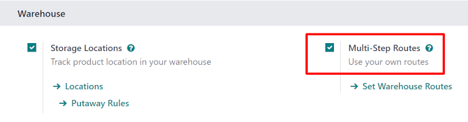
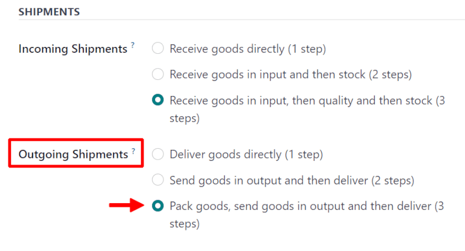
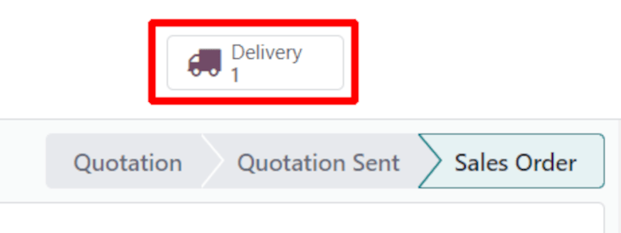
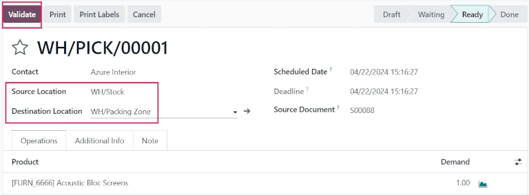
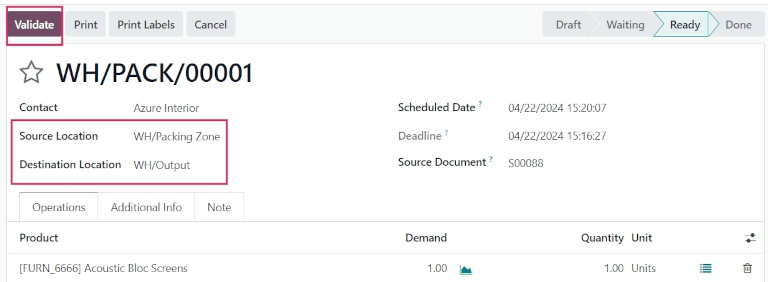
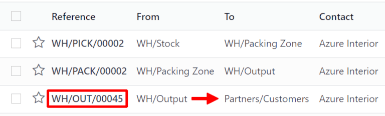

===================
Three-step delivery
===================

Some companies process large amounts of deliveries every day, many of which include multiple
products or require special packaging. To make this efficient, a packing step is needed before
shipping out products. For this, Odoo has a three step process for delivering goods.

In the default three-step delivery process, products that are part of a delivery order are picked in
the warehouse according to their removal strategy, and brought to a packing zone. After the items
have been packed into the different shipments in the packing zone, they are brought to an output
location before being shipped. These steps can be modified if they do not fit the needs of the
business.

Configuration
=============

To change delivery settings from :doc:`one step <receipts_delivery_one_step>` to three steps, make
sure the *Multi-Step Routes* option is enabled in :menuselection:`Inventory app --> Configuration
--> Settings --> Warehouse`. Note that activating :guilabel:`Multi-Step Routes` will also activate
*Storage Locations*.

Next, the warehouse needs to be configured for three step deliveries. To do this, go to
:menuselection:`Inventory app --> Configuration --> Warehouses`, and click on the
:guilabel:`warehouse` to edit. Then, select :guilabel:`Pack goods, send goods in output and then
deliver (3 steps)` for :guilabel:`Outgoing Shipments`.

Activating three-step receipts and deliveries creates two new internal locations: a *Packing Zone*
(WH/Packing Zone), and *Output* (WH/Output). To rename these locations, go to
:menuselection:`Inventory app --> Configuration --> Locations`, click on the :guilabel:`Location` to
change, and update the name.

Deliver in three steps (pick + pack + ship)
===========================================

Create a sales order
--------------------

To create a new quote, navigate to :menuselection:`Sales app --> Create`, which reveals a blank
quotation form. On the blank quotation form, select a :guilabel:`Customer`, add a storable
:guilabel:`Product`, and click :guilabel:`Confirm`.

A :guilabel:`Delivery` smart button appears in the top right of the quotation form. Clicking it
opens the picking order to move the ordered product from `WH/Stock` to `WH/Packing Zone`.

         associated with it.

Process a picking
-----------------

The picking order will be created once the sales order is confirmed. To view the picking, navigate
to the :menuselection:`Inventory app`, and locate the :guilabel:`Pick` task card on the
:guilabel:`Inventory Overview` dashboard.

Click the :guilabel:`# To Process` button, which reveals the picking order generated from the
previously confirmed sales order.

Click on the picking to process. If the product is in stock, Odoo will automatically reserve the
product. Click :guilabel:`Validate` to mark the picking as done, and complete the transfer to the
:guilabel:`Packing Zone`.

Process a packing
-----------------

After validating the picking, the packing order is ready to process. Click back to the
:guilabel:`Inventory Overview`, and locate the :guilabel:`Pack` task card on the dashboard.

Click the :guilabel:`# To Process` button (in this case, :guilabel:`1 To Process`). This reveals the
packing order generated from the previously confirmed sales order.

Click on the packing order associated with the sales order, then click on :guilabel:`Validate` to
complete the packing.

Once the packing order is validated, the product leaves the :guilabel:`WH/Packing Zone` location and
moves to the :guilabel:`WH/Output` location. Then, the status of the document will change to
:guilabel:`Done`.

Process a delivery
------------------

Once the packing order has been validated, the delivery order is ready to process. Navigate back to
the original sales order to process the delivery by going to :menuselection:`Sales app`, and
selecting the sales order created previously.

.. tip::
   Delivery orders can *also* be accessed by going to :menuselection:`Inventory app --> Operations
   --> Deliveries`.

The :guilabel:`Delivery` smart button now indicates there are 3 transfers, instead of one. Clicking
the :guilabel:`Delivery` smart button shows the three operations for this sales order: the picking,
the packing, and the delivery.

Click the delivery (WH/OUT) transfer to open the delivery order. Then, click :guilabel:`Validate`.

         the customer location.

Once the delivery order is validated, the product leaves the :guilabel:`WH/Output` location and
moves to the :guilabel:`Partners/Customers` location. Then, the status of the document will change
to :guilabel:`Done`.
