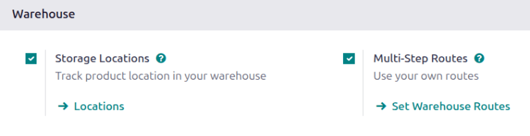

=============
Putaway rules
=============

Putaway is the process of routing products to appropriate storage locations upon shipment arrival.

Odoo can accomplish this seamlessly using *putaway rules*, which dictate how products move through
specified warehouse locations.

Upon shipment arrival, operations are generated based on putaway rules to efficiently move products
to specified locations, and ensure easy retrieval for future delivery orders.

In warehouses that process specific kinds of products, putaway rules can also prevent volatile
substances from being stored in close proximity, by directing them to different locations determined
by the warehouse manager.

.. seealso::
   `Odoo Tutorials: Putaway Rules <https://www.youtube.com/watch?v=nCQMf6sj_w8>`_

Configuration
=============

To use putaway rules, navigate to :menuselection:`Inventory app --> Configuration --> Settings`, and
activate the :guilabel:`Multi-Step Routes` feature under the :guilabel:`Warehouse` section. By doing
so, the :guilabel:`Storage Locations` feature is also automatically activated.

Finally, click :guilabel:`Save`.

.. _inventory/routes/putaway-rule:

Define putaway rule
-------------------

To manage where specific products are routed for storage, navigate to :menuselection:`Inventory app
--> Configuration --> Putaway Rules`. Use the :guilabel:`Create` button to configure a new putaway
rule on a :guilabel:`Product` or :guilabel:`Product Category` that the rule affects.

.. important::
   Putaway rules can be defined either per product/product category, and/or package type (the
   *Packages* setting must be enabled in :menuselection:`Inventory app --> Configuration -->
   Settings` for that).

In the same line, the :guilabel:`When product arrives in` location is where the putaway rule is
triggered to create an operation to move the product to the :guilabel:`Store to` location.

For this to work, the :guilabel:`Store to` location must be a *sub-location* of the first (e.g.,
`WH/Stock/Fruits` is a specific, named location inside `WH/Stock` to make the products stored here
easier to find).

.. example::
   In a warehouse location, **WH/Stock**, there are the following sub-locations:

   - WH/Stock/Fruits
   - WH/Stock/Vegetables

   Ensure all apples are stored in the fruits section by filling the field :guilabel:`Store to` with
   the location `WH/Stock/Fruits` when the :guilabel:`Product`, `Apple` arrives in `WH/Stock`.

   Repeat this for all products and hit :guilabel:`Save`.

   .. image:: putaway/create-putaway-rules.png
      :align: center
      :alt: Create putaway rules for apples and carrots.

Putaway rule priority
---------------------

Odoo selects a putaway rule based on the following priority list (from highest to lowest) until a
match is found:

#. Package type and product
#. Package type and product category
#. Package type
#. Product
#. Product category

.. example::
   The product `Lemonade can` has the following putaway rules configured:

   #. When receiving a `Pallet` (:guilabel:`Package Type`) of `Lemonade cans`, it is redirected to
      `WH/Stock/Pallets/PAL1`.
   #. `Lemonade can`'s :guilabel:`Product Category` is `All/drinks`, and when receiving a `Box` of
      any item in this product category, items are redirected to `WH/Stock/Shelf 1`.
   #. Any product on a `Pallet` is redirected to `WH/Stock/Pallets`
   #. The product `Lemonade can` is redirected to `WH/Stock/Shelf 2`
   #. Items in the `All/drinks` product category are redirected to `WH/Stock/Small Refrigerator`.

  .. image:: putaway/putaway-example.png
     :align: center
     :alt: Some examples of putaway rules.

