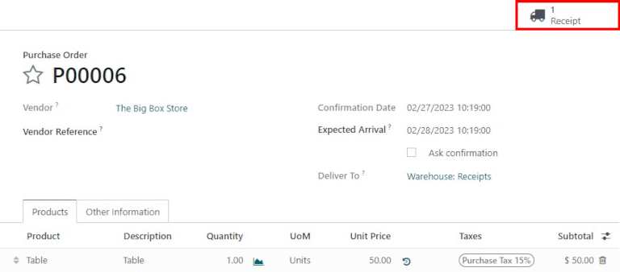
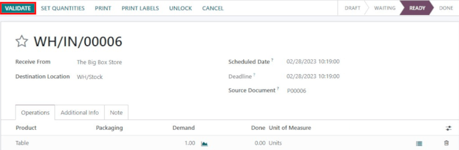
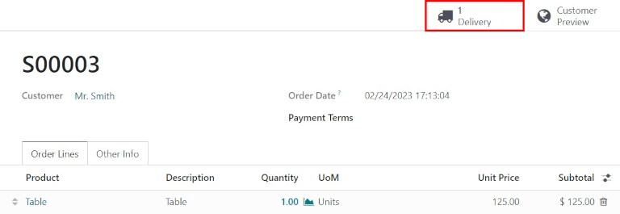
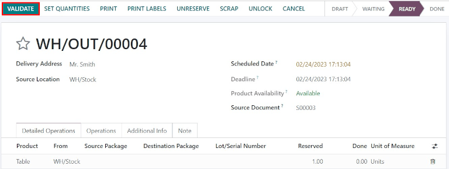

===========================================
Process receipts and deliveries in one step
===========================================

.. _inventory/receipts_delivery_one_step:

By default, incoming shipments are configured to be received directly into stock, and outgoing
shipments are configured to be delivered directly from stock to the customer; the default setting
for warehouses in Odoo is one step receipts and deliveries.

.. note::
   Incoming and outgoing shipments do not need to be configured with the same steps. For example,
   products can be received in one step, but shipped in three steps.

In the following example, one step will be used for both receipts and deliveries.

.. _inventory/receipts_delivery_one_step/wh:

Configure the warehouse
=======================

If another receiving or shipping configuration is set on the warehouse, they can easily be set back
to the one step setting.

Begin by navigating to :menuselection:`Inventory --> Configuration --> Warehouses`, and click on the
desired warehouse to edit. Next, on the :guilabel:`Warehouse Configuration` tab, under the
:guilabel:`Shipments` section, select :guilabel:`Receive goods directly (1 step)` for
:guilabel:`Incoming Shipments` and/or :guilabel:`Deliver goods directly (1 step)` for
:guilabel:`Outgoing Shipments`.

.. image:: receipts_delivery_one_step/one-step-warehouse-config.png
   :align: center
   :alt: Set incoming and outgoing shipment options to receive and deliver in one step.

Receive goods directly (1 step)
===============================

Create a purchase order
-----------------------

On the main :menuselection:`Purchase` application dashboard, start by making a new quote by clicking
:guilabel:`New`. Then, select (or create) a :guilabel:`Vendor` from the drop-down field, add a
storable :guilabel:`Product` to the order lines, and click :guilabel:`Confirm Order` to finalize the
quote as a new purchase order.

A :guilabel:`Receipt` smart button will appear in the top-right corner of the :abbr:`PO (purchase
order)` form — click it to reveal the associated receipt for the purchase order.

.. tip::
   Purchase order receipts can also be found in the :menuselection:`Inventory` application. In
   the :guilabel:`Overview` dashboard, click the :guilabel:`# to Process` smart button in the
   :guilabel:`Receipts` kanban card.

   .. image:: receipts_delivery_one_step/one-step-to-process-btn.png
      :align: center
      :alt: Receipt kanban card's 1 to Process smart button.

Process the receipt
-------------------

When viewing the receipt (associated with the purchase order above), click :guilabel:`Validate` to
then complete the receipt.

.. note::
   If :guilabel:`Storage Locations` are activated, clicking the :guilabel:`≣ (bullet list)` details
   icon next to the :guilabel:`🗑️ (trash)` delete icon enables the :guilabel:`Detailed Operations`
   screen to pop-up. This allows the location(s) to be specified for the received product(s).

   .. image:: receipts_delivery_one_step/receive-storage-location.png
      :align: center
      :alt: Select the Storage Location for the products being received in the Detailed Operations
            pop-up.

Once the receipt is validated, the product leaves the :guilabel:`Supplier Location` and enters the
:guilabel:`WH/Stock Location`. Once it arrives here, it will be available for manufacturing, sales,
etc. Then, the status of the document will change to :guilabel:`Done`, thus completing the reception
process in one step.

.. _inventory/delivery/one-step:

Deliver goods directly (1 step)
===============================

Create a sales order
--------------------

Start my navigating to the main :menuselection:`Sales` app dashboard, and make a new quote by
clicking :guilabel:`New`. Then select (or create) a :guilabel:`Customer` from the drop-down field,
add a storable :guilabel:`Product` that is in stock to the order lines, and click
:guilabel:`Confirm` to finalize the quotation as a sales order.

A :guilabel:`Receipt` smart button will appear in the top-right corner of the :abbr:`PO (purchase
order)` form — click it to reveal the associated receipt for the purchase order.

A :guilabel:`Delivery` smart button will appear in the top-right corner of the :abbr:`SO (Sales
Order)` form — click it to reveal the associated delivery order for the sales order.

.. tip::
   Delivery orders can also be found in the :menuselection:`Inventory` application. In the
   :guilabel:`Overview` dashboard, click the :guilabel:`# to Process` smart button in the
   :guilabel:`Delivery Orders` kanban card.

   .. image:: receipts_delivery_one_step/one-step-delivery-to-process.png
      :align: center
      :alt: Delivery Orders kanban card's 1 to Process smart button.

Process the delivery
--------------------

When viewing the delivery order (associated with the sales order above), click :guilabel:`Validate`
to then complete the delivery.

Once the picking order is validated, the product leaves the :guilabel:`WH/Stock location` and moves
to the :guilabel:`Partners/Customers location`. Then, the status of the document will change to
:guilabel:`Done`, thus completing delivery in one step.
